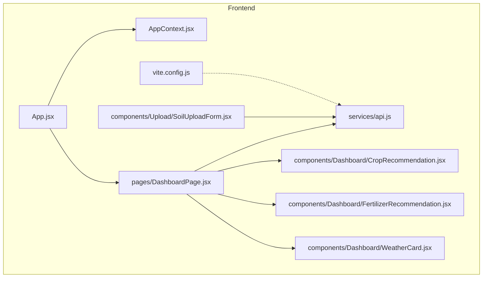
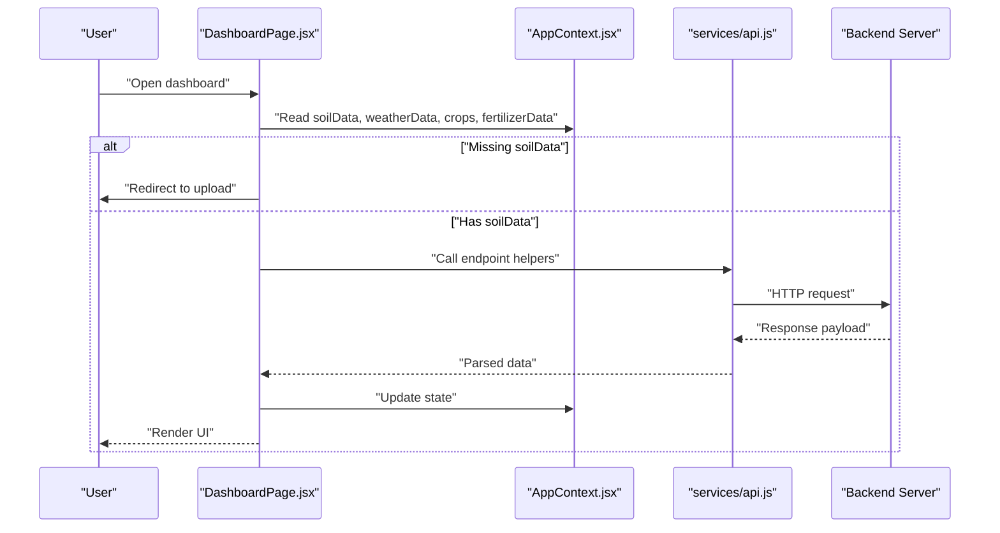
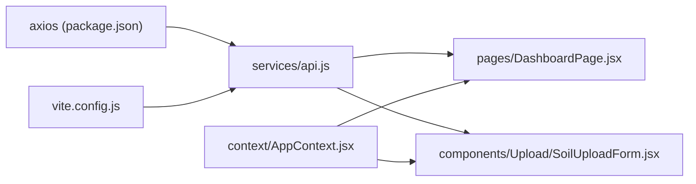

# API Integration

<cite>
**Referenced Files in This Document**
- [api.js](file://frontend/src/services/api.js)
- [vite.config.js](file://frontend/vite.config.js)
- [AppContext.jsx](file://frontend/src/context/AppContext.jsx)
- [DashboardPage.jsx](file://frontend/src/pages/DashboardPage.jsx)
- [SoilUploadForm.jsx](file://frontend/src/components/Upload/SoilUploadForm.jsx)
- [CropRecommendation.jsx](file://frontend/src/components/Dashboard/CropRecommendation.jsx)
- [FertilizerRecommendation.jsx](file://frontend/src/components/Dashboard/FertilizerRecommendation.jsx)
- [WeatherCard.jsx](file://frontend/src/components/Dashboard/WeatherCard.jsx)
- [App.jsx](file://frontend/src/App.jsx)
- [package.json](file://frontend/package.json)
</cite>

## Table of Contents
1. [Introduction](#introduction)
2. [Project Structure](#project-structure)
3. [Core Components](#core-components)
4. [Architecture Overview](#architecture-overview)
5. [Detailed Component Analysis](#detailed-component-analysis)
6. [Dependency Analysis](#dependency-analysis)
7. [Performance Considerations](#performance-considerations)
8. [Troubleshooting Guide](#troubleshooting-guide)
9. [Conclusion](#conclusion)
10. [Appendices](#appendices)

## Introduction
This document provides API integration documentation for the Smart Farming Advisor service layer. It focuses on the Axios-based HTTP client configuration, request/response patterns, error handling strategies, and the frontend integration patterns used by the application. It also documents the API endpoints exposed by the backend service and how the frontend consumes them, including mock data behavior during development.

## Project Structure
The frontend service layer is organized around a single Axios client module that encapsulates HTTP communication and endpoint-specific helpers. Proxy configuration routes requests to the backend server. Context manages shared state across components, while pages and components render UI and orchestrate API calls.

**Diagram sources**
- [App.jsx:1-20](file://frontend/src/App.jsx#L1-L20)
- [AppContext.jsx:1-53](file://frontend/src/context/AppContext.jsx#L1-L53)
- [DashboardPage.jsx:1-68](file://frontend/src/pages/DashboardPage.jsx#L1-L68)
- [api.js:1-86](file://frontend/src/services/api.js#L1-L86)
- [vite.config.js:1-15](file://frontend/vite.config.js#L1-L15)
- [SoilUploadForm.jsx:1-272](file://frontend/src/components/Upload/SoilUploadForm.jsx#L1-L272)
- [CropRecommendation.jsx:1-98](file://frontend/src/components/Dashboard/CropRecommendation.jsx#L1-L98)
- [FertilizerRecommendation.jsx:1-63](file://frontend/src/components/Dashboard/FertilizerRecommendation.jsx#L1-L63)
- [WeatherCard.jsx:1-71](file://frontend/src/components/Dashboard/WeatherCard.jsx#L1-L71)

**Section sources**
- [App.jsx:1-20](file://frontend/src/App.jsx#L1-L20)
- [vite.config.js:1-15](file://frontend/vite.config.js#L1-L15)

## Core Components
- Axios HTTP client with base URL, JSON headers, and timeout.
- Interceptors for logging requests and centralizing error handling.
- Endpoint helpers for crop prediction, fertilizer recommendation, weather retrieval, and soil image analysis.
- Vite proxy configuration to forward API calls to the backend server.
- App context for state management across components.

Key implementation references:
- Axios client creation and interceptors: [api.js:1-31](file://frontend/src/services/api.js#L1-L31)
- Endpoint helpers: [api.js:33-83](file://frontend/src/services/api.js#L33-L83)
- Proxy configuration: [vite.config.js:8-13](file://frontend/vite.config.js#L8-L13)
- App context state: [AppContext.jsx:13-52](file://frontend/src/context/AppContext.jsx#L13-L52)

**Section sources**
- [api.js:1-86](file://frontend/src/services/api.js#L1-L86)
- [vite.config.js:1-15](file://frontend/vite.config.js#L1-L15)
- [AppContext.jsx:1-53](file://frontend/src/context/AppContext.jsx#L1-L53)

## Architecture Overview
The frontend uses a centralized Axios client to communicate with backend endpoints. Requests are proxied via Vite’s dev server to the backend host. Components consume the API helpers and update shared state through the app context.

**Diagram sources**
- [DashboardPage.jsx:11-30](file://frontend/src/pages/DashboardPage.jsx#L11-L30)
- [AppContext.jsx:13-52](file://frontend/src/context/AppContext.jsx#L13-L52)
- [api.js:33-83](file://frontend/src/services/api.js#L33-L83)

## Detailed Component Analysis

### Axios Client and Interceptors
- Base URL is configurable via environment variable; defaults to local backend.
- JSON content-type header is applied globally.
- Timeout is set to 30 seconds.
- Request interceptor logs method and URL.
- Response interceptor logs errors and rethrows them.

Implementation references:
- Client configuration: [api.js:3-11](file://frontend/src/services/api.js#L3-L11)
- Request interceptor: [api.js:13-21](file://frontend/src/services/api.js#L13-L21)
- Response interceptor: [api.js:23-31](file://frontend/src/services/api.js#L23-L31)

**Section sources**
- [api.js:1-31](file://frontend/src/services/api.js#L1-L31)

### Endpoint Helpers
- POST /predict: Accepts soil data, location, and land area; returns crop recommendations.
- POST /fertilizer: Accepts crop name and soil data; returns fertilizer suggestions per crop.
- GET /weather: Accepts location query parameter; returns current weather metrics.
- POST /analyze-soil: Sends image file as multipart/form-data; returns soil analysis.

Implementation references:
- Crop prediction: [api.js:33-44](file://frontend/src/services/api.js#L33-L44)
- Fertilizer recommendation: [api.js:46-56](file://frontend/src/services/api.js#L46-L56)
- Weather data: [api.js:58-67](file://frontend/src/services/api.js#L58-L67)
- Soil image analysis: [api.js:69-83](file://frontend/src/services/api.js#L69-L83)

**Section sources**
- [api.js:33-83](file://frontend/src/services/api.js#L33-L83)

### Frontend Integration Patterns
- App context stores and exposes shared state (soilData, weatherData, crops, fertilizerData, loading, error, location, landArea).
- Dashboard page renders UI components and redirects to the upload page if no analysis data exists.
- Upload form collects user inputs, validates them, and triggers mock analysis to populate state.

Implementation references:
- App context provider: [AppContext.jsx:13-52](file://frontend/src/context/AppContext.jsx#L13-L52)
- Dashboard routing and rendering: [DashboardPage.jsx:11-68](file://frontend/src/pages/DashboardPage.jsx#L11-L68)
- Upload form validation and mock data: [SoilUploadForm.jsx:41-149](file://frontend/src/components/Upload/SoilUploadForm.jsx#L41-L149)

**Section sources**
- [AppContext.jsx:13-52](file://frontend/src/context/AppContext.jsx#L13-L52)
- [DashboardPage.jsx:11-68](file://frontend/src/pages/DashboardPage.jsx#L11-L68)
- [SoilUploadForm.jsx:41-149](file://frontend/src/components/Upload/SoilUploadForm.jsx#L41-L149)

### UI Components Consuming API Data
- CropRecommendation displays ranked crop recommendations with confidence and profit metrics.
- FertilizerRecommendation shows fertilizer requirements per crop.
- WeatherCard shows temperature, humidity, rainfall, and location.

Implementation references:
- Crop recommendations rendering: [CropRecommendation.jsx:27-95](file://frontend/src/components/Dashboard/CropRecommendation.jsx#L27-L95)
- Fertilizer recommendations rendering: [FertilizerRecommendation.jsx:15-62](file://frontend/src/components/Dashboard/FertilizerRecommendation.jsx#L15-L62)
- Weather card rendering: [WeatherCard.jsx:4-70](file://frontend/src/components/Dashboard/WeatherCard.jsx#L4-L70)

**Section sources**
- [CropRecommendation.jsx:1-98](file://frontend/src/components/Dashboard/CropRecommendation.jsx#L1-L98)
- [FertilizerRecommendation.jsx:1-63](file://frontend/src/components/Dashboard/FertilizerRecommendation.jsx#L1-L63)
- [WeatherCard.jsx:1-71](file://frontend/src/components/Dashboard/WeatherCard.jsx#L1-L71)

## Dependency Analysis
The frontend depends on Axios for HTTP requests and Vite for development-time proxying. The app context coordinates state updates triggered by API calls.

**Diagram sources**
- [package.json:15](file://frontend/package.json#L15)
- [vite.config.js:1-15](file://frontend/vite.config.js#L1-L15)
- [api.js:1-86](file://frontend/src/services/api.js#L1-L86)
- [DashboardPage.jsx:1-68](file://frontend/src/pages/DashboardPage.jsx#L1-L68)
- [SoilUploadForm.jsx:1-272](file://frontend/src/components/Upload/SoilUploadForm.jsx#L1-L272)
- [AppContext.jsx:1-53](file://frontend/src/context/AppContext.jsx#L1-L53)

**Section sources**
- [package.json:15](file://frontend/package.json#L15)
- [vite.config.js:1-15](file://frontend/vite.config.js#L1-L15)
- [api.js:1-86](file://frontend/src/services/api.js#L1-L86)

## Performance Considerations
- Timeout configuration: The Axios client sets a 30-second timeout to prevent hanging requests.
- Request logging: Logging requests helps diagnose slow endpoints during development.
- Mock data during development: The upload form simulates API responses to reduce reliance on a live backend and improve iteration speed.
- Proxy configuration: Using Vite’s proxy avoids CORS complications and simplifies local development.

References:
- Timeout setting: [api.js:10](file://frontend/src/services/api.js#L10)
- Request logging: [api.js:15](file://frontend/src/services/api.js#L15)
- Mock simulation: [SoilUploadForm.jsx:65-149](file://frontend/src/components/Upload/SoilUploadForm.jsx#L65-L149)
- Proxy configuration: [vite.config.js:8-13](file://frontend/vite.config.js#L8-L13)

**Section sources**
- [api.js:10](file://frontend/src/services/api.js#L10)
- [SoilUploadForm.jsx:65-149](file://frontend/src/components/Upload/SoilUploadForm.jsx#L65-L149)
- [vite.config.js:8-13](file://frontend/vite.config.js#L8-L13)

## Troubleshooting Guide
Common issues and resolutions:
- Backend connectivity: Ensure the backend server is running at the configured base URL. The default is localhost:5000.
- Environment variable: Set VITE_API_URL to override the base URL in production or non-default environments.
- Proxy misconfiguration: Verify Vite proxy forwards /api to the backend host.
- Request timeouts: Increase timeout if network latency is high; adjust the Axios timeout accordingly.
- Error messages: Centralized response interceptor logs errors; inspect browser console for detailed messages.

References:
- Base URL and timeout: [api.js:3-11](file://frontend/src/services/api.js#L3-L11)
- Proxy configuration: [vite.config.js:8-13](file://frontend/vite.config.js#L8-L13)
- Response interceptor: [api.js:23-31](file://frontend/src/services/api.js#L23-L31)

**Section sources**
- [api.js:3-11](file://frontend/src/services/api.js#L3-L11)
- [vite.config.js:8-13](file://frontend/vite.config.js#L8-L13)
- [api.js:23-31](file://frontend/src/services/api.js#L23-L31)

## Conclusion
The service layer uses a clean Axios client with interceptors to manage HTTP communication and error handling. The frontend integrates these helpers through a shared context and renders results via dedicated UI components. During development, mock data improves usability until the backend is available. The proxy configuration streamlines local development and avoids CORS concerns.

## Appendices

### API Endpoints Specification
- POST /predict
  - Purpose: Get crop recommendations based on soil data, location, and land area.
  - Request body: Object containing soil attributes, location, and land_area.
  - Response: Array of crop recommendations with name, confidence, expected_profit, and optional rank.
  - Example usage reference: [api.js:33-44](file://frontend/src/services/api.js#L33-L44)

- POST /fertilizer
  - Purpose: Get fertilizer recommendations per crop based on soil data.
  - Request body: Object containing crop and soil attributes.
  - Response: Array of fertilizer entries with crop and quantities for urea, dap, and mop.
  - Example usage reference: [api.js:46-56](file://frontend/src/services/api.js#L46-L56)

- GET /weather
  - Purpose: Retrieve current weather metrics for a given location.
  - Query parameters: location (required).
  - Response: Object with temperature, humidity, rainfall, description, and location.
  - Example usage reference: [api.js:58-67](file://frontend/src/services/api.js#L58-L67)

- POST /analyze-soil
  - Purpose: Analyze uploaded soil image and return analysis results.
  - Request body: Multipart/form-data with image field.
  - Response: Soil analysis object (schema depends on backend implementation).
  - Example usage reference: [api.js:69-83](file://frontend/src/services/api.js#L69-L83)

### Authentication and Rate Limiting
- Authentication: Not implemented in the current service layer.
- Rate limiting: Not implemented in the current service layer.

### Request/Response Patterns and Error Handling
- Request pattern: Axios client with JSON headers and timeout; interceptors log requests and handle errors.
- Error handling: Response interceptor centralizes logging and rethrows errors; endpoint helpers wrap calls in try/catch and surface user-friendly messages.
- Example references:
  - Client configuration and interceptors: [api.js:3-31](file://frontend/src/services/api.js#L3-L31)
  - Endpoint helpers with try/catch: [api.js:33-83](file://frontend/src/services/api.js#L33-L83)

### Frontend Integration Examples
- Dashboard rendering and redirection: [DashboardPage.jsx:11-30](file://frontend/src/pages/DashboardPage.jsx#L11-L30)
- Upload form validation and mock data population: [SoilUploadForm.jsx:41-149](file://frontend/src/components/Upload/SoilUploadForm.jsx#L41-L149)
- UI components consuming state: [CropRecommendation.jsx:27-95](file://frontend/src/components/Dashboard/CropRecommendation.jsx#L27-L95), [FertilizerRecommendation.jsx:15-62](file://frontend/src/components/Dashboard/FertilizerRecommendation.jsx#L15-L62), [WeatherCard.jsx:4-70](file://frontend/src/components/Dashboard/WeatherCard.jsx#L4-L70)