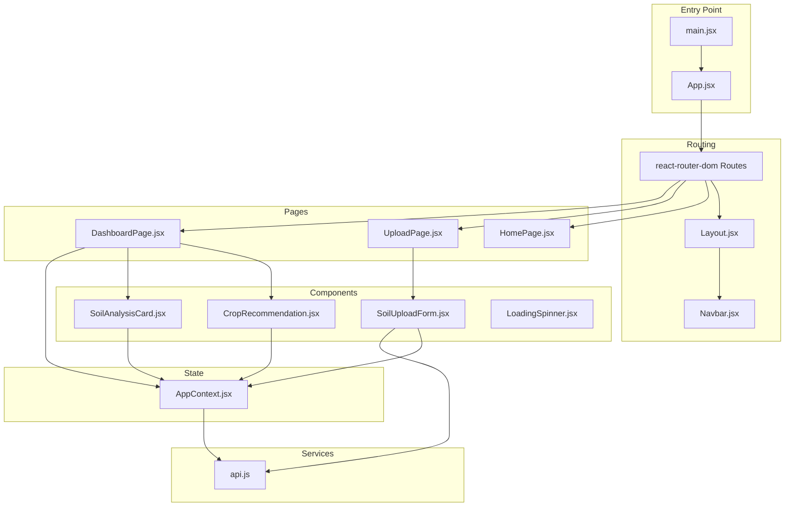
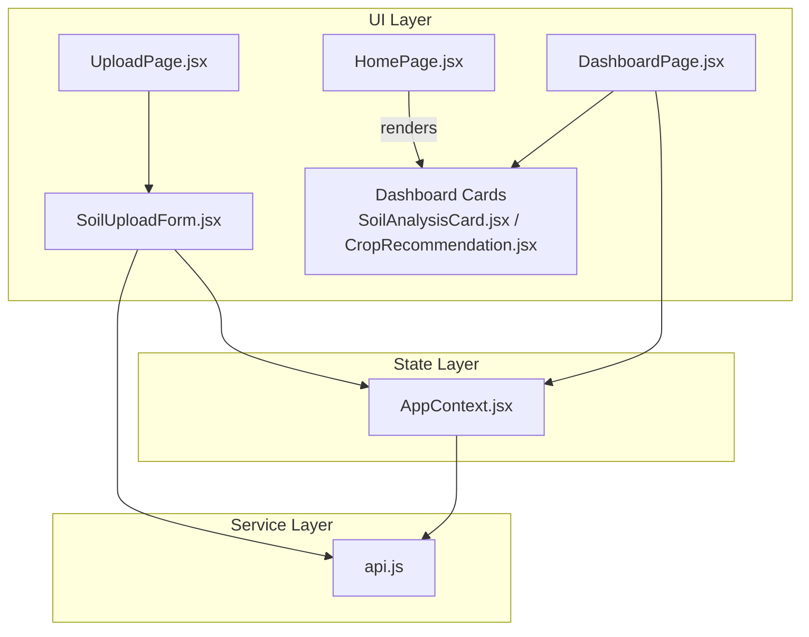
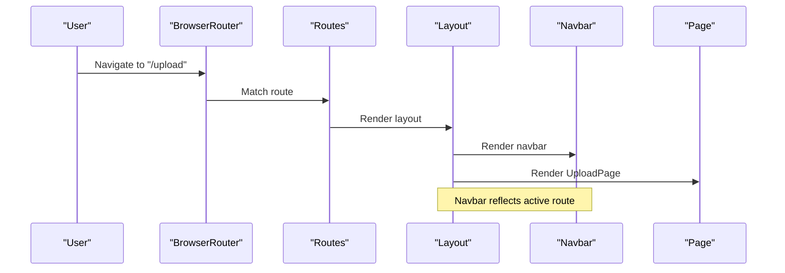
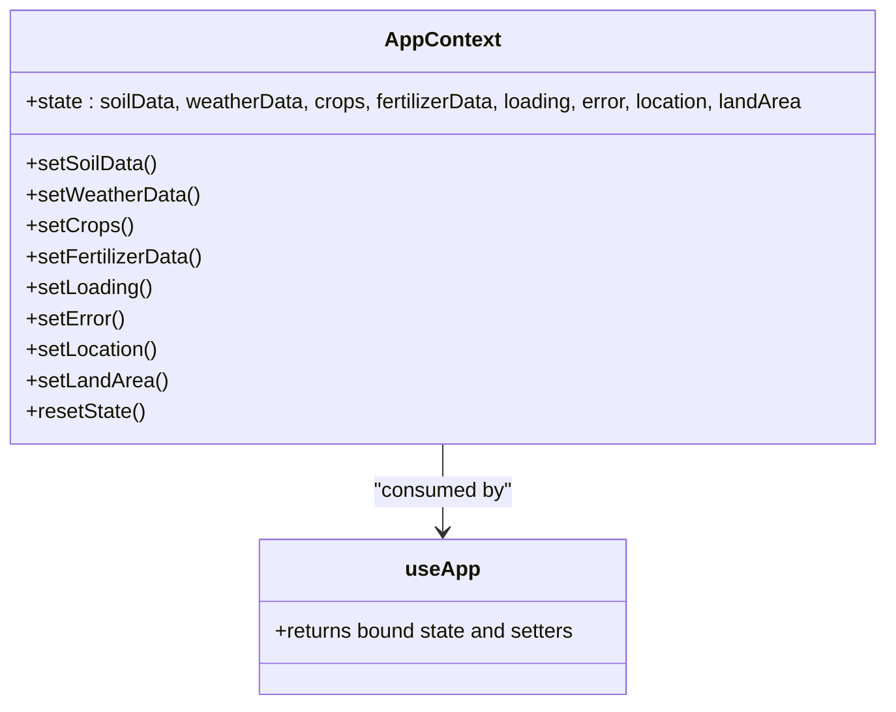
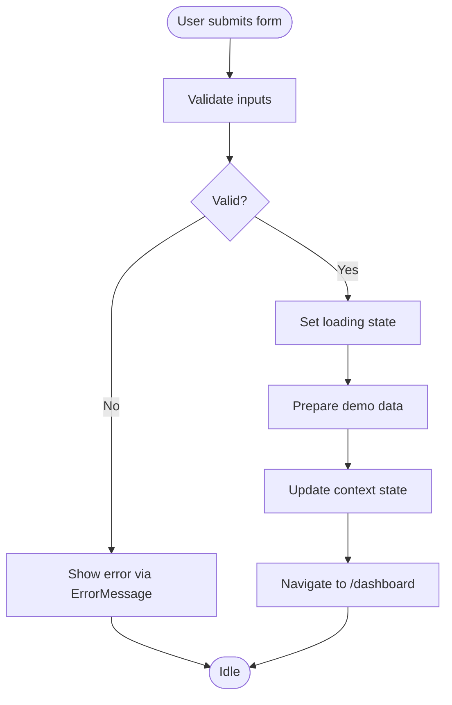
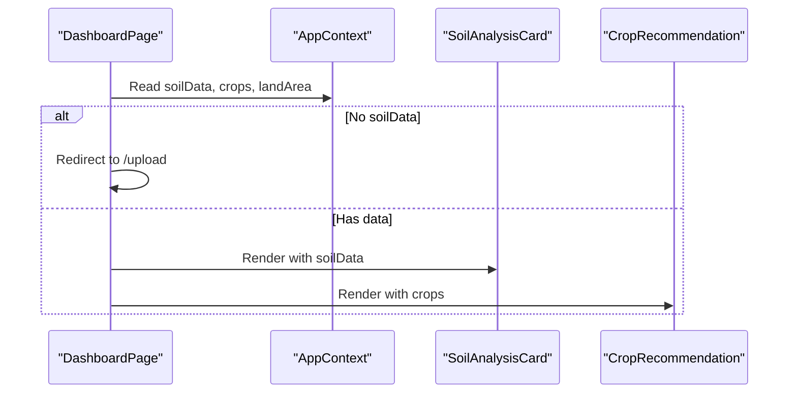
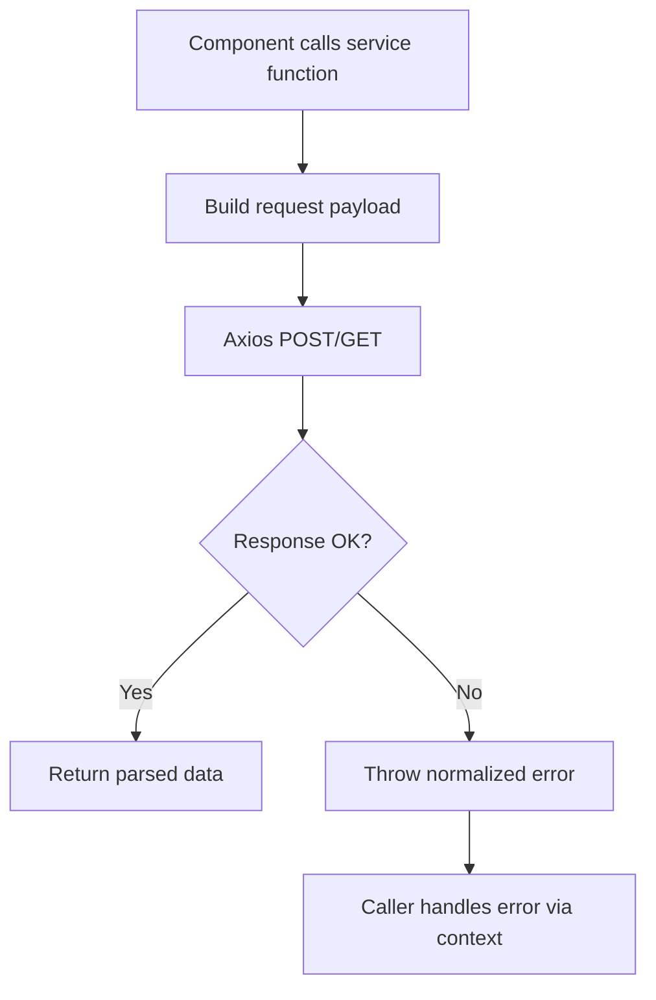
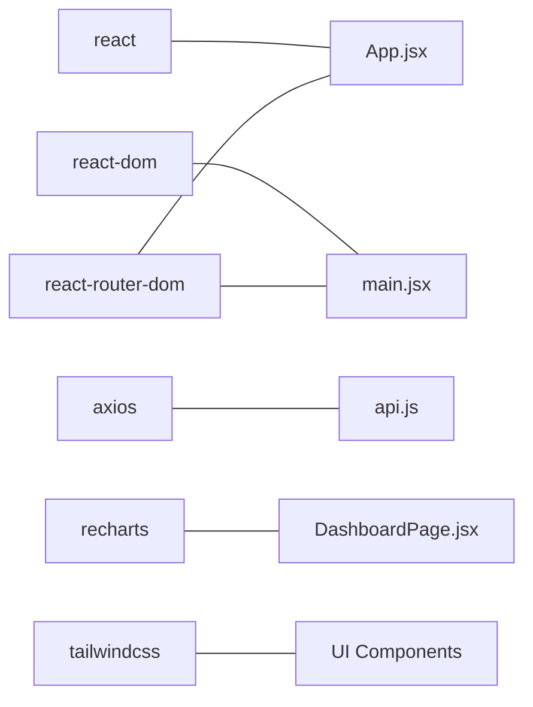

# Architecture Overview

<cite>
**Referenced Files in This Document**
- [main.jsx](file://frontend/src/main.jsx)
- [App.jsx](file://frontend/src/App.jsx)
- [Layout.jsx](file://frontend/src/components/Layout/Layout.jsx)
- [Navbar.jsx](file://frontend/src/components/Layout/Navbar.jsx)
- [HomePage.jsx](file://frontend/src/pages/HomePage.jsx)
- [UploadPage.jsx](file://frontend/src/pages/UploadPage.jsx)
- [DashboardPage.jsx](file://frontend/src/pages/DashboardPage.jsx)
- [AppContext.jsx](file://frontend/src/context/AppContext.jsx)
- [api.js](file://frontend/src/services/api.js)
- [SoilUploadForm.jsx](file://frontend/src/components/Upload/SoilUploadForm.jsx)
- [CropRecommendation.jsx](file://frontend/src/components/Dashboard/CropRecommendation.jsx)
- [SoilAnalysisCard.jsx](file://frontend/src/components/Dashboard/SoilAnalysisCard.jsx)
- [LoadingSpinner.jsx](file://frontend/src/components/common/LoadingSpinner.jsx)
- [package.json](file://frontend/package.json)
</cite>

## Table of Contents
1. [Introduction](#introduction)
2. [Project Structure](#project-structure)
3. [Core Components](#core-components)
4. [Architecture Overview](#architecture-overview)
5. [Detailed Component Analysis](#detailed-component-analysis)
6. [Dependency Analysis](#dependency-analysis)
7. [Performance Considerations](#performance-considerations)
8. [Troubleshooting Guide](#troubleshooting-guide)
9. [Conclusion](#conclusion)

## Introduction
This document describes the frontend architecture of the Smart Farming Advisor, a React-based single-page application. The system follows modern React patterns with a centralized Context API for state management, a clean component hierarchy, and a service layer abstraction for API communication. Routing is handled by React Router DOM, and the UI leverages Tailwind CSS for styling. The design emphasizes separation of concerns: presentational components remain stateless and reusable, container components orchestrate data fetching and state updates, and service abstractions encapsulate network concerns.

## Project Structure
The frontend is organized into feature-based directories with clear separation of concerns:
- Root entry initializes the app with routing and context providers.
- Pages represent routeable views.
- Components are grouped by domain (Dashboard, Home, Upload, common).
- Services encapsulate HTTP client configuration and API endpoints.
- Context manages shared application state.

**Diagram sources**
- [main.jsx:1-17](file://frontend/src/main.jsx#L1-L17)
- [App.jsx:1-20](file://frontend/src/App.jsx#L1-L20)
- [Layout.jsx:1-17](file://frontend/src/components/Layout/Layout.jsx#L1-L17)
- [Navbar.jsx:1-80](file://frontend/src/components/Layout/Navbar.jsx#L1-L80)
- [HomePage.jsx:1-14](file://frontend/src/pages/HomePage.jsx#L1-L14)
- [UploadPage.jsx:1-29](file://frontend/src/pages/UploadPage.jsx#L1-L29)
- [DashboardPage.jsx:1-68](file://frontend/src/pages/DashboardPage.jsx#L1-L68)
- [SoilUploadForm.jsx:1-272](file://frontend/src/components/Upload/SoilUploadForm.jsx#L1-L272)
- [CropRecommendation.jsx:1-98](file://frontend/src/components/Dashboard/CropRecommendation.jsx#L1-L98)
- [SoilAnalysisCard.jsx:1-74](file://frontend/src/components/Dashboard/SoilAnalysisCard.jsx#L1-L74)
- [LoadingSpinner.jsx:1-17](file://frontend/src/components/common/LoadingSpinner.jsx#L1-L17)
- [AppContext.jsx:1-53](file://frontend/src/context/AppContext.jsx#L1-L53)
- [api.js:1-86](file://frontend/src/services/api.js#L1-L86)

**Section sources**
- [main.jsx:1-17](file://frontend/src/main.jsx#L1-L17)
- [App.jsx:1-20](file://frontend/src/App.jsx#L1-L20)
- [package.json:1-29](file://frontend/package.json#L1-L29)

## Core Components
- Application bootstrap and routing provider setup are configured at the root entry.
- The layout composes a persistent navigation bar and footer around routed content.
- Pages are thin containers that delegate rendering to domain-specific components.
- The Context API centralizes state for soil data, weather, crops, fertilizers, loading, errors, and user inputs.
- The service layer abstracts HTTP requests and exposes typed functions for each endpoint.

Key responsibilities:
- Entry initialization: wrap the app with routing and state providers.
- Routing: define routes and render pages within the layout shell.
- Layout: provide global navigation and consistent page framing.
- State: expose getters/setters and helpers for cross-component sharing.
- Services: encapsulate base URL, interceptors, and endpoint-specific logic.

**Section sources**
- [main.jsx:1-17](file://frontend/src/main.jsx#L1-L17)
- [App.jsx:1-20](file://frontend/src/App.jsx#L1-L20)
- [Layout.jsx:1-17](file://frontend/src/components/Layout/Layout.jsx#L1-L17)
- [Navbar.jsx:1-80](file://frontend/src/components/Layout/Navbar.jsx#L1-L80)
- [AppContext.jsx:1-53](file://frontend/src/context/AppContext.jsx#L1-L53)
- [api.js:1-86](file://frontend/src/services/api.js#L1-L86)

## Architecture Overview
The system follows a unidirectional data flow:
- UI components trigger actions via handlers in container components.
- Container components update context state and orchestrate service calls.
- Services encapsulate HTTP logic and return normalized data.
- Presentational components re-render based on context subscriptions.

**Diagram sources**
- [HomePage.jsx:1-14](file://frontend/src/pages/HomePage.jsx#L1-L14)
- [UploadPage.jsx:1-29](file://frontend/src/pages/UploadPage.jsx#L1-L29)
- [DashboardPage.jsx:1-68](file://frontend/src/pages/DashboardPage.jsx#L1-L68)
- [SoilUploadForm.jsx:1-272](file://frontend/src/components/Upload/SoilUploadForm.jsx#L1-L272)
- [SoilAnalysisCard.jsx:1-74](file://frontend/src/components/Dashboard/SoilAnalysisCard.jsx#L1-L74)
- [CropRecommendation.jsx:1-98](file://frontend/src/components/Dashboard/CropRecommendation.jsx#L1-L98)
- [AppContext.jsx:1-53](file://frontend/src/context/AppContext.jsx#L1-L53)
- [api.js:1-86](file://frontend/src/services/api.js#L1-L86)

## Detailed Component Analysis

### Routing and Navigation
- The router defines three public routes: home, upload, and dashboard.
- The layout wraps all routes and renders a persistent navbar and footer.
- The navbar dynamically highlights the active route and supports responsive mobile behavior.

**Diagram sources**
- [main.jsx:1-17](file://frontend/src/main.jsx#L1-L17)
- [App.jsx:1-20](file://frontend/src/App.jsx#L1-L20)
- [Layout.jsx:1-17](file://frontend/src/components/Layout/Layout.jsx#L1-L17)
- [Navbar.jsx:1-80](file://frontend/src/components/Layout/Navbar.jsx#L1-L80)
- [UploadPage.jsx:1-29](file://frontend/src/pages/UploadPage.jsx#L1-L29)

**Section sources**
- [App.jsx:1-20](file://frontend/src/App.jsx#L1-L20)
- [Layout.jsx:1-17](file://frontend/src/components/Layout/Layout.jsx#L1-L17)
- [Navbar.jsx:1-80](file://frontend/src/components/Layout/Navbar.jsx#L1-L80)

### State Management with Context API
- A single context provider supplies state and setters for soil data, weather, crops, fertilizers, loading, error, location, and land area.
- A helper hook enforces proper usage within the provider boundary.
- A reset utility clears derived state after navigation or analysis completion.

**Diagram sources**
- [AppContext.jsx:1-53](file://frontend/src/context/AppContext.jsx#L1-L53)

**Section sources**
- [AppContext.jsx:1-53](file://frontend/src/context/AppContext.jsx#L1-L53)

### Upload Page and Form Orchestration
- The upload page hosts a form that accepts either a soil image or manual nutrient inputs.
- Validation ensures required fields are present before proceeding.
- On submission, the form simulates API calls and populates context state with demo data, then navigates to the dashboard.

**Diagram sources**
- [UploadPage.jsx:1-29](file://frontend/src/pages/UploadPage.jsx#L1-L29)
- [SoilUploadForm.jsx:1-272](file://frontend/src/components/Upload/SoilUploadForm.jsx#L1-L272)
- [AppContext.jsx:1-53](file://frontend/src/context/AppContext.jsx#L1-L53)

**Section sources**
- [UploadPage.jsx:1-29](file://frontend/src/pages/UploadPage.jsx#L1-L29)
- [SoilUploadForm.jsx:1-272](file://frontend/src/components/Upload/SoilUploadForm.jsx#L1-L272)

### Dashboard Rendering and Data Presentation
- The dashboard page enforces that analysis data exists; otherwise, it redirects to the upload page.
- It renders multiple presentational cards that consume data from context:
  - Soil analysis metrics
  - Crop recommendations with ranking and profit indicators
- Navigation buttons allow returning to the upload page.

**Diagram sources**
- [DashboardPage.jsx:1-68](file://frontend/src/pages/DashboardPage.jsx#L1-L68)
- [SoilAnalysisCard.jsx:1-74](file://frontend/src/components/Dashboard/SoilAnalysisCard.jsx#L1-L74)
- [CropRecommendation.jsx:1-98](file://frontend/src/components/Dashboard/CropRecommendation.jsx#L1-L98)
- [AppContext.jsx:1-53](file://frontend/src/context/AppContext.jsx#L1-L53)

**Section sources**
- [DashboardPage.jsx:1-68](file://frontend/src/pages/DashboardPage.jsx#L1-L68)
- [SoilAnalysisCard.jsx:1-74](file://frontend/src/components/Dashboard/SoilAnalysisCard.jsx#L1-L74)
- [CropRecommendation.jsx:1-98](file://frontend/src/components/Dashboard/CropRecommendation.jsx#L1-L98)

### Service Layer Abstraction
- Axios client is configured with a base URL, JSON headers, and a timeout.
- Interceptors log requests and surface errors consistently.
- Endpoint functions encapsulate payload shapes and error handling, exposing simple async functions to the rest of the app.

**Diagram sources**
- [api.js:1-86](file://frontend/src/services/api.js#L1-L86)

**Section sources**
- [api.js:1-86](file://frontend/src/services/api.js#L1-L86)

## Dependency Analysis
External dependencies include React, React Router DOM, Axios, Recharts, and Tailwind CSS. These enable declarative UI, routing, HTTP client capabilities, charting, and styling primitives.

**Diagram sources**
- [package.json:1-29](file://frontend/package.json#L1-L29)
- [App.jsx:1-20](file://frontend/src/App.jsx#L1-L20)
- [main.jsx:1-17](file://frontend/src/main.jsx#L1-L17)
- [api.js:1-86](file://frontend/src/services/api.js#L1-L86)
- [DashboardPage.jsx:1-68](file://frontend/src/pages/DashboardPage.jsx#L1-L68)

**Section sources**
- [package.json:1-29](file://frontend/package.json#L1-L29)

## Performance Considerations
- Prefer memoization for expensive computations in presentational components.
- Defer heavy rendering until data is available to avoid unnecessary work.
- Keep context updates granular to minimize re-renders across unrelated components.
- Use lazy loading for charts and images to improve initial load times.
- Avoid blocking UI during network calls; leverage loading states and skeleton components.

## Troubleshooting Guide
Common issues and remedies:
- Context consumption outside provider: Ensure the app is wrapped with the provider at the root.
- Missing environment variable for API base URL: Verify the environment configuration for the API base URL.
- Navigation loops: Confirm that the dashboard checks for required state before rendering.
- Network failures: Inspect interceptor logs and surface user-friendly messages via the shared error state.

**Section sources**
- [AppContext.jsx:1-53](file://frontend/src/context/AppContext.jsx#L1-L53)
- [api.js:1-86](file://frontend/src/services/api.js#L1-L86)
- [DashboardPage.jsx:1-68](file://frontend/src/pages/DashboardPage.jsx#L1-L68)

## Conclusion
The Smart Farming Advisor frontend employs a clean, scalable architecture built on React fundamentals. Routing, context-based state management, and a dedicated service layer combine to deliver a maintainable and extensible user experience. The separation of presentational and container components, along with a strong service abstraction, enables future enhancements such as real backend integration, advanced analytics, and expanded feature sets while preserving simplicity and clarity.