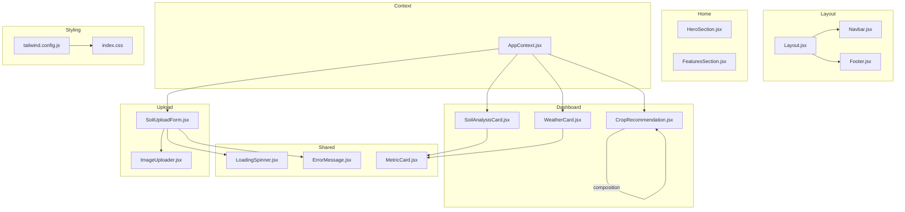
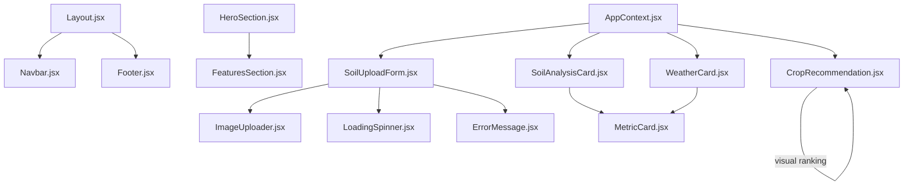
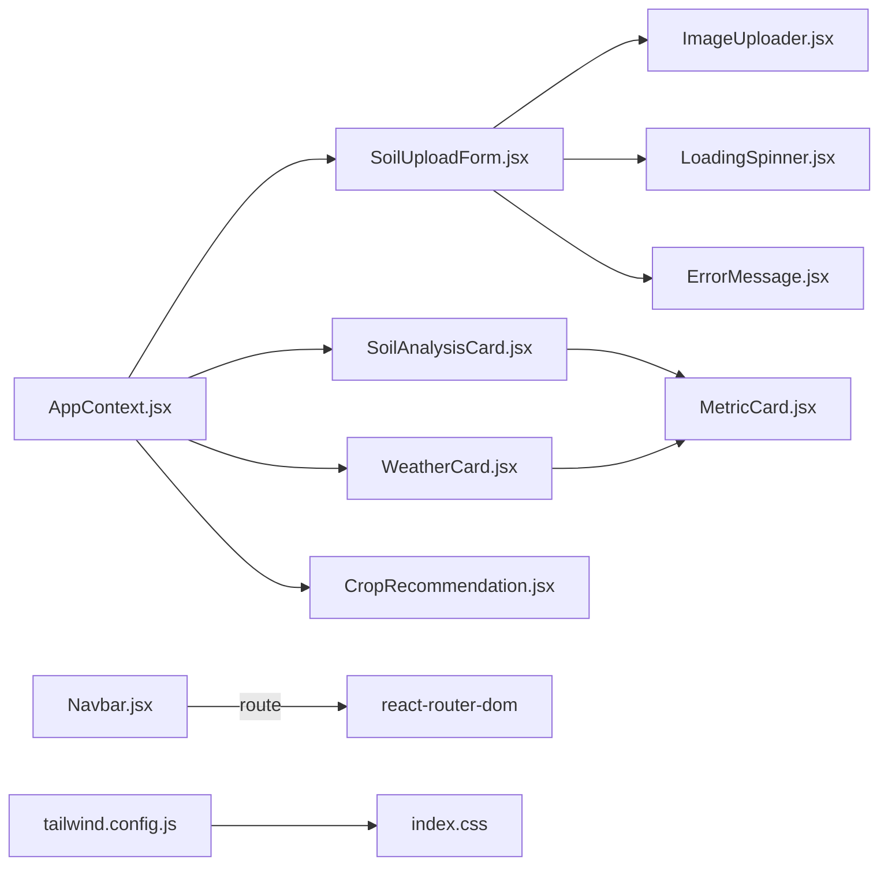

# Component Library

<cite>
**Referenced Files in This Document**
- [MetricCard.jsx](file://frontend/src/components/common/MetricCard.jsx)
- [LoadingSpinner.jsx](file://frontend/src/components/common/LoadingSpinner.jsx)
- [ErrorMessage.jsx](file://frontend/src/components/common/ErrorMessage.jsx)
- [Navbar.jsx](file://frontend/src/components/Layout/Navbar.jsx)
- [Footer.jsx](file://frontend/src/components/Layout/Footer.jsx)
- [Layout.jsx](file://frontend/src/components/Layout/Layout.jsx)
- [HeroSection.jsx](file://frontend/src/components/Home/HeroSection.jsx)
- [FeaturesSection.jsx](file://frontend/src/components/Home/FeaturesSection.jsx)
- [CropRecommendation.jsx](file://frontend/src/components/Dashboard/CropRecommendation.jsx)
- [SoilAnalysisCard.jsx](file://frontend/src/components/Dashboard/SoilAnalysisCard.jsx)
- [WeatherCard.jsx](file://frontend/src/components/Dashboard/WeatherCard.jsx)
- [ImageUploader.jsx](file://frontend/src/components/Upload/ImageUploader.jsx)
- [SoilUploadForm.jsx](file://frontend/src/components/Upload/SoilUploadForm.jsx)
- [AppContext.jsx](file://frontend/src/context/AppContext.jsx)
- [tailwind.config.js](file://frontend/tailwind.config.js)
- [index.css](file://frontend/src/index.css)
</cite>

## Table of Contents
1. [Introduction](#introduction)
2. [Project Structure](#project-structure)
3. [Core Components](#core-components)
4. [Architecture Overview](#architecture-overview)
5. [Detailed Component Analysis](#detailed-component-analysis)
6. [Dependency Analysis](#dependency-analysis)
7. [Performance Considerations](#performance-considerations)
8. [Accessibility and Responsive Design](#accessibility-and-responsive-design)
9. [Integration Guidelines](#integration-guidelines)
10. [Troubleshooting Guide](#troubleshooting-guide)
11. [Conclusion](#conclusion)

## Introduction
This document describes the Smart Farming Advisor component library. It covers reusable UI components (shared components MetricCard, LoadingSpinner, ErrorMessage), layout components (Navbar, Footer, Layout), and feature-specific components (HeroSection, FeaturesSection). For each component, we explain visual appearance, behavior, props interface, customization options, usage patterns, accessibility considerations, responsive design, and integration guidelines. We also document the design system principles, styling approach with Tailwind CSS, and component composition patterns used across the application.

## Project Structure
The component library is organized by feature domains:
- Shared components under common/
- Layout components under Layout/
- Feature-specific components under Home/
- Dashboard feature components under Dashboard/
- Upload feature components under Upload/
- Global context under context/
- Styling under src/index.css and Tailwind configuration under tailwind.config.js

**Diagram sources**
- [Layout.jsx:1-17](file://frontend/src/components/Layout/Layout.jsx#L1-L17)
- [Navbar.jsx:1-80](file://frontend/src/components/Layout/Navbar.jsx#L1-L80)
- [Footer.jsx:1-27](file://frontend/src/components/Layout/Footer.jsx#L1-L27)
- [MetricCard.jsx:1-39](file://frontend/src/components/common/MetricCard.jsx#L1-L39)
- [LoadingSpinner.jsx:1-17](file://frontend/src/components/common/LoadingSpinner.jsx#L1-L17)
- [ErrorMessage.jsx:1-37](file://frontend/src/components/common/ErrorMessage.jsx#L1-L37)
- [SoilAnalysisCard.jsx:1-74](file://frontend/src/components/Dashboard/SoilAnalysisCard.jsx#L1-L74)
- [WeatherCard.jsx:1-71](file://frontend/src/components/Dashboard/WeatherCard.jsx#L1-L71)
- [CropRecommendation.jsx:1-98](file://frontend/src/components/Dashboard/CropRecommendation.jsx#L1-L98)
- [ImageUploader.jsx:1-108](file://frontend/src/components/Upload/ImageUploader.jsx#L1-L108)
- [SoilUploadForm.jsx:1-272](file://frontend/src/components/Upload/SoilUploadForm.jsx#L1-L272)
- [AppContext.jsx:1-53](file://frontend/src/context/AppContext.jsx#L1-L53)
- [tailwind.config.js:1-57](file://frontend/tailwind.config.js#L1-L57)
- [index.css:1-23](file://frontend/src/index.css#L1-L23)

**Section sources**
- [Layout.jsx:1-17](file://frontend/src/components/Layout/Layout.jsx#L1-L17)
- [tailwind.config.js:1-57](file://frontend/tailwind.config.js#L1-L57)
- [index.css:1-23](file://frontend/src/index.css#L1-L23)

## Core Components
This section documents the shared components used across the application.

### MetricCard
- Purpose: Display a single metric with optional icon and color-coded theme.
- Props:
  - title: string
  - value: number or string
  - unit: string (optional)
  - icon: React component (optional)
  - color: one of "agri", "earth", "blue", "amber", "rose"
- Behavior:
  - Renders a card with a left-aligned icon and value/unit text.
  - Uses color themes for background, text, and border.
  - Hover adds subtle shadow; includes entrance animation.
- Accessibility:
  - Uses semantic text and icons; ensure sufficient color contrast per theme.
- Customization:
  - Change color to match context.
  - Provide an icon component for visual reinforcement.
- Usage pattern:
  - Compose within cards like SoilAnalysisCard and WeatherCard.

**Section sources**
- [MetricCard.jsx:1-39](file://frontend/src/components/common/MetricCard.jsx#L1-L39)
- [SoilAnalysisCard.jsx:57-67](file://frontend/src/components/Dashboard/SoilAnalysisCard.jsx#L57-L67)
- [WeatherCard.jsx:49-59](file://frontend/src/components/Dashboard/WeatherCard.jsx#L49-L59)

### LoadingSpinner
- Purpose: Show ongoing processing with animated spinner and message.
- Props:
  - message: string (default: "Analyzing your land...")
- Behavior:
  - Centered layout with spinning loader and pulse effect.
  - Includes friendly message and note about duration.
- Accessibility:
  - Spinner is visually prominent; consider adding aria-live region if used in critical flows.
- Customization:
  - Adjust message text to reflect current operation.
- Usage pattern:
  - Render while performing asynchronous operations (e.g., form submission).

**Section sources**
- [LoadingSpinner.jsx:1-17](file://frontend/src/components/common/LoadingSpinner.jsx#L1-L17)
- [SoilUploadForm.jsx:151-153](file://frontend/src/components/Upload/SoilUploadForm.jsx#L151-L153)

### ErrorMessage
- Purpose: Display error messages with optional retry action and dismiss button.
- Props:
  - message: string
  - onRetry: function (optional)
- Behavior:
  - Animated fade-in container with alert icon.
  - Optional "Try Again" button triggers onRetry callback.
  - Dismiss button hides the component.
- Accessibility:
  - Clear heading and message; ensure keyboard operability for buttons.
- Customization:
  - Provide custom onRetry handler to reattempt failed operations.
- Usage pattern:
  - Show after validation failures or API errors.

**Section sources**
- [ErrorMessage.jsx:1-37](file://frontend/src/components/common/ErrorMessage.jsx#L1-L37)
- [SoilUploadForm.jsx:157-162](file://frontend/src/components/Upload/SoilUploadForm.jsx#L157-L162)

## Architecture Overview
The application follows a composition-first architecture:
- Layout wraps page content with Navbar and Footer.
- Feature pages (Home, Upload, Dashboard) render domain-specific sections.
- Shared components are reused across features.
- AppContext manages global state for soil, weather, crops, fertilizers, loading, error, location, and land area.

**Diagram sources**
- [Layout.jsx:1-17](file://frontend/src/components/Layout/Layout.jsx#L1-L17)
- [Navbar.jsx:1-80](file://frontend/src/components/Layout/Navbar.jsx#L1-L80)
- [Footer.jsx:1-27](file://frontend/src/components/Layout/Footer.jsx#L1-L27)
- [HeroSection.jsx:1-67](file://frontend/src/components/Home/HeroSection.jsx#L1-L67)
- [FeaturesSection.jsx:1-84](file://frontend/src/components/Home/FeaturesSection.jsx#L1-L84)
- [SoilUploadForm.jsx:1-272](file://frontend/src/components/Upload/SoilUploadForm.jsx#L1-L272)
- [ImageUploader.jsx:1-108](file://frontend/src/components/Upload/ImageUploader.jsx#L1-L108)
- [SoilAnalysisCard.jsx:1-74](file://frontend/src/components/Dashboard/SoilAnalysisCard.jsx#L1-L74)
- [WeatherCard.jsx:1-71](file://frontend/src/components/Dashboard/WeatherCard.jsx#L1-L71)
- [CropRecommendation.jsx:1-98](file://frontend/src/components/Dashboard/CropRecommendation.jsx#L1-L98)
- [MetricCard.jsx:1-39](file://frontend/src/components/common/MetricCard.jsx#L1-L39)
- [LoadingSpinner.jsx:1-17](file://frontend/src/components/common/LoadingSpinner.jsx#L1-L17)
- [ErrorMessage.jsx:1-37](file://frontend/src/components/common/ErrorMessage.jsx#L1-L37)
- [AppContext.jsx:1-53](file://frontend/src/context/AppContext.jsx#L1-L53)

## Detailed Component Analysis

### Layout Components

#### Layout
- Purpose: Provide consistent page scaffolding with Navbar and Footer.
- Props:
  - children: React node
- Behavior:
  - Flex column layout ensuring Footer stays at bottom.
  - Min-height ensures full viewport coverage.
- Composition:
  - Wraps page content; used in page components.

**Section sources**
- [Layout.jsx:1-17](file://frontend/src/components/Layout/Layout.jsx#L1-L17)

#### Navbar
- Purpose: Navigation bar with responsive mobile menu.
- Behavior:
  - Desktop: horizontal links with active-state styling.
  - Mobile: collapsible drawer toggled by hamburger icon.
  - Active link highlighting based on current route.
- Accessibility:
  - Keyboard navigable; screen reader-friendly labels.
- Customization:
  - Add/remove nav items in navLinks array.
  - Adjust hover/active styles via Tailwind utilities.

**Section sources**
- [Navbar.jsx:1-80](file://frontend/src/components/Layout/Navbar.jsx#L1-L80)

#### Footer
- Purpose: Branding and legal information footer.
- Behavior:
  - Centered layout with responsive flex direction.
  - Consistent agri palette for typography and accents.
- Customization:
  - Modify year dynamically if needed.

**Section sources**
- [Footer.jsx:1-27](file://frontend/src/components/Layout/Footer.jsx#L1-L27)

### Feature-Specific Components

#### HeroSection
- Purpose: Hero banner introducing the platform with call-to-action buttons and feature highlights.
- Behavior:
  - Full-width section with gradient background and overlay radial highlight.
  - Centered headline, description, and CTA buttons.
  - Three feature tiles below CTAs.
- Accessibility:
  - Large text and clear contrast; ensure focus styles for buttons.
- Customization:
  - Adjust gradient stops and overlay opacity.
  - Modify feature tile icons and labels.

**Section sources**
- [HeroSection.jsx:1-67](file://frontend/src/components/Home/HeroSection.jsx#L1-L67)

#### FeaturesSection
- Purpose: Present step-by-step workflow with feature cards and statistics.
- Behavior:
  - Four feature cards with colored icons and hover effects.
  - Stats section with three metrics.
- Accessibility:
  - Semantic headings and readable text sizes.
- Customization:
  - Add or modify features in the features array.

**Section sources**
- [FeaturesSection.jsx:1-84](file://frontend/src/components/Home/FeaturesSection.jsx#L1-L84)

### Dashboard Components

#### SoilAnalysisCard
- Purpose: Display soil metrics using MetricCard components.
- Props:
  - soilData: object containing nutrient and pH values
- Behavior:
  - Grid of MetricCards for NPK, pH, and organic matter.
  - Animated entrance.
- Composition:
  - Reuses MetricCard with appropriate color themes.

**Section sources**
- [SoilAnalysisCard.jsx:1-74](file://frontend/src/components/Dashboard/SoilAnalysisCard.jsx#L1-L74)
- [MetricCard.jsx:1-39](file://frontend/src/components/common/MetricCard.jsx#L1-L39)

#### WeatherCard
- Purpose: Display current weather metrics using MetricCard components.
- Props:
  - weatherData: object containing temperature, humidity, rainfall, location, and description
- Behavior:
  - Header with location badge.
  - Grid of MetricCards for temperature, humidity, rainfall.
  - Additional description card.
- Composition:
  - Reuses MetricCard with appropriate color themes.

**Section sources**
- [WeatherCard.jsx:1-71](file://frontend/src/components/Dashboard/WeatherCard.jsx#L1-L71)
- [MetricCard.jsx:1-39](file://frontend/src/components/common/MetricCard.jsx#L1-L39)

#### CropRecommendation
- Purpose: Present ranked crop recommendations with confidence and profit.
- Props:
  - crops: array of crop objects with name, confidence, expected_profit, and optional rank
- Behavior:
  - Three recommendation cards with rank-specific styling and medals.
  - Confidence bars with animated width.
  - Profit display with currency formatting.
- Accessibility:
  - Ensure sufficient contrast for rank badges and progress bars.
- Customization:
  - Extend rankConfig for additional ranks or customize colors.

**Section sources**
- [CropRecommendation.jsx:1-98](file://frontend/src/components/Dashboard/CropRecommendation.jsx#L1-L98)

### Upload Components

#### ImageUploader
- Purpose: Drag-and-drop and file selection for image uploads.
- Props:
  - onImageSelect: function to receive selected file
  - selectedImage: currently selected file or null
- Behavior:
  - Drop zone with drag-over state.
  - Preview panel with clear action when an image is selected.
  - Accepts image/* types.
- Accessibility:
  - Hidden input is keyboard accessible; visible drop zone is clear.
- Customization:
  - Update supported formats and preview layout.

**Section sources**
- [ImageUploader.jsx:1-108](file://frontend/src/components/Upload/ImageUploader.jsx#L1-L108)

#### SoilUploadForm
- Purpose: Collect location, land area, and either image or manual soil inputs; submit to trigger analysis.
- Props: None (uses AppContext)
- Behavior:
  - Toggle between image upload and manual input modes.
  - Form validation for required fields.
  - Loading state with LoadingSpinner; error state with ErrorMessage.
  - Demo data population for soil, weather, crops, and fertilizers.
  - Navigation to dashboard on success.
- Composition:
  - Uses ImageUploader, LoadingSpinner, ErrorMessage.
  - Consumes AppContext for state updates.

**Section sources**
- [SoilUploadForm.jsx:1-272](file://frontend/src/components/Upload/SoilUploadForm.jsx#L1-L272)
- [ImageUploader.jsx:1-108](file://frontend/src/components/Upload/ImageUploader.jsx#L1-L108)
- [LoadingSpinner.jsx:1-17](file://frontend/src/components/common/LoadingSpinner.jsx#L1-L17)
- [ErrorMessage.jsx:1-37](file://frontend/src/components/common/ErrorMessage.jsx#L1-L37)
- [AppContext.jsx:1-53](file://frontend/src/context/AppContext.jsx#L1-L53)

### Context Provider
- AppContext
  - Provides global state for soilData, weatherData, crops, fertilizerData, loading, error, location, and landArea.
  - Exposes setters and a resetState function.
  - Consumers use useApp hook to access state and update functions.

**Section sources**
- [AppContext.jsx:1-53](file://frontend/src/context/AppContext.jsx#L1-L53)

## Dependency Analysis
- Component coupling:
  - Dashboard components depend on MetricCard for metric rendering.
  - Upload form composes ImageUploader, LoadingSpinner, and ErrorMessage.
  - Layout composes Navbar and Footer.
- External dependencies:
  - Icons from lucide-react.
  - Routing via react-router-dom.
  - State management via React Context.
- Styling:
  - Tailwind CSS with custom agri and earth palettes.
  - Custom animations and utilities layered via index.css.

**Diagram sources**
- [SoilUploadForm.jsx:1-272](file://frontend/src/components/Upload/SoilUploadForm.jsx#L1-L272)
- [ImageUploader.jsx:1-108](file://frontend/src/components/Upload/ImageUploader.jsx#L1-L108)
- [LoadingSpinner.jsx:1-17](file://frontend/src/components/common/LoadingSpinner.jsx#L1-L17)
- [ErrorMessage.jsx:1-37](file://frontend/src/components/common/ErrorMessage.jsx#L1-L37)
- [SoilAnalysisCard.jsx:1-74](file://frontend/src/components/Dashboard/SoilAnalysisCard.jsx#L1-L74)
- [WeatherCard.jsx:1-71](file://frontend/src/components/Dashboard/WeatherCard.jsx#L1-L71)
- [MetricCard.jsx:1-39](file://frontend/src/components/common/MetricCard.jsx#L1-L39)
- [AppContext.jsx:1-53](file://frontend/src/context/AppContext.jsx#L1-L53)
- [Navbar.jsx:1-80](file://frontend/src/components/Layout/Navbar.jsx#L1-L80)
- [tailwind.config.js:1-57](file://frontend/tailwind.config.js#L1-L57)
- [index.css:1-23](file://frontend/src/index.css#L1-L23)

**Section sources**
- [SoilUploadForm.jsx:1-272](file://frontend/src/components/Upload/SoilUploadForm.jsx#L1-L272)
- [SoilAnalysisCard.jsx:1-74](file://frontend/src/components/Dashboard/SoilAnalysisCard.jsx#L1-L74)
- [WeatherCard.jsx:1-71](file://frontend/src/components/Dashboard/WeatherCard.jsx#L1-L71)
- [MetricCard.jsx:1-39](file://frontend/src/components/common/MetricCard.jsx#L1-L39)
- [AppContext.jsx:1-53](file://frontend/src/context/AppContext.jsx#L1-L53)
- [tailwind.config.js:1-57](file://frontend/tailwind.config.js#L1-L57)
- [index.css:1-23](file://frontend/src/index.css#L1-L23)

## Performance Considerations
- Prefer lightweight icons and avoid unnecessary re-renders by passing stable callbacks (as seen with drag handlers).
- Use lazy loading for images in previews when scaling up.
- Keep animation durations reasonable to maintain perceived performance.
- Memoize derived data (e.g., formatted currency) when used frequently.

## Accessibility and Responsive Design
- Accessibility:
  - Ensure interactive elements have visible focus states.
  - Provide meaningful text alternatives for icons.
  - Use semantic HTML and ARIA roles where appropriate.
- Responsive design:
  - Components use responsive grid layouts and breakpoints (e.g., md, lg).
  - Mobile-first navigation with collapsible drawer.
  - Flexible spacing and typography scales across devices.

## Integration Guidelines
- Shared components:
  - Import MetricCard into cards that present metrics.
  - Use LoadingSpinner during async operations.
  - Use ErrorMessage for validation and error feedback.
- Layout:
  - Wrap page components with Layout to ensure consistent header/footer.
  - Use Navbar for navigation and Footer for branding/legal.
- Feature components:
  - Compose HeroSection and FeaturesSection on the home page.
  - Use SoilUploadForm for onboarding and data input.
  - Display results using SoilAnalysisCard, WeatherCard, and CropRecommendation.
- State management:
  - Consume AppContext in forms and pages to manage shared state.
  - Reset state when navigating away from upload to clean previous inputs.

## Troubleshooting Guide
- Validation errors:
  - SoilUploadForm displays ErrorMessage when required fields are missing or invalid.
  - Clear error state on retry.
- Loading states:
  - Show LoadingSpinner while performing analysis; hide on completion.
- Image upload issues:
  - Verify file type acceptance and handle drag-and-drop events properly.
- Navigation:
  - Ensure routes exist and Navbar links match routing configuration.

**Section sources**
- [SoilUploadForm.jsx:41-51](file://frontend/src/components/Upload/SoilUploadForm.jsx#L41-L51)
- [SoilUploadForm.jsx:157-162](file://frontend/src/components/Upload/SoilUploadForm.jsx#L157-L162)
- [SoilUploadForm.jsx:151-153](file://frontend/src/components/Upload/SoilUploadForm.jsx#L151-L153)
- [ImageUploader.jsx:17-31](file://frontend/src/components/Upload/ImageUploader.jsx#L17-L31)

## Conclusion
The Smart Farming Advisor component library emphasizes reuse, consistency, and clarity. Shared components encapsulate common UI patterns, layout components ensure coherent navigation and branding, and feature-specific components deliver domain-focused experiences. Tailwind CSS with custom color palettes and animations provides a cohesive visual language, while React Context supports predictable state management across the app.