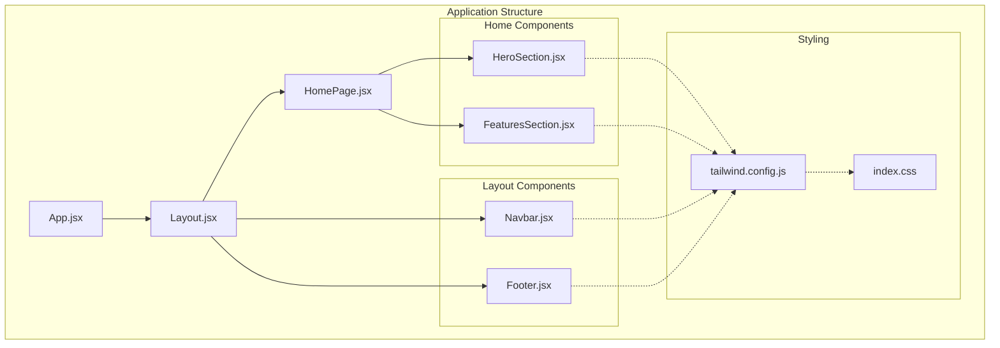
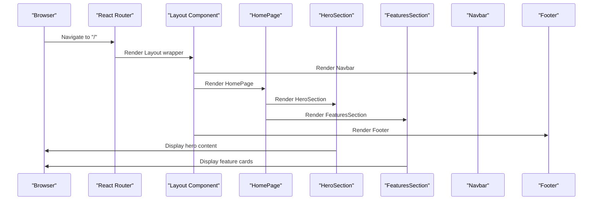
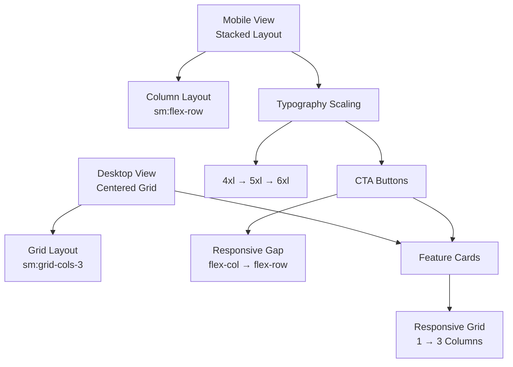
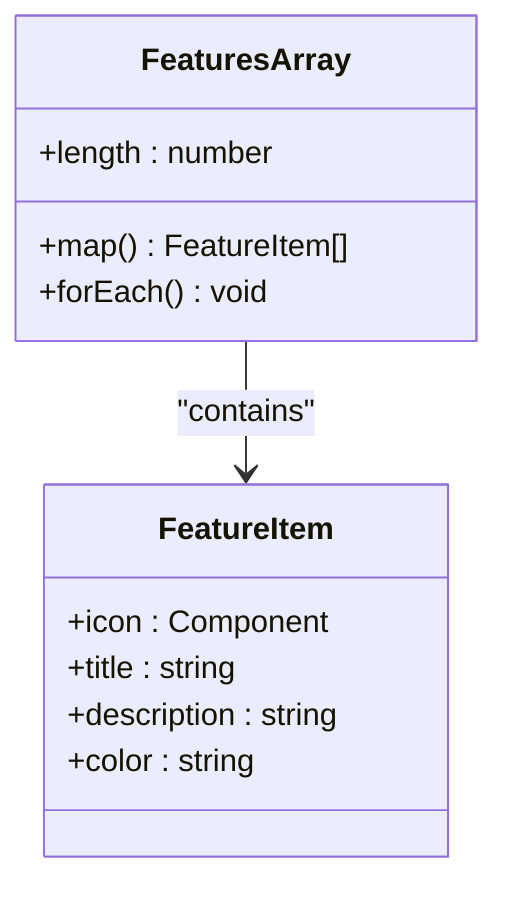
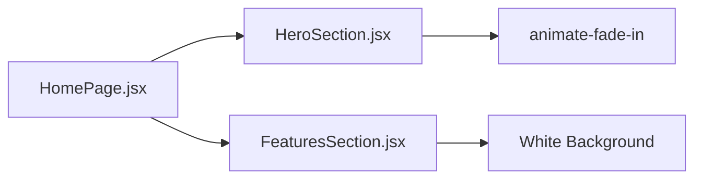
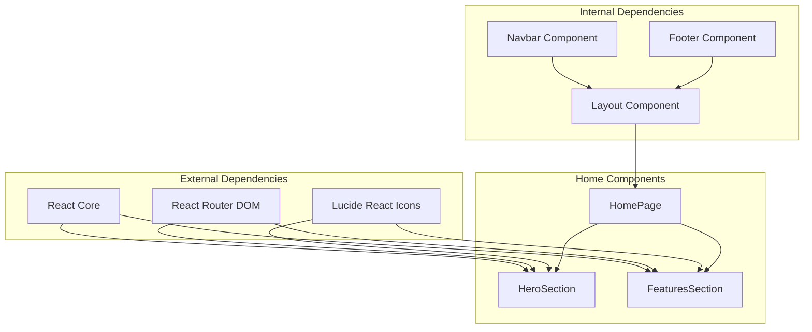

# Home & Features Components

<cite>
**Referenced Files in This Document**
- [HeroSection.jsx](file://frontend/src/components/Home/HeroSection.jsx)
- [FeaturesSection.jsx](file://frontend/src/components/Home/FeaturesSection.jsx)
- [HomePage.jsx](file://frontend/src/pages/HomePage.jsx)
- [Layout.jsx](file://frontend/src/components/Layout/Layout.jsx)
- [App.jsx](file://frontend/src/App.jsx)
- [Navbar.jsx](file://frontend/src/components/Layout/Navbar.jsx)
- [Footer.jsx](file://frontend/src/components/Layout/Footer.jsx)
- [tailwind.config.js](file://frontend/tailwind.config.js)
- [index.css](file://frontend/src/index.css)
</cite>

## Table of Contents
1. [Introduction](#introduction)
2. [Project Structure](#project-structure)
3. [Core Components](#core-components)
4. [Architecture Overview](#architecture-overview)
5. [Detailed Component Analysis](#detailed-component-analysis)
6. [Dependency Analysis](#dependency-analysis)
7. [Performance Considerations](#performance-considerations)
8. [Troubleshooting Guide](#troubleshooting-guide)
9. [Conclusion](#conclusion)

## Introduction
This document provides comprehensive technical documentation for the Smart Farming Advisor application's home page and feature showcase components. It focuses on the HeroSection and FeaturesSection components that serve as the primary engagement points on the landing page. The documentation covers component architecture, prop specifications, content structure requirements, responsive design implementations, integration patterns, styling variations, accessibility considerations, and user experience goals.

## Project Structure
The home page components are organized within a clear modular structure that separates concerns between layout, navigation, and content sections.

**Diagram sources**
- [App.jsx:1-20](file://frontend/src/App.jsx#L1-L20)
- [Layout.jsx:1-17](file://frontend/src/components/Layout/Layout.jsx#L1-L17)
- [HomePage.jsx:1-14](file://frontend/src/pages/HomePage.jsx#L1-L14)
- [HeroSection.jsx:1-67](file://frontend/src/components/Home/HeroSection.jsx#L1-L67)
- [FeaturesSection.jsx:1-84](file://frontend/src/components/Home/FeaturesSection.jsx#L1-L84)

**Section sources**
- [App.jsx:1-20](file://frontend/src/App.jsx#L1-L20)
- [Layout.jsx:1-17](file://frontend/src/components/Layout/Layout.jsx#L1-L17)
- [HomePage.jsx:1-14](file://frontend/src/pages/HomePage.jsx#L1-L14)

## Core Components
Both HeroSection and FeaturesSection components are designed as self-contained, reusable React functional components that require no props. They leverage Tailwind CSS for styling and Lucide React icons for visual elements.

### HeroSection Component
The HeroSection serves as the primary hero unit that introduces users to the Smart Farming Advisor platform. It features a visually striking gradient background with overlay effects, centered headline messaging, dual call-to-action buttons, and capability showcase cards.

### FeaturesSection Component
The FeaturesSection presents the application's core functionality through four feature cards, each highlighting a specific service area with associated benefits and statistics showcasing platform capabilities.

**Section sources**
- [HeroSection.jsx:4-67](file://frontend/src/components/Home/HeroSection.jsx#L4-L67)
- [FeaturesSection.jsx:30-84](file://frontend/src/components/Home/FeaturesSection.jsx#L30-L84)

## Architecture Overview
The components integrate seamlessly within the application's routing and layout system, following React best practices for component composition and state management.

**Diagram sources**
- [App.jsx:7-17](file://frontend/src/App.jsx#L7-L17)
- [Layout.jsx:4-13](file://frontend/src/components/Layout/Layout.jsx#L4-L13)
- [HomePage.jsx:4-11](file://frontend/src/pages/HomePage.jsx#L4-L11)
- [HeroSection.jsx:5-63](file://frontend/src/components/Home/HeroSection.jsx#L5-L63)
- [FeaturesSection.jsx:32-80](file://frontend/src/components/Home/FeaturesSection.jsx#L32-L80)

## Detailed Component Analysis

### HeroSection Component Analysis

#### Component Structure and Props
The HeroSection component is implemented as a pure functional component with no required props. It internally manages all content and styling requirements.

**Component Properties:**
- **Type:** Functional Component
- **Props:** None (no props required)
- **Returns:** JSX structure containing hero content
- **Dependencies:** react-router-dom Link, lucide-react icons

#### Content Structure and Visual Elements
The hero section follows a hierarchical content structure:

1. **Background Layering:**
   - Gradient overlay from agri-600 to agri-800
   - Radial gradient overlay for depth effect
   - Glass-morphism accent elements

2. **Primary Messaging:**
   - Tagline with leaf icon indicating AI-powered agriculture
   - Multi-line headline with brand emphasis
   - Supporting paragraph with benefit-focused copy

3. **Call-to-Action Buttons:**
   - Primary action button with hover animations
   - Secondary dashboard button with glass effect
   - Responsive flex layout for mobile optimization

4. **Capability Showcase:**
   - Three feature cards with icons
   - Real-time data indicators
   - Consistent styling with glass effect

#### Responsive Design Implementation
The component implements comprehensive responsive design patterns:

**Diagram sources**
- [HeroSection.jsx:10-62](file://frontend/src/components/Home/HeroSection.jsx#L10-L62)

#### Styling System and Color Palette
The component utilizes a custom agricultural-themed color palette defined in Tailwind CSS:

- **Agri Green Scale:** agri-50 to agri-900 for consistent branding
- **Earth Tones:** earth-50 to earth-900 for complementary elements
- **Glass Effects:** backdrop-blur-sm with opacity controls
- **Gradient Backgrounds:** radial and linear gradients for depth

#### Accessibility Considerations
The component incorporates several accessibility best practices:
- Semantic HTML structure with proper heading hierarchy
- Sufficient color contrast ratios for text elements
- Focus-visible states for interactive elements
- Screen reader friendly content structure
- Keyboard navigable interface elements

**Section sources**
- [HeroSection.jsx:1-67](file://frontend/src/components/Home/HeroSection.jsx#L1-L67)
- [tailwind.config.js:9-34](file://frontend/tailwind.config.js#L9-L34)

### FeaturesSection Component Analysis

#### Component Structure and Props
The FeaturesSection component operates as a static feature showcase with no external props required. It internally manages feature data and presentation logic.

**Component Properties:**
- **Type:** Functional Component
- **Props:** None (static content)
- **Returns:** JSX structure with feature cards
- **Dependencies:** lucide-react icons for feature representation

#### Feature Data Model
The component defines a structured feature array with consistent data patterns:

**Diagram sources**
- [FeaturesSection.jsx:3-28](file://frontend/src/components/Home/FeaturesSection.jsx#L3-L28)

#### Feature Presentation Pattern
Each feature card follows a consistent pattern:
1. **Icon Container:** Colored circular container with hover scaling
2. **Title Element:** Bold headline with consistent typography
3. **Description Text:** Benefit-focused copy with proper spacing
4. **Interactive States:** Hover effects with border transitions

#### Statistics Showcase
The component includes a statistics section displaying platform capabilities:
- Prediction accuracy percentage
- Crop variety count
- Weather update frequency
- Responsive divider elements for mobile layouts

#### Responsive Grid Implementation
The feature cards utilize a responsive grid system:
- **Mobile:** Single column layout (1 column)
- **Tablet:** Two column layout (2 columns)
- **Desktop:** Four column layout (4 columns)
- **Gap Management:** Consistent 8-unit spacing across breakpoints

**Section sources**
- [FeaturesSection.jsx:1-84](file://frontend/src/components/Home/FeaturesSection.jsx#L1-L84)

### Integration Patterns

#### Page Composition
The HomePage component serves as the orchestrator for both hero and feature sections:

**Diagram sources**
- [HomePage.jsx:4-11](file://frontend/src/pages/HomePage.jsx#L4-L11)
- [HeroSection.jsx:6](file://frontend/src/components/Home/HeroSection.jsx#L6)
- [FeaturesSection.jsx:32](file://frontend/src/components/Home/FeaturesSection.jsx#L32)

#### Layout Integration
Both components integrate seamlessly with the application's layout system:
- **Layout Wrapper:** Provides consistent navigation and footer
- **Content Flow:** Hero section immediately followed by features
- **Animation Integration:** Fade-in animation for smooth page transitions

**Section sources**
- [HomePage.jsx:1-14](file://frontend/src/pages/HomePage.jsx#L1-L14)
- [Layout.jsx:4-13](file://frontend/src/components/Layout/Layout.jsx#L4-L13)

## Dependency Analysis

### Component Dependencies
The home page components have minimal external dependencies, relying primarily on React ecosystem libraries:

**Diagram sources**
- [HeroSection.jsx:1-2](file://frontend/src/components/Home/HeroSection.jsx#L1-L2)
- [FeaturesSection.jsx:1](file://frontend/src/components/Home/FeaturesSection.jsx#L1)
- [HomePage.jsx:1-2](file://frontend/src/pages/HomePage.jsx#L1-L2)
- [Layout.jsx:1](file://frontend/src/components/Layout/Layout.jsx#L1)

### Styling Dependencies
The components rely on a comprehensive Tailwind CSS configuration:

- **Custom Color Scales:** Agri green and earth tone palettes
- **Animation Utilities:** Fade-in and slide-up transitions
- **Glass Morphism:** Backdrop blur and transparency effects
- **Responsive Breakpoints:** Mobile-first design approach

**Section sources**
- [tailwind.config.js:1-57](file://frontend/tailwind.config.js#L1-L57)
- [index.css:1-23](file://frontend/src/index.css#L1-L23)

## Performance Considerations
The components are optimized for performance through several design patterns:

### Rendering Optimization
- **Pure Components:** No internal state management reduces re-render cycles
- **Static Content:** Minimal dynamic content reduces computational overhead
- **Efficient Grid Layout:** CSS Grid provides optimal rendering performance

### Bundle Size Impact
- **Icon Loading:** Lucide React icons are tree-shaken for optimal bundle size
- **CSS Utilities:** Tailwind utilities are scoped to component usage
- **Minimal Dependencies:** Only essential libraries are included

### Accessibility Performance
- **Semantic Markup:** Proper HTML structure improves SEO and accessibility
- **Keyboard Navigation:** Full keyboard support reduces interaction latency
- **Screen Reader Compatibility:** ARIA-friendly markup for assistive technologies

## Troubleshooting Guide

### Common Issues and Solutions

#### Styling Problems
**Issue:** Components appear unstyled or incorrectly sized
**Solution:** Verify Tailwind CSS configuration and ensure proper build process

#### Routing Issues
**Issue:** Navigation links not functioning correctly
**Solution:** Check React Router configuration and ensure proper route definitions

#### Responsive Display Problems
**Issue:** Components not displaying correctly on mobile devices
**Solution:** Verify responsive breakpoint classes and viewport meta tags

#### Accessibility Concerns
**Issue:** Screen reader compatibility issues
**Solution:** Implement proper ARIA attributes and focus management

### Debugging Strategies
1. **Console Inspection:** Use browser developer tools to inspect component rendering
2. **Network Analysis:** Monitor asset loading and dependency resolution
3. **Performance Profiling:** Analyze component render performance and memory usage
4. **Accessibility Testing:** Use automated tools to verify WCAG compliance

**Section sources**
- [HeroSection.jsx:1-67](file://frontend/src/components/Home/HeroSection.jsx#L1-L67)
- [FeaturesSection.jsx:1-84](file://frontend/src/components/Home/FeaturesSection.jsx#L1-L84)

## Conclusion
The HeroSection and FeaturesSection components form the cornerstone of the Smart Farming Advisor application's landing page experience. Their thoughtful design balances aesthetic appeal with functional effectiveness, providing users with clear value propositions and intuitive navigation paths. The components demonstrate modern React development practices through their pure functional approach, comprehensive responsive design, and integration with the application's broader architectural patterns.

The implementation successfully achieves its user experience goals by:
- Establishing clear brand identity through visual design
- Communicating core value propositions effectively
- Providing intuitive navigation pathways
- Ensuring accessibility compliance
- Maintaining performance optimization
- Supporting scalability for future enhancements

These components serve as excellent examples of modern web development practices while delivering practical solutions for agricultural technology adoption.