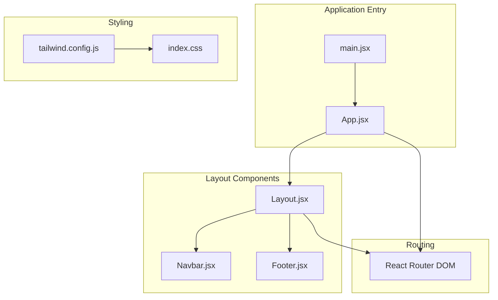
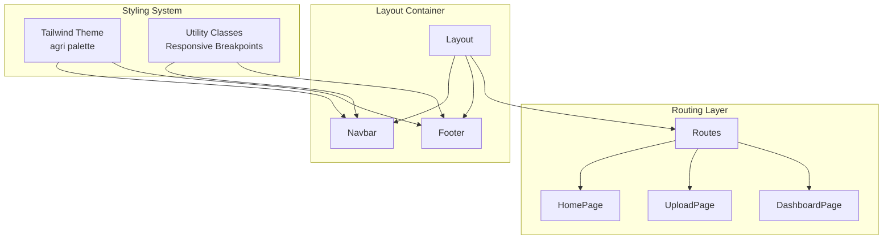
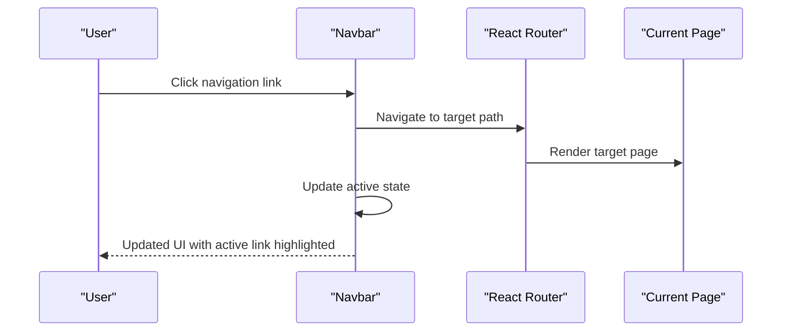
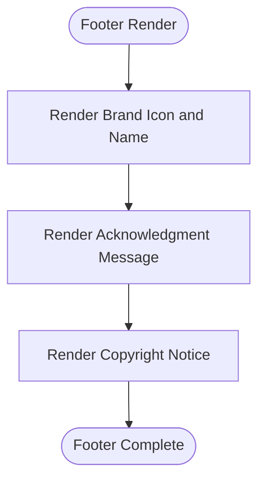
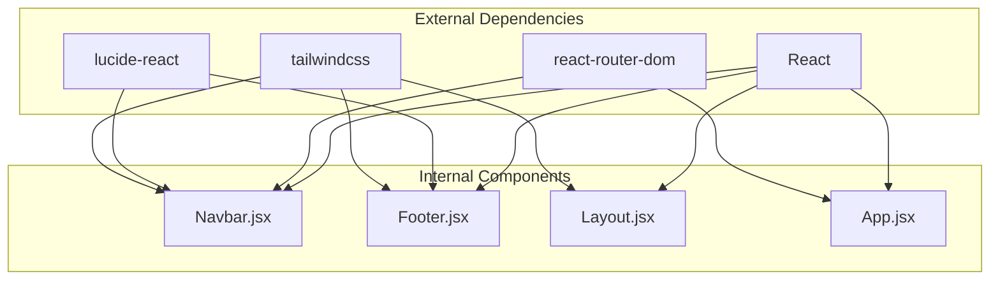

# Layout Components

<cite>
**Referenced Files in This Document**
- [Navbar.jsx](file://frontend/src/components/Layout/Navbar.jsx)
- [Footer.jsx](file://frontend/src/components/Layout/Footer.jsx)
- [Layout.jsx](file://frontend/src/components/Layout/Layout.jsx)
- [App.jsx](file://frontend/src/App.jsx)
- [main.jsx](file://frontend/src/main.jsx)
- [index.css](file://frontend/src/index.css)
- [tailwind.config.js](file://frontend/tailwind.config.js)
- [package.json](file://frontend/package.json)
</cite>

## Table of Contents
1. [Introduction](#introduction)
2. [Project Structure](#project-structure)
3. [Core Components](#core-components)
4. [Architecture Overview](#architecture-overview)
5. [Detailed Component Analysis](#detailed-component-analysis)
6. [Dependency Analysis](#dependency-analysis)
7. [Performance Considerations](#performance-considerations)
8. [Troubleshooting Guide](#troubleshooting-guide)
9. [Conclusion](#conclusion)

## Introduction
This document provides comprehensive documentation for the layout components that form the structural foundation of the Smart Farming Advisor application. It covers the Navbar component (navigation links, responsive behavior, and mobile menu), the Footer component (copyright information, links, and layout), and the main Layout component that orchestrates page structure and ensures consistent spacing. The documentation explains the props interfaces, styling approach with Tailwind CSS, responsive breakpoints, and integration with the routing system. It also includes customization options, theme integration, accessibility features, and the overall layout philosophy that creates a cohesive user experience.

## Project Structure
The layout components are organized under the frontend/src/components/Layout directory and integrate with the routing system defined in App.jsx. The main entry point wraps the application with routing and context providers, while Tailwind CSS provides the theming and responsive utilities.



**Diagram sources**
- [main.jsx:1-17](file://frontend/src/main.jsx#L1-L17)
- [App.jsx:1-20](file://frontend/src/App.jsx#L1-L20)
- [Layout.jsx:1-17](file://frontend/src/components/Layout/Layout.jsx#L1-L17)
- [Navbar.jsx:1-80](file://frontend/src/components/Layout/Navbar.jsx#L1-L80)
- [Footer.jsx:1-27](file://frontend/src/components/Layout/Footer.jsx#L1-L27)
- [tailwind.config.js:1-57](file://frontend/tailwind.config.js#L1-L57)
- [index.css:1-23](file://frontend/src/index.css#L1-L23)

**Section sources**
- [main.jsx:1-17](file://frontend/src/main.jsx#L1-L17)
- [App.jsx:1-20](file://frontend/src/App.jsx#L1-L20)
- [Layout.jsx:1-17](file://frontend/src/components/Layout/Layout.jsx#L1-L17)
- [Navbar.jsx:1-80](file://frontend/src/components/Layout/Navbar.jsx#L1-L80)
- [Footer.jsx:1-27](file://frontend/src/components/Layout/Footer.jsx#L1-L27)
- [tailwind.config.js:1-57](file://frontend/tailwind.config.js#L1-L57)
- [index.css:1-23](file://frontend/src/index.css#L1-L23)

## Core Components
This section documents the three primary layout components and their roles in the application.

- Navbar: Provides top-level navigation, responsive behavior, and a mobile menu toggle.
- Footer: Displays branding, acknowledgments, and copyright information.
- Layout: Wraps pages with the Navbar and Footer, ensuring consistent spacing and structure.

Props and behavior:
- Navbar: No props required. Uses react-router-dom for navigation and Lucide icons for UI elements.
- Footer: No props required. Renders static content with thematic styling.
- Layout: Accepts children prop to render page content between Navbar and Footer.

Styling approach:
- Tailwind CSS classes define responsive layouts, colors, typography, and animations.
- Theme colors are defined in tailwind.config.js under the agri palette.
- index.css sets base styles and utility classes for glass-like effects.

Responsive breakpoints:
- Mobile-first design with hidden and visible toggles at md and sm breakpoints.
- Navbar switches from desktop horizontal links to a collapsible mobile menu.

Integration with routing:
- App.jsx defines routes for Home, Upload, and Dashboard pages.
- Layout.jsx renders the Navbar and Footer around the routed content.

Accessibility features:
- Semantic HTML structure with nav and footer elements.
- Focusable interactive elements with keyboard navigation support.
- Icons with appropriate contrast and sizing for readability.

Customization options:
- Theme colors can be adjusted in tailwind.config.js.
- Typography and animations can be extended in tailwind.config.js.
- Additional utility classes can be added in index.css.

**Section sources**
- [Navbar.jsx:1-80](file://frontend/src/components/Layout/Navbar.jsx#L1-L80)
- [Footer.jsx:1-27](file://frontend/src/components/Layout/Footer.jsx#L1-L27)
- [Layout.jsx:1-17](file://frontend/src/components/Layout/Layout.jsx#L1-L17)
- [App.jsx:1-20](file://frontend/src/App.jsx#L1-L20)
- [tailwind.config.js:1-57](file://frontend/tailwind.config.js#L1-L57)
- [index.css:1-23](file://frontend/src/index.css#L1-L23)

## Architecture Overview
The layout architecture follows a container pattern where Layout serves as the page wrapper, embedding Navbar and Footer around dynamic content managed by React Router. The theming system is centralized in Tailwind CSS, enabling consistent styling across components.



**Diagram sources**
- [App.jsx:1-20](file://frontend/src/App.jsx#L1-L20)
- [Layout.jsx:1-17](file://frontend/src/components/Layout/Layout.jsx#L1-L17)
- [Navbar.jsx:1-80](file://frontend/src/components/Layout/Navbar.jsx#L1-L80)
- [Footer.jsx:1-27](file://frontend/src/components/Layout/Footer.jsx#L1-L27)
- [tailwind.config.js:1-57](file://frontend/tailwind.config.js#L1-L57)

## Detailed Component Analysis

### Navbar Component
The Navbar component provides navigation across the application with responsive behavior and a mobile menu toggle.

Key features:
- Navigation links for Home, Analyze (Upload), and Dashboard.
- Active state highlighting based on current route.
- Responsive design switching between desktop and mobile views.
- Animated mobile menu with fade-in transitions.

Props interface:
- None. Uses react-router-dom for navigation and Lucide icons for UI elements.

Styling approach:
- Uses Tailwind CSS classes for layout, colors, and animations.
- Thematic colors from the agri palette for consistent branding.
- Backdrop blur effect for modern glass-like appearance.

Responsive behavior:
- Desktop: Horizontal navigation bar with hover states.
- Mobile: Hamburger menu icon that toggles a collapsible drawer.
- Breakpoints: Hidden on small screens, visible from md and up.

Mobile menu functionality:
- State management for open/close toggle.
- Click handlers to close the menu after navigation selection.
- Smooth animations for opening and closing.

Accessibility features:
- Semantic button elements with clear focus states.
- Keyboard navigable menu items.
- Proper contrast ratios for text and backgrounds.

Customization options:
- Add new navigation items by extending the navLinks array.
- Modify active state styling by adjusting Tailwind classes.
- Change breakpoint thresholds by updating responsive utility classes.



**Diagram sources**
- [Navbar.jsx:15-16](file://frontend/src/components/Layout/Navbar.jsx#L15-L16)
- [Navbar.jsx:30-44](file://frontend/src/components/Layout/Navbar.jsx#L30-L44)
- [Navbar.jsx:55-74](file://frontend/src/components/Layout/Navbar.jsx#L55-L74)

**Section sources**
- [Navbar.jsx:1-80](file://frontend/src/components/Layout/Navbar.jsx#L1-L80)
- [App.jsx:1-20](file://frontend/src/App.jsx#L1-L20)
- [tailwind.config.js:1-57](file://frontend/tailwind.config.js#L1-L57)
- [index.css:1-23](file://frontend/src/index.css#L1-L23)

### Footer Component
The Footer component displays branding, acknowledgments, and copyright information with a cohesive design aligned to the application theme.

Key features:
- Application branding with icon and name.
- Acknowledgment message with heart icon.
- Copyright notice with current year.
- Responsive layout adapting to screen sizes.

Props interface:
- None. Renders static content with thematic styling.

Styling approach:
- Uses Tailwind CSS classes for layout and color theming.
- Dark theme background with light text for contrast.
- Responsive flex layout for alignment across devices.

Responsive behavior:
- Stacked layout on small screens.
- Side-by-side layout on medium screens and above.

Accessibility features:
- Semantic footer element.
- Sufficient color contrast for readability.
- Clear visual hierarchy for content sections.

Customization options:
- Modify text content for acknowledgment or copyright.
- Adjust color palette by changing Tailwind color classes.
- Update layout by modifying flex utilities.



**Diagram sources**
- [Footer.jsx:3-24](file://frontend/src/components/Layout/Footer.jsx#L3-L24)

**Section sources**
- [Footer.jsx:1-27](file://frontend/src/components/Layout/Footer.jsx#L1-L27)
- [tailwind.config.js:1-57](file://frontend/tailwind.config.js#L1-L57)
- [index.css:1-23](file://frontend/src/index.css#L1-L23)

### Layout Component
The Layout component orchestrates the overall page structure, ensuring consistent spacing and rendering of Navbar and Footer around dynamic content.

Key features:
- Minimal height layout with flexbox for sticky footer behavior.
- Centralized content area with flexible growth.
- Consistent background color and spacing.

Props interface:
- children: React node(s) to render within the main content area.

Styling approach:
- Flexbox layout for vertical arrangement.
- Background color from the agri palette for subtle branding.
- Responsive padding and max-width constraints.

Integration with routing:
- Wraps Routes defined in App.jsx.
- Ensures Navbar and Footer are present on all pages.

Accessibility features:
- Semantic div structure for content areas.
- Maintains focus order with header and footer elements.

Customization options:
- Modify background color by changing Tailwind color classes.
- Adjust spacing by updating padding and margin utilities.
- Add global styles in index.css for additional effects.

```mermaid
classDiagram
class Layout {
+children : ReactNode
+render() JSX.Element
}
class Navbar {
+render() JSX.Element
}
class Footer {
+render() JSX.Element
}
Layout --> Navbar : "renders"
Layout --> Footer : "renders"
Layout --> "children" : "renders content"
```

**Diagram sources**
- [Layout.jsx:4-14](file://frontend/src/components/Layout/Layout.jsx#L4-L14)
- [Navbar.jsx:1-80](file://frontend/src/components/Layout/Navbar.jsx#L1-L80)
- [Footer.jsx:1-27](file://frontend/src/components/Layout/Footer.jsx#L1-L27)

**Section sources**
- [Layout.jsx:1-17](file://frontend/src/components/Layout/Layout.jsx#L1-L17)
- [App.jsx:1-20](file://frontend/src/App.jsx#L1-L20)
- [tailwind.config.js:1-57](file://frontend/tailwind.config.js#L1-L57)
- [index.css:1-23](file://frontend/src/index.css#L1-L23)

## Dependency Analysis
The layout components depend on React Router for navigation, Tailwind CSS for styling, and Lucide React for icons. The main entry point initializes routing and context providers before rendering the application.



**Diagram sources**
- [package.json:11-27](file://frontend/package.json#L11-L27)
- [Navbar.jsx:1-3](file://frontend/src/components/Layout/Navbar.jsx#L1-L3)
- [Footer.jsx:1](file://frontend/src/components/Layout/Footer.jsx#L1)
- [Layout.jsx:1-2](file://frontend/src/components/Layout/Layout.jsx#L1-L2)
- [App.jsx:1-5](file://frontend/src/App.jsx#L1-L5)

**Section sources**
- [package.json:1-29](file://frontend/package.json#L1-L29)
- [main.jsx:1-17](file://frontend/src/main.jsx#L1-L17)
- [Navbar.jsx:1-80](file://frontend/src/components/Layout/Navbar.jsx#L1-L80)
- [Footer.jsx:1-27](file://frontend/src/components/Layout/Footer.jsx#L1-L27)
- [Layout.jsx:1-17](file://frontend/src/components/Layout/Layout.jsx#L1-L17)
- [App.jsx:1-20](file://frontend/src/App.jsx#L1-L20)

## Performance Considerations
- Component composition: The Layout component minimizes re-renders by wrapping pages efficiently.
- CSS utilities: Tailwind classes are scoped to components, avoiding global style conflicts.
- Responsive design: Mobile-first approach reduces unnecessary rendering on smaller screens.
- Theme consistency: Centralized color definitions reduce style computation overhead.

## Troubleshooting Guide
Common issues and resolutions:
- Navigation not highlighting: Verify isActive logic matches route paths and that react-router is properly initialized.
- Mobile menu not closing: Ensure click handlers update the isOpen state and that menu items trigger navigation.
- Styling inconsistencies: Confirm Tailwind configuration includes the agri palette and that utility classes match the intended theme.
- Routing problems: Check that Layout wraps Routes and that App.jsx defines all necessary routes.

Accessibility checks:
- Verify keyboard navigation works for all interactive elements.
- Ensure sufficient color contrast for text and backgrounds.
- Test focus indicators and tab order across components.

**Section sources**
- [Navbar.jsx:15-16](file://frontend/src/components/Layout/Navbar.jsx#L15-L16)
- [Navbar.jsx:46-51](file://frontend/src/components/Layout/Navbar.jsx#L46-L51)
- [Footer.jsx:5](file://frontend/src/components/Layout/Footer.jsx#L5)
- [Layout.jsx:6](file://frontend/src/components/Layout/Layout.jsx#L6)
- [tailwind.config.js:9-34](file://frontend/tailwind.config.js#L9-L34)

## Conclusion
The layout components provide a cohesive and accessible foundation for the Smart Farming Advisor application. The Navbar offers intuitive navigation with responsive behavior, the Footer delivers consistent branding and acknowledgments, and the Layout component ensures uniform spacing and structure across all pages. Together, they leverage Tailwind CSS theming and responsive utilities to create a professional, user-friendly experience tailored to agricultural stakeholders. The modular design allows for easy customization and extension while maintaining visual consistency and accessibility standards.