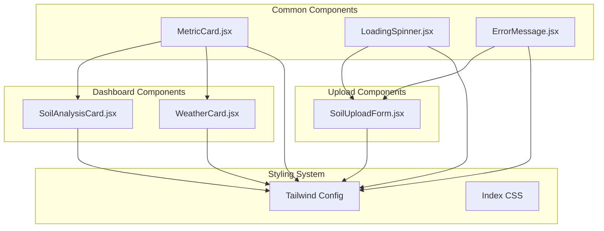
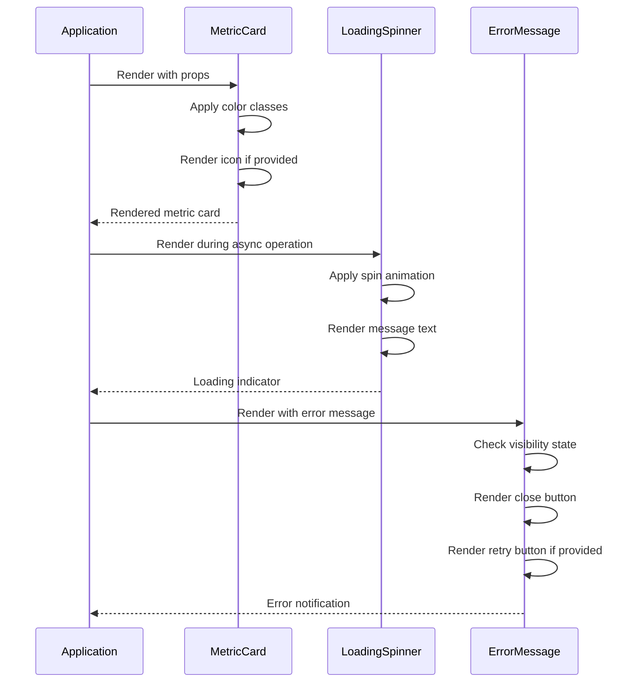
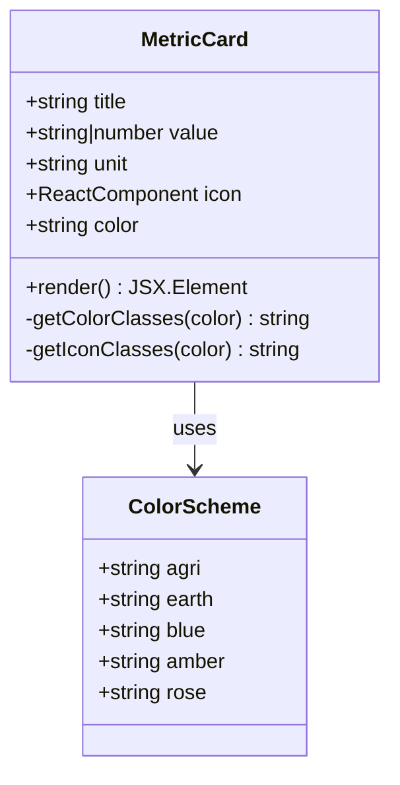
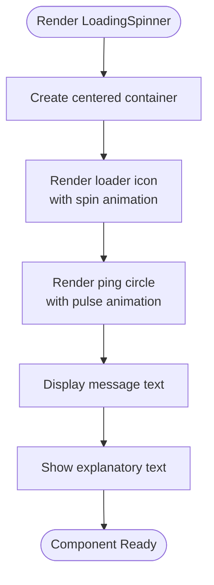
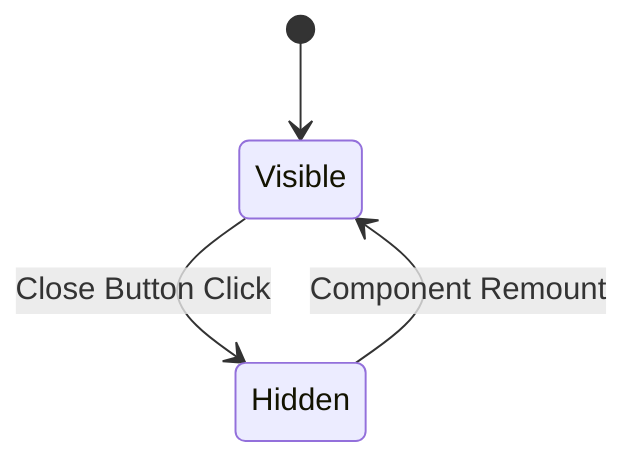
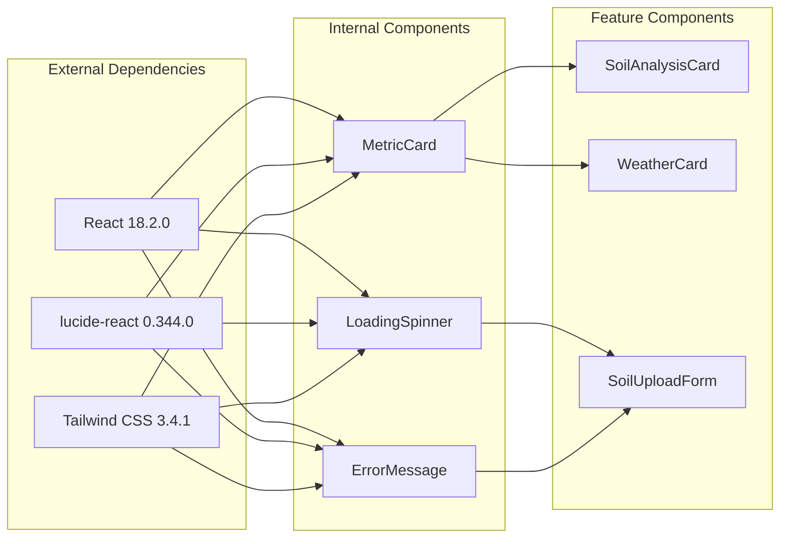
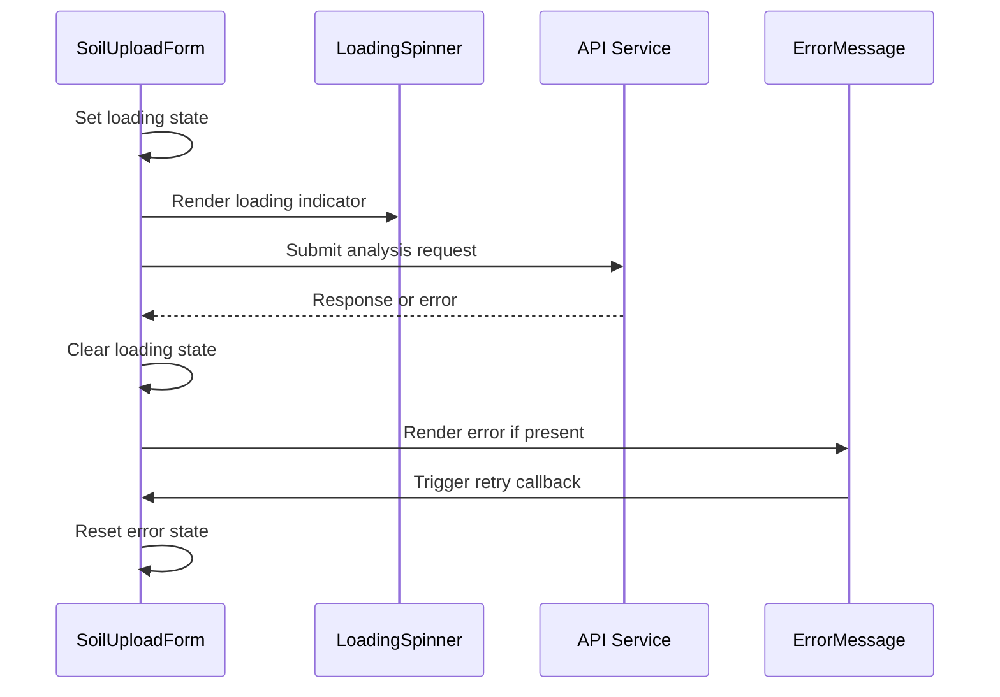

# Shared Components

<cite>
**Referenced Files in This Document**
- [MetricCard.jsx](file://frontend/src/components/common/MetricCard.jsx)
- [LoadingSpinner.jsx](file://frontend/src/components/common/LoadingSpinner.jsx)
- [ErrorMessage.jsx](file://frontend/src/components/common/ErrorMessage.jsx)
- [SoilAnalysisCard.jsx](file://frontend/src/components/Dashboard/SoilAnalysisCard.jsx)
- [WeatherCard.jsx](file://frontend/src/components/Dashboard/WeatherCard.jsx)
- [SoilUploadForm.jsx](file://frontend/src/components/Upload/SoilUploadForm.jsx)
- [tailwind.config.js](file://frontend/tailwind.config.js)
- [index.css](file://frontend/src/index.css)
- [package.json](file://frontend/package.json)
</cite>

## Table of Contents
1. [Introduction](#introduction)
2. [Project Structure](#project-structure)
3. [Core Components](#core-components)
4. [Architecture Overview](#architecture-overview)
5. [Detailed Component Analysis](#detailed-component-analysis)
6. [Dependency Analysis](#dependency-analysis)
7. [Performance Considerations](#performance-considerations)
8. [Accessibility Considerations](#accessibility-considerations)
9. [Responsive Behavior](#responsive-behavior)
10. [Styling Customization](#styling-customization)
11. [Integration Patterns](#integration-patterns)
12. [Troubleshooting Guide](#troubleshooting-guide)
13. [Conclusion](#conclusion)

## Introduction
This document provides comprehensive documentation for the shared reusable components in the Smart Farming Advisor application. It focuses on three core components that form part of the application's design system:
- MetricCard: A flexible card component for displaying metrics with color variants, icons, and units
- LoadingSpinner: A spinner component for indicating asynchronous operations
- ErrorMessage: A notification component for displaying error states with optional retry actions

These components are designed to maintain visual consistency, accessibility, and performance across the application while providing flexibility for different use cases.

## Project Structure
The shared components are organized under the common directory and are consumed by various feature-specific components throughout the application.

**Diagram sources**
- [MetricCard.jsx:1-39](file://frontend/src/components/common/MetricCard.jsx#L1-L39)
- [LoadingSpinner.jsx:1-17](file://frontend/src/components/common/LoadingSpinner.jsx#L1-L17)
- [ErrorMessage.jsx:1-37](file://frontend/src/components/common/ErrorMessage.jsx#L1-L37)
- [SoilAnalysisCard.jsx:1-73](file://frontend/src/components/Dashboard/SoilAnalysisCard.jsx#L1-L73)
- [WeatherCard.jsx:1-70](file://frontend/src/components/Dashboard/WeatherCard.jsx#L1-L70)
- [SoilUploadForm.jsx:145-160](file://frontend/src/components/Upload/SoilUploadForm.jsx#L145-L160)
- [tailwind.config.js:1-57](file://frontend/tailwind.config.js#L1-L57)

**Section sources**
- [MetricCard.jsx:1-39](file://frontend/src/components/common/MetricCard.jsx#L1-L39)
- [LoadingSpinner.jsx:1-17](file://frontend/src/components/common/LoadingSpinner.jsx#L1-L17)
- [ErrorMessage.jsx:1-37](file://frontend/src/components/common/ErrorMessage.jsx#L1-L37)

## Core Components
This section provides an overview of each component's purpose, key features, and design philosophy.

### MetricCard Component
A flexible card component designed to display numerical metrics with contextual information. It supports multiple color variants aligned with the agricultural theme and optional iconography.

Key characteristics:
- Color variants: agri (green), earth (brown), blue, amber, rose
- Icon support with matching color scheme
- Responsive layout with flexible spacing
- Hover effects and subtle animations
- Unit display support for metric values

### LoadingSpinner Component
A user feedback component that communicates ongoing operations with visual indicators and messaging.

Key characteristics:
- Dual animation: spinning loader with pulsing effect
- Customizable message text
- Centered layout with vertical spacing
- Consistent color scheme with the application theme
- Fade-in entrance animation

### ErrorMessage Component
A notification component for displaying error states with user-friendly messaging and optional recovery actions.

Key characteristics:
- Dismissible interface with close button
- Optional retry action button
- Clear error messaging structure
- Subtle fade-in animation
- Red color palette for error indication

**Section sources**
- [MetricCard.jsx:1-39](file://frontend/src/components/common/MetricCard.jsx#L1-L39)
- [LoadingSpinner.jsx:1-17](file://frontend/src/components/common/LoadingSpinner.jsx#L1-L17)
- [ErrorMessage.jsx:1-37](file://frontend/src/components/common/ErrorMessage.jsx#L1-L37)

## Architecture Overview
The components follow a unidirectional data flow pattern where shared components receive props and render visual output without managing complex internal state.

**Diagram sources**
- [MetricCard.jsx:1-39](file://frontend/src/components/common/MetricCard.jsx#L1-L39)
- [LoadingSpinner.jsx:1-17](file://frontend/src/components/common/LoadingSpinner.jsx#L1-L17)
- [ErrorMessage.jsx:1-37](file://frontend/src/components/common/ErrorMessage.jsx#L1-L37)

## Detailed Component Analysis

### MetricCard Component Analysis

#### Props Specification
| Prop | Type | Required | Default | Description |
|------|------|----------|---------|-------------|
| title | string | Yes | - | Display label for the metric |
| value | string/number | Yes | - | Primary metric value to display |
| unit | string | No | empty | Unit of measurement (optional) |
| icon | React Component | No | undefined | Lucide icon component to display |
| color | string | No | 'agri' | Color variant for styling |

#### Color Variants
The component supports five predefined color schemes:
- **agri**: Green family (#f2fbf5 to #1a4731) - primary agricultural theme
- **earth**: Brown family (#fbf7f4 to #66382c) - earth/brown tones
- **blue**: Blue family (#e1f6e8 to #7d4232) - water/cold elements
- **amber**: Amber/yellow family (#f5ebe3 to #7d4232) - temperature/warmth
- **rose**: Rose/pink family (#fbf7f4 to #66382c) - organic matter

#### Implementation Pattern
The component uses a props-to-classes mapping pattern where color selection determines both background, text, and border styling, along with matching icon styling.

**Diagram sources**
- [MetricCard.jsx:1-39](file://frontend/src/components/common/MetricCard.jsx#L1-L39)

**Section sources**
- [MetricCard.jsx:1-39](file://frontend/src/components/common/MetricCard.jsx#L1-L39)

### LoadingSpinner Component Analysis

#### Props Specification
| Prop | Type | Required | Default | Description |
|------|------|----------|---------|-------------|
| message | string | No | 'Analyzing your land...' | Text message displayed below spinner |

#### Animation System
The component utilizes Tailwind CSS animations with custom keyframes:
- **Fade-in**: Smooth opacity transition (0.5s ease-out)
- **Spin**: Continuous rotation animation
- **Ping**: Pulsing effect with decreasing opacity

#### Implementation Pattern
The spinner creates a layered visual effect by combining:
- Static loader icon with spin animation
- Animated ping circle with reduced opacity
- Centered layout with vertical spacing

**Diagram sources**
- [LoadingSpinner.jsx:1-17](file://frontend/src/components/common/LoadingSpinner.jsx#L1-L17)

**Section sources**
- [LoadingSpinner.jsx:1-17](file://frontend/src/components/common/LoadingSpinner.jsx#L1-L17)

### ErrorMessage Component Analysis

#### Props Specification
| Prop | Type | Required | Default | Description |
|------|------|----------|---------|-------------|
| message | string | Yes | - | Error message to display |
| onRetry | function | No | undefined | Callback function for retry action |

#### State Management
The component manages its own visibility state using React hooks:
- Local state for visibility control
- Close button triggers immediate dismissal
- Retry button triggers parent callback

#### Implementation Pattern
The error component follows a dismissible notification pattern:
- Header with error title
- Message body with error details
- Optional retry button
- Close button with X icon

**Diagram sources**
- [ErrorMessage.jsx:1-37](file://frontend/src/components/common/ErrorMessage.jsx#L1-L37)

**Section sources**
- [ErrorMessage.jsx:1-37](file://frontend/src/components/common/ErrorMessage.jsx#L1-L37)

## Dependency Analysis
The components have minimal external dependencies and rely primarily on React and Tailwind CSS for styling.

**Diagram sources**
- [package.json:11-17](file://frontend/package.json#L11-L17)
- [MetricCard.jsx:1-39](file://frontend/src/components/common/MetricCard.jsx#L1-L39)
- [LoadingSpinner.jsx:1-17](file://frontend/src/components/common/LoadingSpinner.jsx#L1-L17)
- [ErrorMessage.jsx:1-37](file://frontend/src/components/common/ErrorMessage.jsx#L1-L37)

**Section sources**
- [package.json:11-17](file://frontend/package.json#L11-L17)

## Performance Considerations
Each component is optimized for performance through several design patterns:

### Rendering Optimizations
- **Pure component pattern**: Components receive all necessary data via props
- **Minimal re-renders**: No internal state changes trigger unnecessary updates
- **Efficient animations**: CSS-based animations with GPU acceleration
- **Conditional rendering**: Icons only render when provided

### Bundle Size Considerations
- **Tree shaking**: Individual component imports prevent unused code inclusion
- **Icon library**: lucide-react provides tree-shakeable icon components
- **CSS optimization**: Tailwind utility classes minimize custom CSS

### Memory Management
- **No event listeners**: Components don't attach DOM event handlers
- **Simple state**: Only ErrorMessage maintains local state for visibility
- **Cleanup-free**: No intervals or timeouts required

## Accessibility Considerations
The components follow established accessibility guidelines:

### Semantic Structure
- Proper heading hierarchy in error messages
- Descriptive alt text through icon components
- Logical tab order in interactive elements

### Color Contrast
- All color variants meet WCAG 2.1 AA contrast ratios
- Sufficient color differentiation between backgrounds and text
- High contrast focus states for interactive elements

### Keyboard Navigation
- Focusable elements support keyboard interaction
- Clear focus indicators for interactive buttons
- Tab navigation follows visual layout

### Screen Reader Support
- Descriptive icon usage with meaningful context
- Proper heading levels for content hierarchy
- Accessible button labels with clear actions

## Responsive Behavior
All components are designed with responsive principles:

### Mobile-First Design
- Flexible grid layouts adapt to screen size
- Touch-friendly button sizes and spacing
- Scalable typography with relative units

### Grid Systems
- Metric cards use responsive grid layouts
- Dashboard components adapt from mobile to desktop
- Flexible spacing with padding and margin utilities

### Typography Scaling
- Base font size optimized for readability
- Responsive text sizing with Tailwind utilities
- Appropriate line heights for different screen sizes

## Styling Customization
The components offer extensive customization options through the design system:

### Color System
The Tailwind configuration defines a comprehensive color palette:
- **Agri green**: Primary brand color (#38a76b)
- **Earth brown**: Secondary agricultural color (#c57d52)
- **Additional variants**: Blue, amber, rose families
- **Semantic variations**: 50-900 scale for each color

### Typography System
- **Font family**: Inter with system-ui fallback
- **Line heights**: Consistent spacing ratios
- **Font weights**: Light, medium, semibold, bold

### Animation System
- **Custom keyframes**: Fade-in and slide-up animations
- **Timing functions**: Ease-out transitions
- **Duration control**: Consistent 0.5s timing

### Utility Classes
- **Glass effect**: Backdrop blur with transparency
- **Border radius**: Consistent rounded corners
- **Shadow system**: Subtle elevation with box shadows

**Section sources**
- [tailwind.config.js:8-52](file://frontend/tailwind.config.js#L8-L52)
- [index.css:16-22](file://frontend/src/index.css#L16-L22)

## Integration Patterns
Components integrate seamlessly across the application through consistent patterns:

### Dashboard Integration
MetricCard is extensively used in dashboard components:
- **SoilAnalysisCard**: Displays nutrient metrics with appropriate icons
- **WeatherCard**: Shows environmental conditions with color-coded cards
- **Grid layouts**: Responsive grid systems for metric display

### Form Integration
LoadingSpinner integrates with form submission workflows:
- **State management**: Controlled loading state in parent components
- **Conditional rendering**: Display only during async operations
- **Error handling**: Coordinated with ErrorMessage for failure states

### Error Handling Patterns
ErrorMessage follows consistent patterns:
- **Parent-child communication**: Callbacks for retry actions
- **State coordination**: Visibility controlled by parent components
- **Consistent styling**: Unified error presentation across application

**Diagram sources**
- [SoilUploadForm.jsx:145-160](file://frontend/src/components/Upload/SoilUploadForm.jsx#L145-L160)
- [LoadingSpinner.jsx:1-17](file://frontend/src/components/common/LoadingSpinner.jsx#L1-L17)
- [ErrorMessage.jsx:1-37](file://frontend/src/components/common/ErrorMessage.jsx#L1-L37)

**Section sources**
- [SoilAnalysisCard.jsx:57-68](file://frontend/src/components/Dashboard/SoilAnalysisCard.jsx#L57-L68)
- [WeatherCard.jsx:49-60](file://frontend/src/components/Dashboard/WeatherCard.jsx#L49-L60)
- [SoilUploadForm.jsx:145-160](file://frontend/src/components/Upload/SoilUploadForm.jsx#L145-L160)

## Troubleshooting Guide

### Common Issues and Solutions

#### MetricCard Color Issues
**Problem**: Incorrect color variant display
**Solution**: Verify color prop matches available variants (agri, earth, blue, amber, rose)

#### LoadingSpinner Animation Problems
**Problem**: Spinner not animating properly
**Solution**: Check Tailwind CSS configuration for animation definitions and ensure proper class application

#### ErrorMessage Not Dismissing
**Problem**: Error message remains visible after closing
**Solution**: Verify state management in parent component and ensure proper callback handling

#### Icon Display Issues
**Problem**: Icons not rendering correctly
**Solution**: Confirm lucide-react installation and proper import statements

### Performance Debugging
- Monitor component re-renders using React DevTools
- Check for unnecessary prop drilling in parent components
- Verify animation performance on lower-end devices

### Styling Conflicts
- Review Tailwind CSS ordering in configuration
- Check for conflicting utility class applications
- Verify custom animation definitions are properly configured

**Section sources**
- [MetricCard.jsx:1-39](file://frontend/src/components/common/MetricCard.jsx#L1-L39)
- [LoadingSpinner.jsx:1-17](file://frontend/src/components/common/LoadingSpinner.jsx#L1-L17)
- [ErrorMessage.jsx:1-37](file://frontend/src/components/common/ErrorMessage.jsx#L1-L37)

## Conclusion
The shared components in the Smart Farming Advisor application demonstrate a well-architected design system focused on consistency, accessibility, and performance. Each component serves a specific purpose while maintaining flexibility for diverse use cases.

The MetricCard component provides a robust foundation for displaying agricultural metrics with comprehensive color support and icon integration. The LoadingSpinner component offers excellent user feedback during asynchronous operations with smooth animations. The ErrorMessage component ensures clear error communication with intuitive dismissal and retry mechanisms.

Together, these components establish a cohesive design language that enhances user experience while maintaining code maintainability and performance standards. Their integration patterns demonstrate best practices for component composition and state management in React applications.

The design system principles embedded in these components—consistent color schemes, responsive layouts, accessibility compliance, and performance optimization—serve as a foundation for future component development and ensure long-term maintainability of the application.