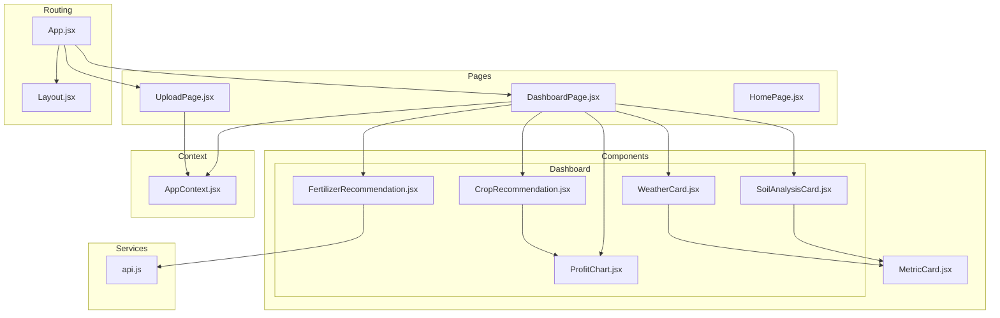
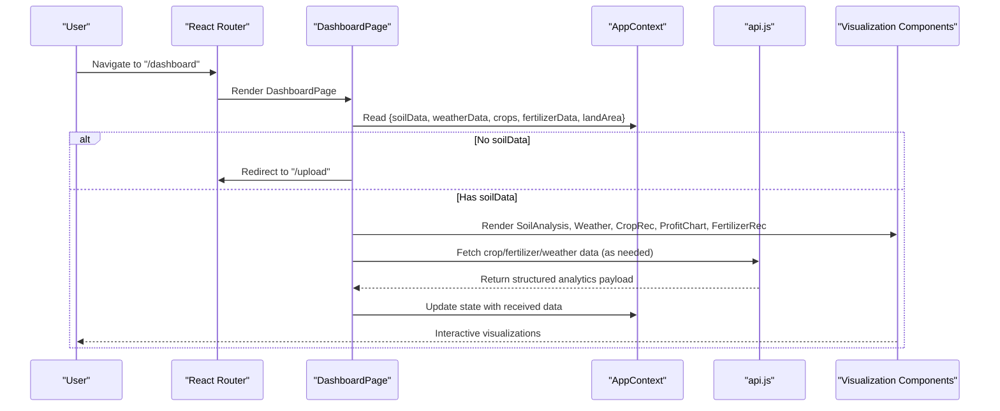
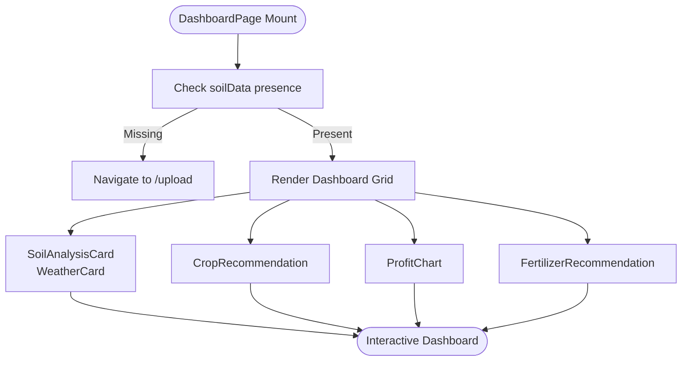
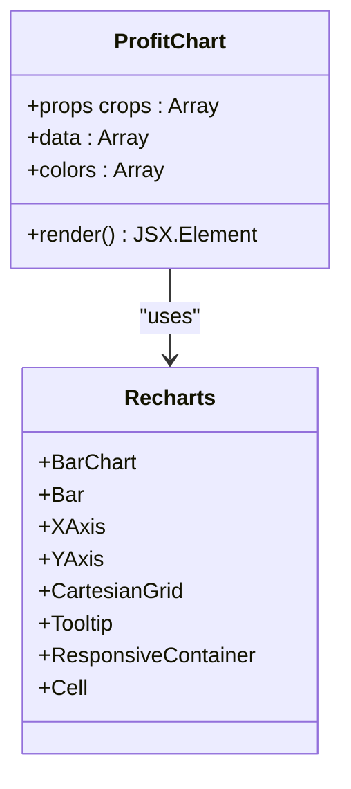
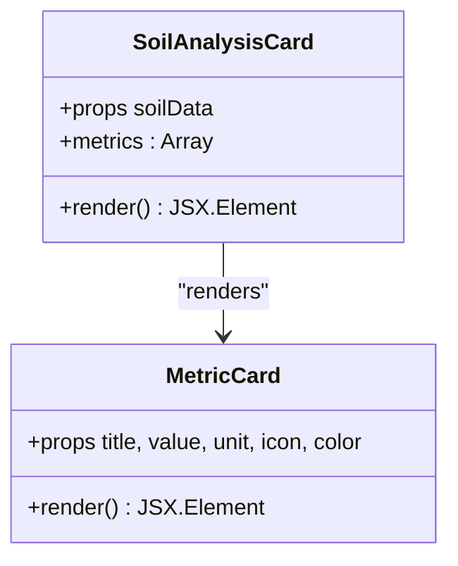
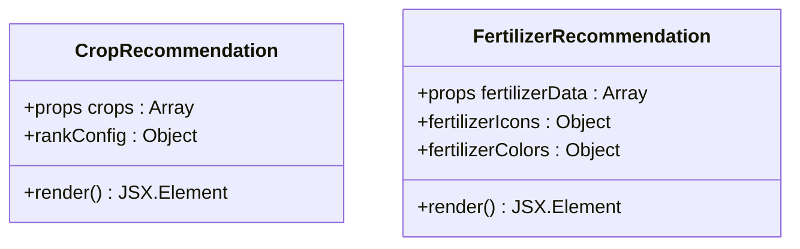
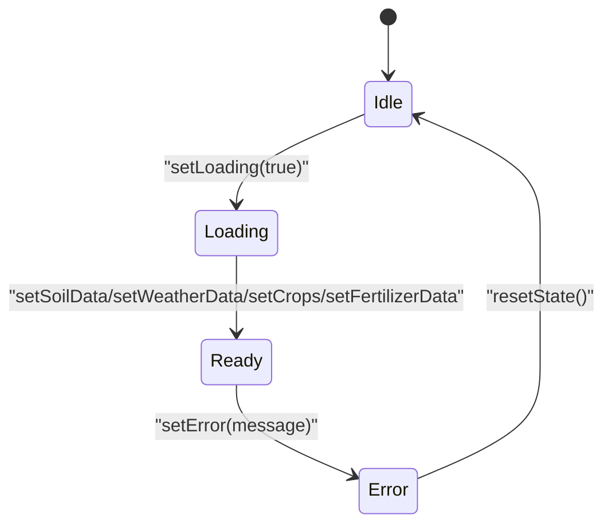
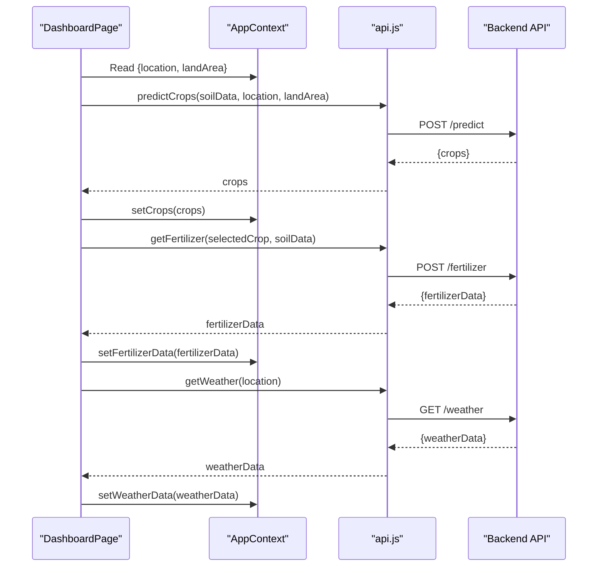
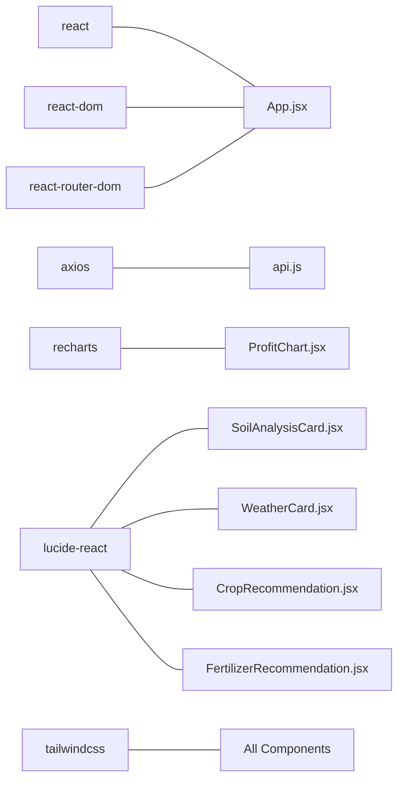

# Analytics Dashboard

<cite>
**Referenced Files in This Document**
- [DashboardPage.jsx](file://frontend/src/pages/DashboardPage.jsx)
- [ProfitChart.jsx](file://frontend/src/components/Dashboard/ProfitChart.jsx)
- [SoilAnalysisCard.jsx](file://frontend/src/components/Dashboard/SoilAnalysisCard.jsx)
- [WeatherCard.jsx](file://frontend/src/components/Dashboard/WeatherCard.jsx)
- [CropRecommendation.jsx](file://frontend/src/components/Dashboard/CropRecommendation.jsx)
- [FertilizerRecommendation.jsx](file://frontend/src/components/Dashboard/FertilizerRecommendation.jsx)
- [MetricCard.jsx](file://frontend/src/components/common/MetricCard.jsx)
- [AppContext.jsx](file://frontend/src/context/AppContext.jsx)
- [api.js](file://frontend/src/services/api.js)
- [App.jsx](file://frontend/src/App.jsx)
- [Layout.jsx](file://frontend/src/components/Layout/Layout.jsx)
- [UploadPage.jsx](file://frontend/src/pages/UploadPage.jsx)
- [package.json](file://frontend/package.json)
- [tailwind.config.js](file://frontend/tailwind.config.js)
</cite>

## Table of Contents
1. [Introduction](#introduction)
2. [Project Structure](#project-structure)
3. [Core Components](#core-components)
4. [Architecture Overview](#architecture-overview)
5. [Detailed Component Analysis](#detailed-component-analysis)
6. [Dependency Analysis](#dependency-analysis)
7. [Performance Considerations](#performance-considerations)
8. [Troubleshooting Guide](#troubleshooting-guide)
9. [Conclusion](#conclusion)
10. [Appendices](#appendices)

## Introduction
The Analytics Dashboard provides an agricultural decision-making interface that visualizes soil analysis, weather conditions, crop recommendations, fertilizer needs, and profit comparisons. It integrates with a backend API to fetch real-time data and presents insights through Recharts-based bar charts, metric cards, and recommendation summaries. The dashboard is built with React, styled using Tailwind CSS, and powered by a centralized context for state management.

## Project Structure
The frontend is organized around feature-based components under the src directory, with dedicated folders for pages, components, context, services, and shared UI elements. The dashboard page composes multiple specialized components that render data-driven visualizations.

**Diagram sources**
- [DashboardPage.jsx:1-68](file://frontend/src/pages/DashboardPage.jsx#L1-L68)
- [SoilAnalysisCard.jsx:1-74](file://frontend/src/components/Dashboard/SoilAnalysisCard.jsx#L1-L74)
- [WeatherCard.jsx:1-71](file://frontend/src/components/Dashboard/WeatherCard.jsx#L1-L71)
- [CropRecommendation.jsx:1-98](file://frontend/src/components/Dashboard/CropRecommendation.jsx#L1-L98)
- [FertilizerRecommendation.jsx:1-63](file://frontend/src/components/Dashboard/FertilizerRecommendation.jsx#L1-L63)
- [ProfitChart.jsx:1-71](file://frontend/src/components/Dashboard/ProfitChart.jsx#L1-L71)
- [MetricCard.jsx:1-39](file://frontend/src/components/common/MetricCard.jsx#L1-L39)
- [AppContext.jsx:1-53](file://frontend/src/context/AppContext.jsx#L1-L53)
- [api.js:1-86](file://frontend/src/services/api.js#L1-L86)
- [App.jsx:1-20](file://frontend/src/App.jsx#L1-L20)
- [Layout.jsx:1-17](file://frontend/src/components/Layout/Layout.jsx#L1-L17)

**Section sources**
- [App.jsx:1-20](file://frontend/src/App.jsx#L1-L20)
- [Layout.jsx:1-17](file://frontend/src/components/Layout/Layout.jsx#L1-L17)
- [DashboardPage.jsx:1-68](file://frontend/src/pages/DashboardPage.jsx#L1-L68)

## Core Components
- DashboardPage: Orchestrates the dashboard layout, redirects unauthenticated users, and renders all analytics components.
- SoilAnalysisCard: Displays nutrient metrics (Nitrogen, Phosphorus, Potassium, pH, Organic Matter) using reusable MetricCard components.
- WeatherCard: Shows current weather metrics (Temperature, Humidity, Rainfall) and location with a descriptive summary.
- CropRecommendation: Presents ranked crop suggestions with confidence indicators and expected profit visuals.
- ProfitChart: Renders a responsive bar chart comparing expected profits across recommended crops using Recharts.
- FertilizerRecommendation: Lists fertilizer needs (Urea, DAP, MOP) per hectare for each recommended crop.
- MetricCard: A generic card component for displaying single metrics with icons and color-coded themes.
- AppContext: Centralized state provider for soilData, weatherData, crops, fertilizerData, loading, error, location, and landArea.
- api.js: Axios-based service module exposing endpoints for crop prediction, fertilizer recommendation, weather retrieval, and soil image analysis.

**Section sources**
- [DashboardPage.jsx:11-68](file://frontend/src/pages/DashboardPage.jsx#L11-L68)
- [SoilAnalysisCard.jsx:4-74](file://frontend/src/components/Dashboard/SoilAnalysisCard.jsx#L4-L74)
- [WeatherCard.jsx:4-71](file://frontend/src/components/Dashboard/WeatherCard.jsx#L4-L71)
- [CropRecommendation.jsx:27-98](file://frontend/src/components/Dashboard/CropRecommendation.jsx#L27-L98)
- [ProfitChart.jsx:4-71](file://frontend/src/components/Dashboard/ProfitChart.jsx#L4-L71)
- [FertilizerRecommendation.jsx:15-63](file://frontend/src/components/Dashboard/FertilizerRecommendation.jsx#L15-L63)
- [MetricCard.jsx:1-39](file://frontend/src/components/common/MetricCard.jsx#L1-L39)
- [AppContext.jsx:13-52](file://frontend/src/context/AppContext.jsx#L13-L52)
- [api.js:33-86](file://frontend/src/services/api.js#L33-L86)

## Architecture Overview
The dashboard follows a unidirectional data flow:
- AppContext holds global state and exposes setters to update analytics data.
- DashboardPage reads state via useApp and conditionally renders components.
- api.js encapsulates backend communication and returns structured payloads.
- Components consume props and render visualizations with Tailwind styling and Recharts.

**Diagram sources**
- [DashboardPage.jsx:11-68](file://frontend/src/pages/DashboardPage.jsx#L11-L68)
- [AppContext.jsx:13-52](file://frontend/src/context/AppContext.jsx#L13-L52)
- [api.js:33-86](file://frontend/src/services/api.js#L33-L86)

## Detailed Component Analysis

### Dashboard Page Composition
- Layout and Navigation: Uses Layout wrapper and routes to switch between HomePage, UploadPage, and DashboardPage.
- Conditional Rendering: Redirects to UploadPage if soilData is missing; otherwise renders analytics grid.
- Grid Layout: Two-column layout for recommendations and charts on larger screens, responsive stacking on smaller screens.
- Interactive Elements: Back button to upload page, animated transitions for content appearance.

**Diagram sources**
- [DashboardPage.jsx:11-68](file://frontend/src/pages/DashboardPage.jsx#L11-L68)

**Section sources**
- [DashboardPage.jsx:11-68](file://frontend/src/pages/DashboardPage.jsx#L11-L68)
- [Layout.jsx:1-17](file://frontend/src/components/Layout/Layout.jsx#L1-L17)
- [App.jsx:1-20](file://frontend/src/App.jsx#L1-L20)

### Profit Comparison Chart (Recharts Integration)
- Data Transformation: Converts crop array to chart data with name, profit, and confidence.
- Chart Configuration: Responsive container, X/Y axes, grid, tooltip, and colored bars.
- Tooltip Customization: Displays crop name and formatted profit with localized currency.
- Styling: Theme-consistent colors, rounded bar caps, compact sizing, and subtle gridlines.

**Diagram sources**
- [ProfitChart.jsx:1-71](file://frontend/src/components/Dashboard/ProfitChart.jsx#L1-L71)

**Section sources**
- [ProfitChart.jsx:4-71](file://frontend/src/components/Dashboard/ProfitChart.jsx#L4-L71)

### Soil Metrics Display Cards
- Metric Mapping: Nitrogen, Phosphorus, Potassium, pH, Organic Matter with units and icons.
- Card Design: Color-coded MetricCard instances with hover effects and animations.
- Responsive Grid: 2–5 columns depending on screen size for optimal readability.

**Diagram sources**
- [SoilAnalysisCard.jsx:4-74](file://frontend/src/components/Dashboard/SoilAnalysisCard.jsx#L4-L74)
- [MetricCard.jsx:1-39](file://frontend/src/components/common/MetricCard.jsx#L1-L39)

**Section sources**
- [SoilAnalysisCard.jsx:4-74](file://frontend/src/components/Dashboard/SoilAnalysisCard.jsx#L4-L74)
- [MetricCard.jsx:1-39](file://frontend/src/components/common/MetricCard.jsx#L1-L39)

### Recommendation Summaries
- Crop Recommendations: Ranked suggestions with confidence progress bars, expected profit display, and medal badges.
- Fertilizer Recommendations: Per-crop fertilizer needs (Urea, DAP, MOP) with color-coded tiles and icons.

**Diagram sources**
- [CropRecommendation.jsx:27-98](file://frontend/src/components/Dashboard/CropRecommendation.jsx#L27-L98)
- [FertilizerRecommendation.jsx:15-63](file://frontend/src/components/Dashboard/FertilizerRecommendation.jsx#L15-L63)

**Section sources**
- [CropRecommendation.jsx:27-98](file://frontend/src/components/Dashboard/CropRecommendation.jsx#L27-L98)
- [FertilizerRecommendation.jsx:15-63](file://frontend/src/components/Dashboard/FertilizerRecommendation.jsx#L15-L63)

### Weather Display Card
- Current Conditions: Temperature, humidity, rainfall with location and descriptive text.
- Metric Presentation: Uses MetricCard for consistent presentation across metrics.

**Section sources**
- [WeatherCard.jsx:4-71](file://frontend/src/components/Dashboard/WeatherCard.jsx#L4-L71)

### State Management and Data Flow
- Centralized State: AppContext manages soilData, weatherData, crops, fertilizerData, loading, error, location, and landArea.
- Provider Pattern: AppProvider exposes setters to update state from upload and analysis flows.
- Consumer Hooks: useApp hook retrieves state and setters for dashboard rendering and updates.

**Diagram sources**
- [AppContext.jsx:13-52](file://frontend/src/context/AppContext.jsx#L13-L52)

**Section sources**
- [AppContext.jsx:13-52](file://frontend/src/context/AppContext.jsx#L13-L52)

### Backend Integration and API Services
- Endpoints:
  - POST /predict: Sends soilData, location, and landArea; returns crop predictions.
  - POST /fertilizer: Sends crop and soilData; returns fertilizer recommendations.
  - GET /weather: Fetches weather by location.
  - POST /analyze-soil: Uploads soil image for analysis.
- Error Handling: Interceptors log requests and responses; service functions wrap errors with user-friendly messages.

**Diagram sources**
- [api.js:33-86](file://frontend/src/services/api.js#L33-L86)
- [DashboardPage.jsx:11-68](file://frontend/src/pages/DashboardPage.jsx#L11-L68)

**Section sources**
- [api.js:33-86](file://frontend/src/services/api.js#L33-L86)

## Dependency Analysis
External libraries and their roles:
- react, react-dom: UI framework and renderer.
- react-router-dom: Routing between pages.
- axios: HTTP client for backend communication.
- recharts: Charting library for profit visualization.
- lucide-react: Icons for UI affordances.
- tailwindcss: Utility-first styling and animations.

**Diagram sources**
- [package.json:11-27](file://frontend/package.json#L11-L27)
- [App.jsx:1-20](file://frontend/src/App.jsx#L1-L20)
- [api.js:1-86](file://frontend/src/services/api.js#L1-L86)
- [ProfitChart.jsx:1-71](file://frontend/src/components/Dashboard/ProfitChart.jsx#L1-L71)
- [SoilAnalysisCard.jsx:1-74](file://frontend/src/components/Dashboard/SoilAnalysisCard.jsx#L1-L74)
- [WeatherCard.jsx:1-71](file://frontend/src/components/Dashboard/WeatherCard.jsx#L1-L71)
- [CropRecommendation.jsx:1-98](file://frontend/src/components/Dashboard/CropRecommendation.jsx#L1-L98)
- [FertilizerRecommendation.jsx:1-63](file://frontend/src/components/Dashboard/FertilizerRecommendation.jsx#L1-L63)

**Section sources**
- [package.json:11-27](file://frontend/package.json#L11-L27)

## Performance Considerations
- Recharts Responsiveness: ResponsiveContainer ensures charts adapt to viewport changes without manual resize handlers.
- Minimal Re-renders: Components guard against rendering when required props are missing (e.g., crops.length === 0).
- Lazy Data Fetching: Data is fetched on-demand and stored in AppContext to avoid redundant network calls.
- Tailwind Utilities: Utility classes keep styles declarative and scoped, reducing CSS overhead.
- Animations: Slide and fade animations are lightweight and applied selectively to enhance perceived performance.

[No sources needed since this section provides general guidance]

## Troubleshooting Guide
- Missing Soil Data: DashboardPage redirects to UploadPage if soilData is absent; ensure the upload flow sets soilData in AppContext.
- API Errors: api.js interceptors log errors; service functions throw descriptive messages. Check VITE_API_URL environment variable and backend availability.
- Chart Visibility: ProfitChart renders only when crops data is present; verify that predictCrops returns a non-empty array.
- Weather Display: WeatherCard requires weatherData; confirm getWeather is called with a valid location.
- Fertilizer Recommendations: Ensure fertilizerData is populated after calling getFertilizer with a selected crop.

**Section sources**
- [DashboardPage.jsx:15-30](file://frontend/src/pages/DashboardPage.jsx#L15-L30)
- [api.js:13-31](file://frontend/src/services/api.js#L13-L31)
- [ProfitChart.jsx:5](file://frontend/src/components/Dashboard/ProfitChart.jsx#L5)
- [WeatherCard.jsx:5](file://frontend/src/components/Dashboard/WeatherCard.jsx#L5)
- [FertilizerRecommendation.jsx:16](file://frontend/src/components/Dashboard/FertilizerRecommendation.jsx#L16)

## Conclusion
The Analytics Dashboard consolidates agricultural insights into a cohesive, responsive interface. By leveraging Recharts for profit visualization, reusable MetricCard components for metrics, and a centralized AppContext for state, it enables farmers to make informed decisions quickly. The modular component architecture and clear data flow facilitate maintainability and extensibility.

[No sources needed since this section summarizes without analyzing specific files]

## Appendices

### Dashboard Layout Examples
- Two-Column Recommendations: On large screens, CropRecommendation spans two columns while ProfitChart occupies the remaining space.
- Responsive Grid: Metric cards stack appropriately on small screens for readability.

**Section sources**
- [DashboardPage.jsx:54-60](file://frontend/src/pages/DashboardPage.jsx#L54-L60)
- [SoilAnalysisCard.jsx:57-68](file://frontend/src/components/Dashboard/SoilAnalysisCard.jsx#L57-L68)

### Chart Configurations
- ProfitChart:
  - Data keys: name, profit, confidence.
  - Axis formatting: Y-axis shows currency with K suffix; X-axis labels from crop names.
  - Tooltip: Custom content with localized currency formatting.
  - Bar styling: Rounded corners, theme colors, compact size.

**Section sources**
- [ProfitChart.jsx:7-27](file://frontend/src/components/Dashboard/ProfitChart.jsx#L7-L27)
- [ProfitChart.jsx:44-62](file://frontend/src/components/Dashboard/ProfitChart.jsx#L44-L62)

### User Interaction Patterns
- Decision-Making Loop:
  - UploadPage collects soil and location data.
  - DashboardPage displays recommendations and charts.
  - Users adjust land area and review fertilizer needs per hectare.
  - ProfitChart helps compare expected revenues across crops.

**Section sources**
- [UploadPage.jsx:4-28](file://frontend/src/pages/UploadPage.jsx#L4-L28)
- [DashboardPage.jsx:32-64](file://frontend/src/pages/DashboardPage.jsx#L32-L64)

### Responsive Design Considerations
- Tailwind Breakpoints: Grid columns scale from 2 to 5 for metric cards; recommendations stack on small screens.
- Animations: Fade and slide animations enhance perceived performance without impacting responsiveness.
- Typography: Consistent font family and sizing improve readability across devices.

**Section sources**
- [tailwind.config.js:3-57](file://frontend/tailwind.config.js#L3-L57)
- [SoilAnalysisCard.jsx:57](file://frontend/src/components/Dashboard/SoilAnalysisCard.jsx#L57)
- [DashboardPage.jsx:54](file://frontend/src/pages/DashboardPage.jsx#L54)