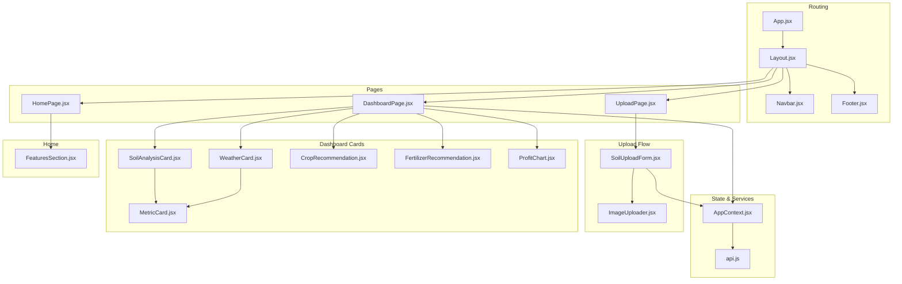
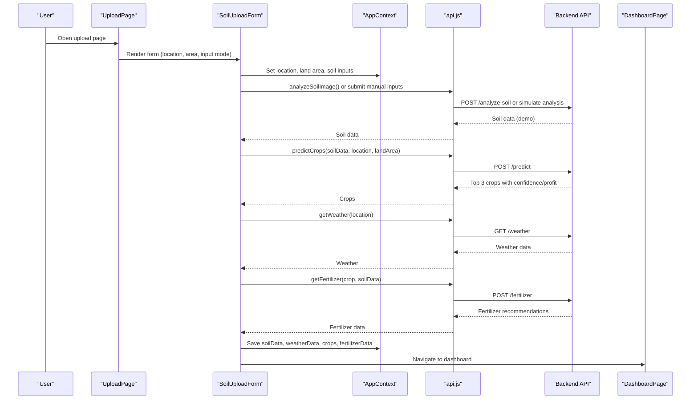
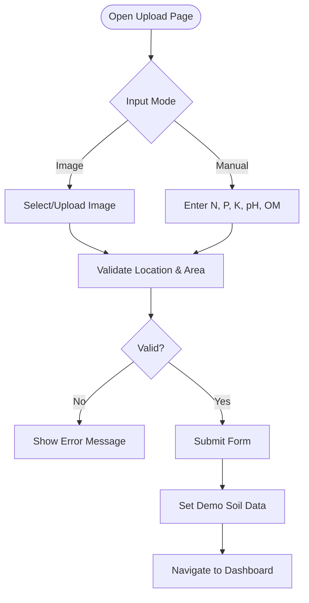
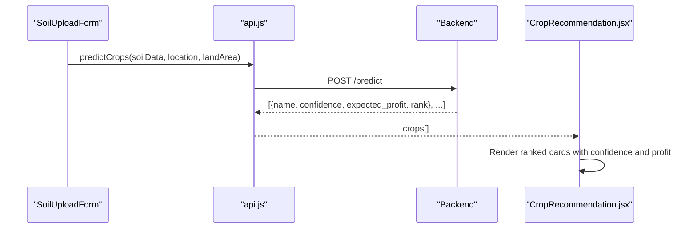
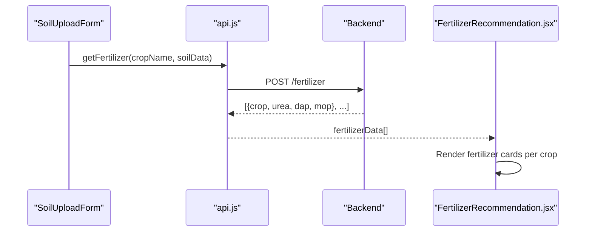
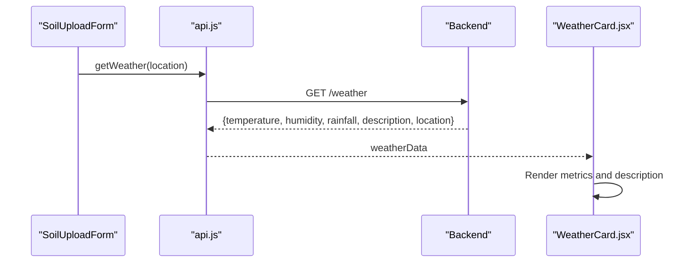
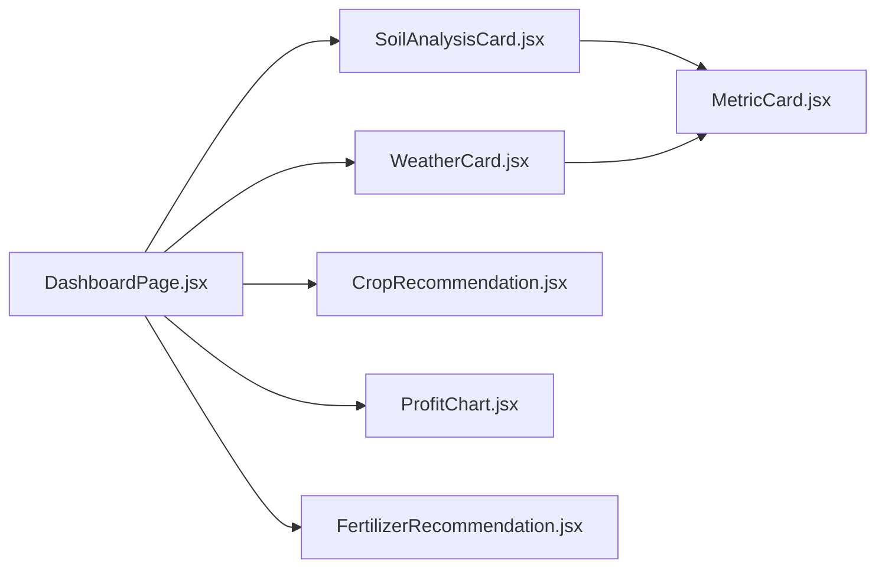
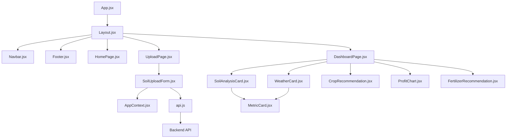

# Core Features

<cite>
**Referenced Files in This Document**
- [App.jsx](file://frontend/src/App.jsx)
- [Layout.jsx](file://frontend/src/components/Layout/Layout.jsx)
- [Navbar.jsx](file://frontend/src/components/Layout/Navbar.jsx)
- [Footer.jsx](file://frontend/src/components/Layout/Footer.jsx)
- [HomePage.jsx](file://frontend/src/pages/HomePage.jsx)
- [UploadPage.jsx](file://frontend/src/pages/UploadPage.jsx)
- [DashboardPage.jsx](file://frontend/src/pages/DashboardPage.jsx)
- [AppContext.jsx](file://frontend/src/context/AppContext.jsx)
- [api.js](file://frontend/src/services/api.js)
- [SoilUploadForm.jsx](file://frontend/src/components/Upload/SoilUploadForm.jsx)
- [ImageUploader.jsx](file://frontend/src/components/Upload/ImageUploader.jsx)
- [SoilAnalysisCard.jsx](file://frontend/src/components/Dashboard/SoilAnalysisCard.jsx)
- [WeatherCard.jsx](file://frontend/src/components/Dashboard/WeatherCard.jsx)
- [CropRecommendation.jsx](file://frontend/src/components/Dashboard/CropRecommendation.jsx)
- [FertilizerRecommendation.jsx](file://frontend/src/components/Dashboard/FertilizerRecommendation.jsx)
- [ProfitChart.jsx](file://frontend/src/components/Dashboard/ProfitChart.jsx)
- [MetricCard.jsx](file://frontend/src/components/common/MetricCard.jsx)
- [FeaturesSection.jsx](file://frontend/src/components/Home/FeaturesSection.jsx)
- [package.json](file://frontend/package.json)
</cite>

## Table of Contents
1. [Introduction](#introduction)
2. [Project Structure](#project-structure)
3. [Core Components](#core-components)
4. [Architecture Overview](#architecture-overview)
5. [Detailed Component Analysis](#detailed-component-analysis)
6. [Dependency Analysis](#dependency-analysis)
7. [Performance Considerations](#performance-considerations)
8. [Troubleshooting Guide](#troubleshooting-guide)
9. [Conclusion](#conclusion)
10. [Appendices](#appendices)

## Introduction
This document explains the Smart Farming Advisor core features and how they work together to deliver intelligent agricultural recommendations. The system integrates:
- Soil analysis (image-based or manual input)
- Crop recommendation engine (AI-powered)
- Fertilizer recommendation system (per crop and hectare)
- Weather integration (current conditions)
- Analytics dashboard (visualizations and summaries)

It covers user workflows, feature interactions, data models, UI patterns, and the AI-driven recommendation pipeline. The frontend orchestrates user inputs, calls the backend APIs, and renders actionable insights.

## Project Structure
The frontend is organized around pages, shared components, context for state management, and service utilities for API communication. Routing is handled via React Router, and UI components are styled with Tailwind CSS.

**Diagram sources**
- [App.jsx:1-20](file://frontend/src/App.jsx#L1-L20)
- [Layout.jsx:1-17](file://frontend/src/components/Layout/Layout.jsx#L1-L17)
- [HomePage.jsx:1-14](file://frontend/src/pages/HomePage.jsx#L1-L14)
- [UploadPage.jsx:1-29](file://frontend/src/pages/UploadPage.jsx#L1-L29)
- [DashboardPage.jsx:1-68](file://frontend/src/pages/DashboardPage.jsx#L1-L68)
- [AppContext.jsx:1-53](file://frontend/src/context/AppContext.jsx#L1-L53)
- [api.js:1-86](file://frontend/src/services/api.js#L1-L86)
- [SoilUploadForm.jsx:1-272](file://frontend/src/components/Upload/SoilUploadForm.jsx#L1-L272)
- [ImageUploader.jsx:1-108](file://frontend/src/components/Upload/ImageUploader.jsx#L1-L108)
- [SoilAnalysisCard.jsx:1-74](file://frontend/src/components/Dashboard/SoilAnalysisCard.jsx#L1-L74)
- [WeatherCard.jsx:1-71](file://frontend/src/components/Dashboard/WeatherCard.jsx#L1-L71)
- [CropRecommendation.jsx:1-98](file://frontend/src/components/Dashboard/CropRecommendation.jsx#L1-L98)
- [FertilizerRecommendation.jsx:1-63](file://frontend/src/components/Dashboard/FertilizerRecommendation.jsx#L1-L63)
- [ProfitChart.jsx:1-71](file://frontend/src/components/Dashboard/ProfitChart.jsx#L1-L71)
- [MetricCard.jsx:1-39](file://frontend/src/components/common/MetricCard.jsx#L1-L39)
- [FeaturesSection.jsx:1-84](file://frontend/src/components/Home/FeaturesSection.jsx#L1-L84)

**Section sources**
- [App.jsx:1-20](file://frontend/src/App.jsx#L1-L20)
- [Layout.jsx:1-17](file://frontend/src/components/Layout/Layout.jsx#L1-L17)
- [package.json:1-29](file://frontend/package.json#L1-L29)

## Core Components
- App routing and layout: Defines routes and wraps pages in a shared layout with navigation and footer.
- AppContext: Global state for soil data, weather, crops, fertilizers, loading, errors, and user inputs.
- API service: Centralized Axios client with interceptors and typed endpoints for crop prediction, fertilizer recommendation, weather, and soil image analysis.
- Upload page and form: Accepts location, land area, and either an image upload or manual soil inputs; triggers analysis and navigates to the dashboard.
- Dashboard: Renders soil metrics, current weather, top crop recommendations, profit comparison chart, and fertilizer recommendations.
- Shared UI: Metric cards for consistent metric rendering across cards.

**Section sources**
- [App.jsx:1-20](file://frontend/src/App.jsx#L1-L20)
- [Layout.jsx:1-17](file://frontend/src/components/Layout/Layout.jsx#L1-L17)
- [AppContext.jsx:1-53](file://frontend/src/context/AppContext.jsx#L1-L53)
- [api.js:1-86](file://frontend/src/services/api.js#L1-L86)
- [UploadPage.jsx:1-29](file://frontend/src/pages/UploadPage.jsx#L1-L29)
- [DashboardPage.jsx:1-68](file://frontend/src/pages/DashboardPage.jsx#L1-L68)
- [MetricCard.jsx:1-39](file://frontend/src/components/common/MetricCard.jsx#L1-L39)

## Architecture Overview
The system follows a reactive, data-driven architecture:
- User inputs are captured in the upload form and stored in global state.
- The app calls backend endpoints to fetch crop recommendations, fertilizer data, and weather.
- Results are rendered in the dashboard as cards and charts.
- UI components are reusable and theme-consistent.

**Diagram sources**
- [UploadPage.jsx:1-29](file://frontend/src/pages/UploadPage.jsx#L1-L29)
- [SoilUploadForm.jsx:1-272](file://frontend/src/components/Upload/SoilUploadForm.jsx#L1-L272)
- [AppContext.jsx:1-53](file://frontend/src/context/AppContext.jsx#L1-L53)
- [api.js:1-86](file://frontend/src/services/api.js#L1-L86)
- [DashboardPage.jsx:1-68](file://frontend/src/pages/DashboardPage.jsx#L1-L68)

## Detailed Component Analysis

### Soil Analysis System
- Input modes:
  - Image upload: Drag-and-drop or file selection of soil health card images.
  - Manual entry: Numeric inputs for N, P, K, pH, and organic matter.
- Validation ensures location and land area are present; numeric fields are required when using manual mode.
- On submit, the system simulates backend calls and sets demo soil data, then navigates to the dashboard.

**Diagram sources**
- [SoilUploadForm.jsx:1-272](file://frontend/src/components/Upload/SoilUploadForm.jsx#L1-L272)
- [ImageUploader.jsx:1-108](file://frontend/src/components/Upload/ImageUploader.jsx#L1-L108)

**Section sources**
- [SoilUploadForm.jsx:1-272](file://frontend/src/components/Upload/SoilUploadForm.jsx#L1-L272)
- [ImageUploader.jsx:1-108](file://frontend/src/components/Upload/ImageUploader.jsx#L1-L108)

### Crop Recommendation Engine
- Receives soil data and location to request crop predictions.
- Backend endpoint returns top 3 crops with confidence percentage and expected profit per hectare.
- UI ranks top crops with medals and confidence bars; profit comparison bar chart visualizes expected revenue.

**Diagram sources**
- [api.js:33-44](file://frontend/src/services/api.js#L33-L44)
- [CropRecommendation.jsx:1-98](file://frontend/src/components/Dashboard/CropRecommendation.jsx#L1-L98)
- [ProfitChart.jsx:1-71](file://frontend/src/components/Dashboard/ProfitChart.jsx#L1-L71)

**Section sources**
- [api.js:33-44](file://frontend/src/services/api.js#L33-L44)
- [CropRecommendation.jsx:1-98](file://frontend/src/components/Dashboard/CropRecommendation.jsx#L1-L98)
- [ProfitChart.jsx:1-71](file://frontend/src/components/Dashboard/ProfitChart.jsx#L1-L71)

### Fertilizer Recommendation System
- Requests fertilizer recommendations per crop using the selected crop name and soil data.
- Backend endpoint returns quantities for Urea, DAP, and MOP per hectare.
- UI displays per-crop fertilizer needs with icons and color-coded badges.

**Diagram sources**
- [api.js:46-56](file://frontend/src/services/api.js#L46-L56)
- [FertilizerRecommendation.jsx:1-63](file://frontend/src/components/Dashboard/FertilizerRecommendation.jsx#L1-L63)

**Section sources**
- [api.js:46-56](file://frontend/src/services/api.js#L46-L56)
- [FertilizerRecommendation.jsx:1-63](file://frontend/src/components/Dashboard/FertilizerRecommendation.jsx#L1-L63)

### Weather Integration
- Fetches current weather for the user’s location.
- Displays temperature, humidity, rainfall, and condition description.
- Shows location pin with city name.

**Diagram sources**
- [api.js:58-67](file://frontend/src/services/api.js#L58-L67)
- [WeatherCard.jsx:1-71](file://frontend/src/components/Dashboard/WeatherCard.jsx#L1-L71)

**Section sources**
- [api.js:58-67](file://frontend/src/services/api.js#L58-L67)
- [WeatherCard.jsx:1-71](file://frontend/src/components/Dashboard/WeatherCard.jsx#L1-L71)

### Analytics Dashboard
- Displays:
  - Soil Analysis: N, P, K, pH, Organic Matter with MetricCard components.
  - Weather: Temperature, Humidity, Rainfall with MetricCard components.
  - Crop Recommendations: Ranked cards with confidence and profit.
  - Profit Comparison: Bar chart of expected profits across top crops.
  - Fertilizer Recommendations: Per-crop fertilizer needs.
- Enforces navigation guard: redirects to upload if no soil data exists.

**Diagram sources**
- [DashboardPage.jsx:1-68](file://frontend/src/pages/DashboardPage.jsx#L1-L68)
- [SoilAnalysisCard.jsx:1-74](file://frontend/src/components/Dashboard/SoilAnalysisCard.jsx#L1-L74)
- [WeatherCard.jsx:1-71](file://frontend/src/components/Dashboard/WeatherCard.jsx#L1-L71)
- [CropRecommendation.jsx:1-98](file://frontend/src/components/Dashboard/CropRecommendation.jsx#L1-L98)
- [ProfitChart.jsx:1-71](file://frontend/src/components/Dashboard/ProfitChart.jsx#L1-L71)
- [FertilizerRecommendation.jsx:1-63](file://frontend/src/components/Dashboard/FertilizerRecommendation.jsx#L1-L63)
- [MetricCard.jsx:1-39](file://frontend/src/components/common/MetricCard.jsx#L1-L39)

**Section sources**
- [DashboardPage.jsx:1-68](file://frontend/src/pages/DashboardPage.jsx#L1-L68)
- [SoilAnalysisCard.jsx:1-74](file://frontend/src/components/Dashboard/SoilAnalysisCard.jsx#L1-L74)
- [WeatherCard.jsx:1-71](file://frontend/src/components/Dashboard/WeatherCard.jsx#L1-L71)
- [CropRecommendation.jsx:1-98](file://frontend/src/components/Dashboard/CropRecommendation.jsx#L1-L98)
- [ProfitChart.jsx:1-71](file://frontend/src/components/Dashboard/ProfitChart.jsx#L1-L71)
- [FertilizerRecommendation.jsx:1-63](file://frontend/src/components/Dashboard/FertilizerRecommendation.jsx#L1-L63)
- [MetricCard.jsx:1-39](file://frontend/src/components/common/MetricCard.jsx#L1-L39)

### Data Models
- Soil Analysis:
  - nitrogen: number (kg/ha)
  - phosphorus: number (kg/ha)
  - potassium: number (kg/ha)
  - ph: number
  - organic_matter: number (%)
- Weather:
  - temperature: number (°C)
  - humidity: number (%)
  - rainfall: number (mm)
  - description: string
  - location: string
- Crop Recommendation:
  - name: string
  - confidence: number (%)
  - expected_profit: number (INR)
  - rank: number
- Fertilizer Recommendation:
  - crop: string
  - urea: number (kg/ha)
  - dap: number (kg/ha)
  - mop: number (kg/ha)

**Section sources**
- [SoilUploadForm.jsx:68-136](file://frontend/src/components/Upload/SoilUploadForm.jsx#L68-L136)
- [SoilAnalysisCard.jsx:7-43](file://frontend/src/components/Dashboard/SoilAnalysisCard.jsx#L7-L43)
- [WeatherCard.jsx:7-29](file://frontend/src/components/Dashboard/WeatherCard.jsx#L7-L29)
- [CropRecommendation.jsx:43-91](file://frontend/src/components/Dashboard/CropRecommendation.jsx#L43-L91)
- [FertilizerRecommendation.jsx:31-56](file://frontend/src/components/Dashboard/FertilizerRecommendation.jsx#L31-L56)

## Dependency Analysis
- Routing and layout:
  - App defines routes; Layout composes Navbar and Footer.
- State management:
  - AppContext centralizes state and exposes actions to all components.
- API layer:
  - api.js encapsulates base URL, interceptors, and endpoint functions.
- Components depend on shared UI primitives (MetricCard) and context.

**Diagram sources**
- [App.jsx:1-20](file://frontend/src/App.jsx#L1-L20)
- [Layout.jsx:1-17](file://frontend/src/components/Layout/Layout.jsx#L1-L17)
- [AppContext.jsx:1-53](file://frontend/src/context/AppContext.jsx#L1-L53)
- [api.js:1-86](file://frontend/src/services/api.js#L1-L86)
- [SoilUploadForm.jsx:1-272](file://frontend/src/components/Upload/SoilUploadForm.jsx#L1-L272)
- [DashboardPage.jsx:1-68](file://frontend/src/pages/DashboardPage.jsx#L1-L68)
- [SoilAnalysisCard.jsx:1-74](file://frontend/src/components/Dashboard/SoilAnalysisCard.jsx#L1-L74)
- [WeatherCard.jsx:1-71](file://frontend/src/components/Dashboard/WeatherCard.jsx#L1-L71)
- [CropRecommendation.jsx:1-98](file://frontend/src/components/Dashboard/CropRecommendation.jsx#L1-L98)
- [ProfitChart.jsx:1-71](file://frontend/src/components/Dashboard/ProfitChart.jsx#L1-L71)
- [FertilizerRecommendation.jsx:1-63](file://frontend/src/components/Dashboard/FertilizerRecommendation.jsx#L1-L63)
- [MetricCard.jsx:1-39](file://frontend/src/components/common/MetricCard.jsx#L1-L39)

**Section sources**
- [App.jsx:1-20](file://frontend/src/App.jsx#L1-L20)
- [Layout.jsx:1-17](file://frontend/src/components/Layout/Layout.jsx#L1-L17)
- [AppContext.jsx:1-53](file://frontend/src/context/AppContext.jsx#L1-L53)
- [api.js:1-86](file://frontend/src/services/api.js#L1-L86)

## Performance Considerations
- API timeouts and retries: Axios client sets a timeout to prevent hanging requests.
- UI responsiveness: Loading spinner is shown during analysis; avoid heavy synchronous computations in render.
- Chart rendering: Recharts components are responsive; keep datasets small for smooth rendering.
- Image uploads: Limit file size and validate MIME types to reduce server load.
- State updates: Batch related state updates in the upload form to minimize re-renders.

[No sources needed since this section provides general guidance]

## Troubleshooting Guide
- Navigation guard: Dashboard redirects to upload if no soil data is present.
- Error handling: API interceptors log errors; form displays validation messages and allows retry.
- Common issues:
  - Missing location or land area: Trigger validation error.
  - Invalid numeric inputs: Ensure decimal steps and positive values.
  - Network failures: Inspect API interceptors and backend connectivity.

**Section sources**
- [DashboardPage.jsx:15-19](file://frontend/src/pages/DashboardPage.jsx#L15-L19)
- [SoilUploadForm.jsx:41-51](file://frontend/src/components/Upload/SoilUploadForm.jsx#L41-L51)
- [api.js:13-31](file://frontend/src/services/api.js#L13-L31)

## Conclusion
Smart Farming Advisor delivers a cohesive, data-driven experience by combining soil analysis, AI-powered crop recommendations, fertilizer planning, weather insights, and insightful visualizations. The modular frontend architecture, centralized state management, and standardized UI components enable scalable enhancements while maintaining a consistent user experience.

[No sources needed since this section summarizes without analyzing specific files]

## Appendices

### User Workflows
- Upload workflow:
  - Enter location and land area.
  - Choose image upload or manual input.
  - Submit to receive demo results and navigate to dashboard.
- Dashboard workflow:
  - Review soil metrics, weather, crop rankings, profit chart, and fertilizer recommendations.
  - Use navigation to return to upload for new analysis.

**Section sources**
- [UploadPage.jsx:1-29](file://frontend/src/pages/UploadPage.jsx#L1-L29)
- [SoilUploadForm.jsx:1-272](file://frontend/src/components/Upload/SoilUploadForm.jsx#L1-L272)
- [DashboardPage.jsx:1-68](file://frontend/src/pages/DashboardPage.jsx#L1-L68)

### Feature Highlights
- Real-time weather integration: Current conditions and location-aware display.
- AI-powered recommendations: Crop ranking with confidence and profit projections.
- Fertilizer planning: Per-crop, per-hectare nutrient requirements.
- Visual analytics: Bar charts and metric cards for quick insights.
- Flexible input modes: Image scanning or manual entry for soil parameters.

**Section sources**
- [FeaturesSection.jsx:1-84](file://frontend/src/components/Home/FeaturesSection.jsx#L1-L84)
- [WeatherCard.jsx:1-71](file://frontend/src/components/Dashboard/WeatherCard.jsx#L1-L71)
- [CropRecommendation.jsx:1-98](file://frontend/src/components/Dashboard/CropRecommendation.jsx#L1-L98)
- [FertilizerRecommendation.jsx:1-63](file://frontend/src/components/Dashboard/FertilizerRecommendation.jsx#L1-L63)
- [ProfitChart.jsx:1-71](file://frontend/src/components/Dashboard/ProfitChart.jsx#L1-L71)