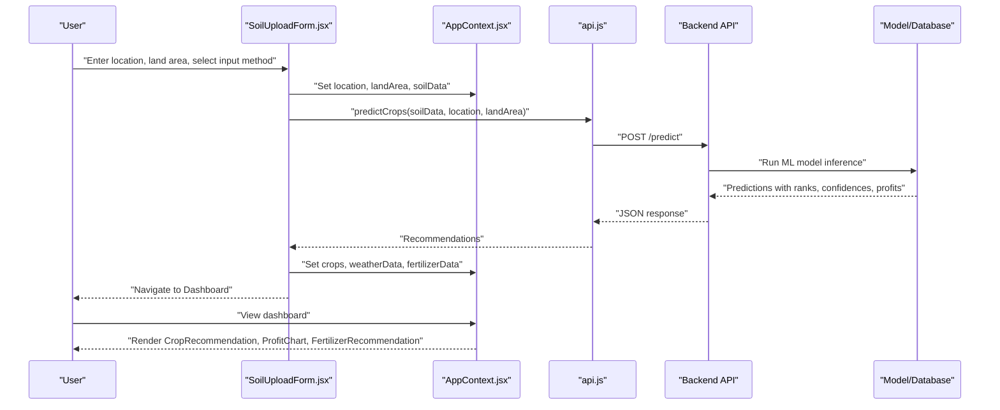
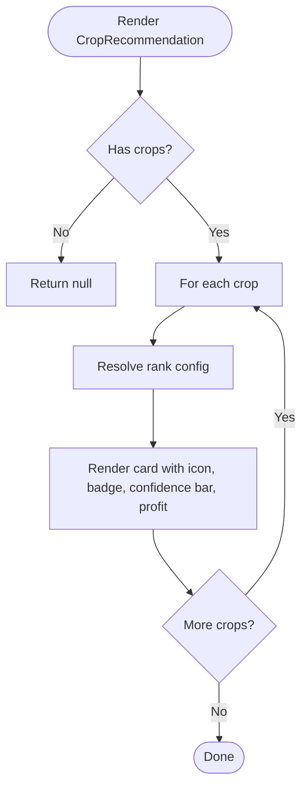
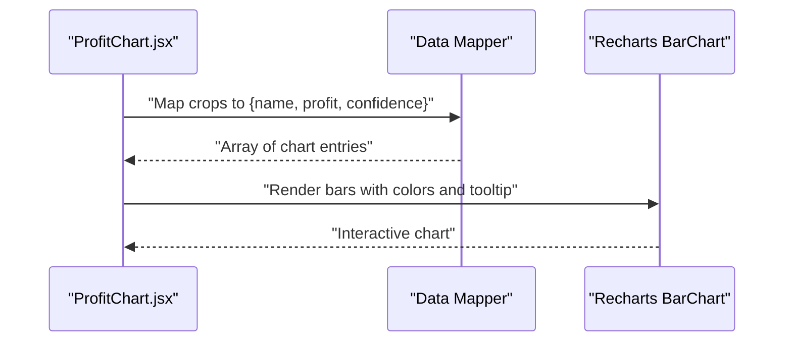
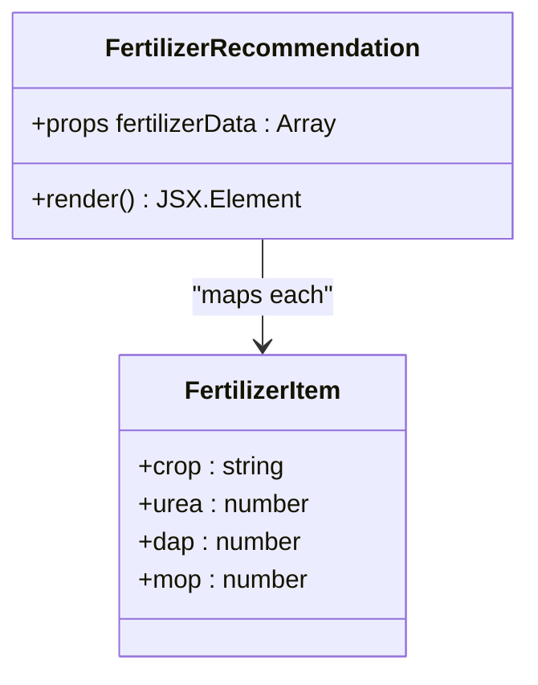
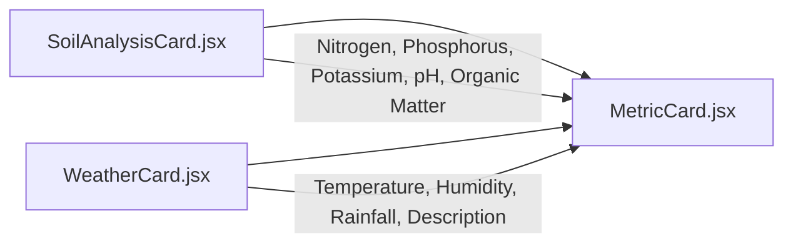
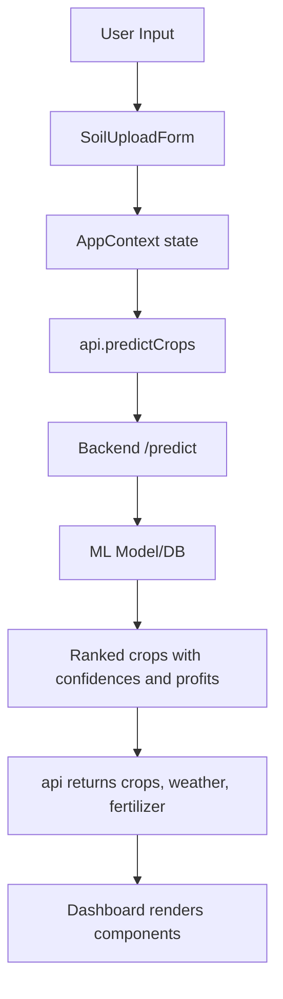
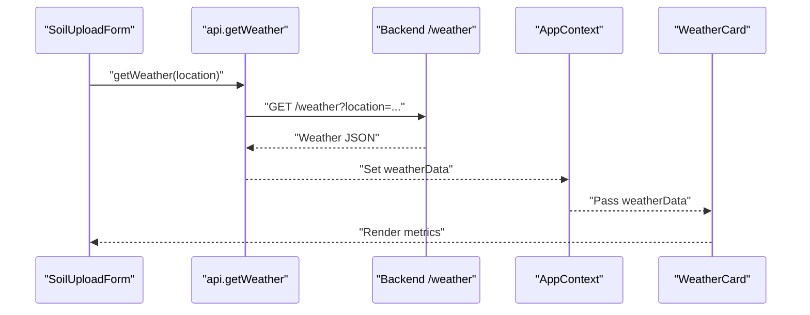
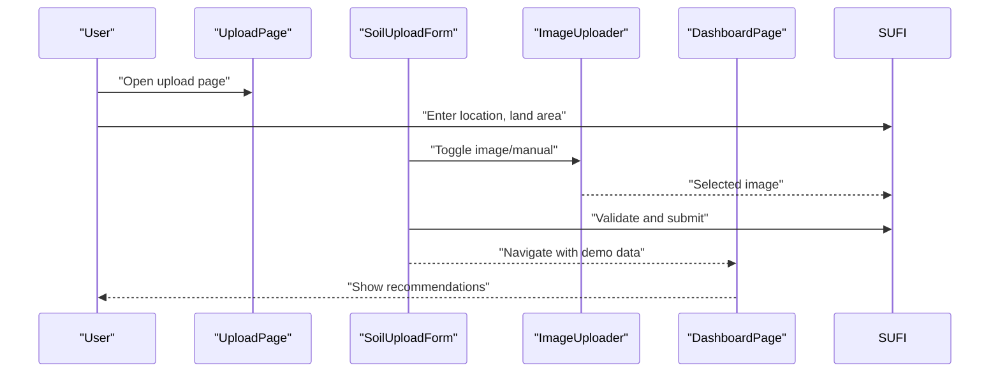
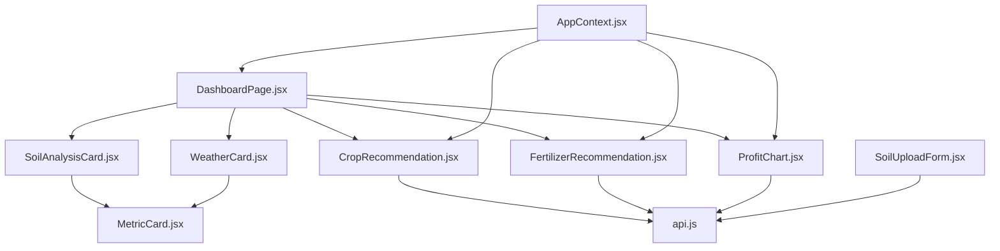

# Crop Recommendation Engine

<cite>
**Referenced Files in This Document**
- [CropRecommendation.jsx](file://frontend/src/components/Dashboard/CropRecommendation.jsx)
- [FertilizerRecommendation.jsx](file://frontend/src/components/Dashboard/FertilizerRecommendation.jsx)
- [ProfitChart.jsx](file://frontend/src/components/Dashboard/ProfitChart.jsx)
- [SoilAnalysisCard.jsx](file://frontend/src/components/Dashboard/SoilAnalysisCard.jsx)
- [WeatherCard.jsx](file://frontend/src/components/Dashboard/WeatherCard.jsx)
- [MetricCard.jsx](file://frontend/src/components/common/MetricCard.jsx)
- [DashboardPage.jsx](file://frontend/src/pages/DashboardPage.jsx)
- [UploadPage.jsx](file://frontend/src/pages/UploadPage.jsx)
- [SoilUploadForm.jsx](file://frontend/src/components/Upload/SoilUploadForm.jsx)
- [ImageUploader.jsx](file://frontend/src/components/Upload/ImageUploader.jsx)
- [AppContext.jsx](file://frontend/src/context/AppContext.jsx)
- [api.js](file://frontend/src/services/api.js)
</cite>

## Table of Contents
1. [Introduction](#introduction)
2. [Project Structure](#project-structure)
3. [Core Components](#core-components)
4. [Architecture Overview](#architecture-overview)
5. [Detailed Component Analysis](#detailed-component-analysis)
6. [Dependency Analysis](#dependency-analysis)
7. [Performance Considerations](#performance-considerations)
8. [Troubleshooting Guide](#troubleshooting-guide)
9. [Conclusion](#conclusion)

## Introduction
This document describes the Crop Recommendation Engine implemented in the frontend of the Agriculture application. It explains how soil analysis data and weather conditions are processed to produce crop recommendations, how confidence levels and rankings are presented, and how profit estimations and fertilizer suggestions are visualized. It also documents the data flow from raw inputs to final recommendations, the integration with backend APIs, and the user interaction patterns. Where applicable, the document highlights the scoring and ranking mechanisms, profit estimation calculations, and comparison features.

## Project Structure
The Crop Recommendation Engine is primarily implemented in the frontend under the src directory. The key areas are:
- Upload and input capture: UploadPage, SoilUploadForm, ImageUploader
- Shared UI components: MetricCard
- Dashboard and visualization: DashboardPage, SoilAnalysisCard, WeatherCard, CropRecommendation, FertilizerRecommendation, ProfitChart
- Application state: AppContext
- API integration: api.js

```mermaid
graph TB
subgraph "Upload"
UP["UploadPage.jsx"]
SUF["SoilUploadForm.jsx"]
IU["ImageUploader.jsx"]
end
subgraph "State"
AC["AppContext.jsx"]
end
subgraph "Dashboard"
DP["DashboardPage.jsx"]
SAC["SoilAnalysisCard.jsx"]
WC["WeatherCard.jsx"]
CR["CropRecommendation.jsx"]
FR["FertilizerRecommendation.jsx"]
PC["ProfitChart.jsx"]
MC["MetricCard.jsx"]
end
subgraph "API"
API["api.js"]
end
UP --> SUF
SUF --> IU
SUF --> AC
AC --> DP
DP --> SAC
DP --> WC
DP --> CR
DP --> FR
DP --> PC
SAC --> MC
WC --> MC
CR --> API
FR --> API
PC --> API
SUF --> API
```

**Diagram sources**
- [UploadPage.jsx:1-29](file://frontend/src/pages/UploadPage.jsx#L1-L29)
- [SoilUploadForm.jsx:1-272](file://frontend/src/components/Upload/SoilUploadForm.jsx#L1-L272)
- [ImageUploader.jsx:1-108](file://frontend/src/components/Upload/ImageUploader.jsx#L1-L108)
- [AppContext.jsx:1-53](file://frontend/src/context/AppContext.jsx#L1-L53)
- [DashboardPage.jsx:1-68](file://frontend/src/pages/DashboardPage.jsx#L1-L68)
- [SoilAnalysisCard.jsx:1-74](file://frontend/src/components/Dashboard/SoilAnalysisCard.jsx#L1-L74)
- [WeatherCard.jsx:1-71](file://frontend/src/components/Dashboard/WeatherCard.jsx#L1-L71)
- [CropRecommendation.jsx:1-98](file://frontend/src/components/Dashboard/CropRecommendation.jsx#L1-L98)
- [FertilizerRecommendation.jsx:1-63](file://frontend/src/components/Dashboard/FertilizerRecommendation.jsx#L1-L63)
- [ProfitChart.jsx:1-71](file://frontend/src/components/Dashboard/ProfitChart.jsx#L1-L71)
- [MetricCard.jsx:1-39](file://frontend/src/components/common/MetricCard.jsx#L1-L39)
- [api.js:1-86](file://frontend/src/services/api.js#L1-L86)

**Section sources**
- [UploadPage.jsx:1-29](file://frontend/src/pages/UploadPage.jsx#L1-L29)
- [SoilUploadForm.jsx:1-272](file://frontend/src/components/Upload/SoilUploadForm.jsx#L1-L272)
- [AppContext.jsx:1-53](file://frontend/src/context/AppContext.jsx#L1-L53)
- [DashboardPage.jsx:1-68](file://frontend/src/pages/DashboardPage.jsx#L1-L68)
- [api.js:1-86](file://frontend/src/services/api.js#L1-L86)

## Core Components
- CropRecommendation: Renders top crop recommendations with rank badges, confidence bars, and expected profit.
- FertilizerRecommendation: Displays fertilizer recommendations per hectare for each crop.
- ProfitChart: Visualizes expected profit comparisons across recommended crops.
- SoilAnalysisCard and WeatherCard: Present nutrient metrics and current weather metrics respectively using MetricCard.
- AppContext: Centralizes state for soilData, weatherData, crops, fertilizerData, loading, error, location, and landArea.
- api.js: Provides typed API functions for prediction, weather retrieval, and soil image analysis.
- Upload forms: Capture location, land area, and either a soil image or manual nutrient inputs.

**Section sources**
- [CropRecommendation.jsx:1-98](file://frontend/src/components/Dashboard/CropRecommendation.jsx#L1-L98)
- [FertilizerRecommendation.jsx:1-63](file://frontend/src/components/Dashboard/FertilizerRecommendation.jsx#L1-L63)
- [ProfitChart.jsx:1-71](file://frontend/src/components/Dashboard/ProfitChart.jsx#L1-L71)
- [SoilAnalysisCard.jsx:1-74](file://frontend/src/components/Dashboard/SoilAnalysisCard.jsx#L1-L74)
- [WeatherCard.jsx:1-71](file://frontend/src/components/Dashboard/WeatherCard.jsx#L1-L71)
- [MetricCard.jsx:1-39](file://frontend/src/components/common/MetricCard.jsx#L1-L39)
- [AppContext.jsx:1-53](file://frontend/src/context/AppContext.jsx#L1-L53)
- [api.js:1-86](file://frontend/src/services/api.js#L1-L86)
- [SoilUploadForm.jsx:1-272](file://frontend/src/components/Upload/SoilUploadForm.jsx#L1-L272)

## Architecture Overview
The system follows a client-driven architecture where the frontend captures inputs, manages state, and renders recommendations. The backend is accessed via REST endpoints exposed by api.js. The data flow is:



**Diagram sources**
- [SoilUploadForm.jsx:53-149](file://frontend/src/components/Upload/SoilUploadForm.jsx#L53-L149)
- [AppContext.jsx:13-52](file://frontend/src/context/AppContext.jsx#L13-L52)
- [api.js:33-44](file://frontend/src/services/api.js#L33-L44)
- [DashboardPage.jsx:11-67](file://frontend/src/pages/DashboardPage.jsx#L11-L67)
- [CropRecommendation.jsx:27-98](file://frontend/src/components/Dashboard/CropRecommendation.jsx#L27-L98)
- [ProfitChart.jsx:4-71](file://frontend/src/components/Dashboard/ProfitChart.jsx#L4-L71)
- [FertilizerRecommendation.jsx:15-63](file://frontend/src/components/Dashboard/FertilizerRecommendation.jsx#L15-L63)

## Detailed Component Analysis

### Crop Recommendation Display
- Purpose: Render top crop recommendations with rank badges, confidence indicators, and expected profit.
- Ranking: First three items receive special styling and medals; others fall back to third-tier styling.
- Confidence: Shown as percentage with a progress bar animation.
- Profit: Formatted currency display per hectare.
- Data shape: Expects an array of crop objects with name, rank, confidence, expected_profit.



**Diagram sources**
- [CropRecommendation.jsx:27-98](file://frontend/src/components/Dashboard/CropRecommendation.jsx#L27-L98)

**Section sources**
- [CropRecommendation.jsx:1-98](file://frontend/src/components/Dashboard/CropRecommendation.jsx#L1-L98)

### Profit Estimation and Comparison
- Purpose: Compare expected profits across recommended crops using a bar chart.
- Data transformation: Converts crop array to chart data with name, profit, and confidence.
- Visualization: Responsive bar chart with custom tooltip and color scheme.
- Currency formatting: Profits shown in thousands with rupee symbol.



**Diagram sources**
- [ProfitChart.jsx:4-71](file://frontend/src/components/Dashboard/ProfitChart.jsx#L4-L71)

**Section sources**
- [ProfitChart.jsx:1-71](file://frontend/src/components/Dashboard/ProfitChart.jsx#L1-L71)

### Fertilizer Recommendations
- Purpose: Display per-hectare fertilizer needs for each crop (urea, DAP, MOP).
- Presentation: Grid layout with icons and color-coded cards for each fertilizer type.
- Data shape: Array of objects with crop and numeric values for each fertilizer type.



**Diagram sources**
- [FertilizerRecommendation.jsx:15-63](file://frontend/src/components/Dashboard/FertilizerRecommendation.jsx#L15-L63)

**Section sources**
- [FertilizerRecommendation.jsx:1-63](file://frontend/src/components/Dashboard/FertilizerRecommendation.jsx#L1-L63)

### Soil and Weather Metrics
- SoilAnalysisCard: Displays N, P, K, pH, and Organic Matter using MetricCard.
- WeatherCard: Displays Temperature, Humidity, Rainfall, and current weather description.
- MetricCard: Reusable card component with configurable icon, color, and units.



**Diagram sources**
- [SoilAnalysisCard.jsx:1-74](file://frontend/src/components/Dashboard/SoilAnalysisCard.jsx#L1-L74)
- [WeatherCard.jsx:1-71](file://frontend/src/components/Dashboard/WeatherCard.jsx#L1-L71)
- [MetricCard.jsx:1-39](file://frontend/src/components/common/MetricCard.jsx#L1-L39)

**Section sources**
- [SoilAnalysisCard.jsx:1-74](file://frontend/src/components/Dashboard/SoilAnalysisCard.jsx#L1-L74)
- [WeatherCard.jsx:1-71](file://frontend/src/components/Dashboard/WeatherCard.jsx#L1-L71)
- [MetricCard.jsx:1-39](file://frontend/src/components/common/MetricCard.jsx#L1-L39)

### Data Flow and Scoring Mechanism
- Inputs: Location, land area, and either a soil image or manual nutrient values.
- Backend integration: predictCrops sends soilData, location, and land_area to /predict.
- Output: crops array with name, rank, confidence, expected_profit; weatherData; fertilizerData.
- Scoring and ranking: The backend computes rank order and confidence scores; frontend displays them.
- Profit estimation: Backend calculates expected_profit per hectare; frontend formats and compares.



**Diagram sources**
- [SoilUploadForm.jsx:53-149](file://frontend/src/components/Upload/SoilUploadForm.jsx#L53-L149)
- [AppContext.jsx:13-52](file://frontend/src/context/AppContext.jsx#L13-L52)
- [api.js:33-44](file://frontend/src/services/api.js#L33-L44)
- [DashboardPage.jsx:11-67](file://frontend/src/pages/DashboardPage.jsx#L11-L67)
- [CropRecommendation.jsx:27-98](file://frontend/src/components/Dashboard/CropRecommendation.jsx#L27-L98)
- [ProfitChart.jsx:4-71](file://frontend/src/components/Dashboard/ProfitChart.jsx#L4-L71)
- [FertilizerRecommendation.jsx:15-63](file://frontend/src/components/Dashboard/FertilizerRecommendation.jsx#L15-L63)

**Section sources**
- [SoilUploadForm.jsx:1-272](file://frontend/src/components/Upload/SoilUploadForm.jsx#L1-L272)
- [api.js:33-44](file://frontend/src/services/api.js#L33-L44)
- [DashboardPage.jsx:1-68](file://frontend/src/pages/DashboardPage.jsx#L1-L68)

### Real-time Weather Data Processing
- API: getWeather(location) fetches current weather metrics.
- Display: WeatherCard renders temperature, humidity, rainfall, and description.
- Integration: Weather data is stored in AppContext and passed to WeatherCard.



**Diagram sources**
- [api.js:58-67](file://frontend/src/services/api.js#L58-L67)
- [AppContext.jsx:13-52](file://frontend/src/context/AppContext.jsx#L13-L52)
- [WeatherCard.jsx:1-71](file://frontend/src/components/Dashboard/WeatherCard.jsx#L1-L71)

**Section sources**
- [api.js:58-67](file://frontend/src/services/api.js#L58-L67)
- [WeatherCard.jsx:1-71](file://frontend/src/components/Dashboard/WeatherCard.jsx#L1-L71)

### User Interaction Patterns
- UploadPage: Prompts for location and land area, offers image or manual input.
- SoilUploadForm: Validates inputs, supports drag-and-drop image upload, toggles manual mode, and navigates to dashboard with demo data.
- DashboardPage: Displays analysis results and recommendations; redirects to upload if no soilData exists.



**Diagram sources**
- [UploadPage.jsx:1-29](file://frontend/src/pages/UploadPage.jsx#L1-L29)
- [SoilUploadForm.jsx:1-272](file://frontend/src/components/Upload/SoilUploadForm.jsx#L1-L272)
- [ImageUploader.jsx:1-108](file://frontend/src/components/Upload/ImageUploader.jsx#L1-L108)
- [DashboardPage.jsx:11-67](file://frontend/src/pages/DashboardPage.jsx#L11-L67)

**Section sources**
- [UploadPage.jsx:1-29](file://frontend/src/pages/UploadPage.jsx#L1-L29)
- [SoilUploadForm.jsx:1-272](file://frontend/src/components/Upload/SoilUploadForm.jsx#L1-L272)
- [ImageUploader.jsx:1-108](file://frontend/src/components/Upload/ImageUploader.jsx#L1-L108)
- [DashboardPage.jsx:1-68](file://frontend/src/pages/DashboardPage.jsx#L1-L68)

## Dependency Analysis
- Component coupling:
  - DashboardPage composes SoilAnalysisCard, WeatherCard, CropRecommendation, FertilizerRecommendation, and ProfitChart.
  - Both CropRecommendation and ProfitChart depend on the crops array from AppContext.
  - FertilizerRecommendation depends on fertilizerData from AppContext.
  - SoilAnalysisCard and WeatherCard depend on MetricCard for rendering.
- API integration:
  - api.js centralizes endpoint calls and error handling.
  - predictCrops, getWeather, and analyzeSoilImage are used by upload and dashboard flows.
- State management:
  - AppContext holds shared state and exposes setters for updates.



**Diagram sources**
- [DashboardPage.jsx:1-68](file://frontend/src/pages/DashboardPage.jsx#L1-L68)
- [SoilAnalysisCard.jsx:1-74](file://frontend/src/components/Dashboard/SoilAnalysisCard.jsx#L1-L74)
- [WeatherCard.jsx:1-71](file://frontend/src/components/Dashboard/WeatherCard.jsx#L1-L71)
- [CropRecommendation.jsx:1-98](file://frontend/src/components/Dashboard/CropRecommendation.jsx#L1-L98)
- [FertilizerRecommendation.jsx:1-63](file://frontend/src/components/Dashboard/FertilizerRecommendation.jsx#L1-L63)
- [ProfitChart.jsx:1-71](file://frontend/src/components/Dashboard/ProfitChart.jsx#L1-L71)
- [MetricCard.jsx:1-39](file://frontend/src/components/common/MetricCard.jsx#L1-L39)
- [SoilUploadForm.jsx:1-272](file://frontend/src/components/Upload/SoilUploadForm.jsx#L1-L272)
- [AppContext.jsx:1-53](file://frontend/src/context/AppContext.jsx#L1-L53)
- [api.js:1-86](file://frontend/src/services/api.js#L1-L86)

**Section sources**
- [DashboardPage.jsx:1-68](file://frontend/src/pages/DashboardPage.jsx#L1-L68)
- [api.js:1-86](file://frontend/src/services/api.js#L1-L86)
- [AppContext.jsx:1-53](file://frontend/src/context/AppContext.jsx#L1-L53)

## Performance Considerations
- Rendering:
  - CropRecommendation and ProfitChart render lists; keep arrays reasonably sized to avoid excessive DOM nodes.
  - Use memoization or virtualization for very large datasets.
- Animations:
  - Slide-up and fade-in animations are present; ensure they do not block critical rendering on low-end devices.
- API timeouts:
  - api.js sets a 30-second timeout; consider retry logic for transient failures.
- Images:
  - ImageUploader supports preview; ensure previews are revoked after use to free memory.
- Charts:
  - Recharts is efficient but still benefits from small datasets; consider throttling updates if data changes frequently.

## Troubleshooting Guide
- Validation errors:
  - SoilUploadForm validates location, land area, and nutrient inputs; errors are surfaced via ErrorMessage and retained until cleared.
- API errors:
  - api.js interceptors log requests and errors; error messages are propagated to the UI with user-friendly fallbacks.
- Redirect loop:
  - DashboardPage redirects to UploadPage if soilData is missing; ensure AppContext state is properly initialized.
- Missing data:
  - Components conditionally render only when data is present; check that AppContext setters are invoked after API calls.

**Section sources**
- [SoilUploadForm.jsx:41-51](file://frontend/src/components/Upload/SoilUploadForm.jsx#L41-L51)
- [SoilUploadForm.jsx:157-162](file://frontend/src/components/Upload/SoilUploadForm.jsx#L157-L162)
- [api.js:13-31](file://frontend/src/services/api.js#L13-L31)
- [DashboardPage.jsx:15-19](file://frontend/src/pages/DashboardPage.jsx#L15-L19)
- [CropRecommendation.jsx:27-28](file://frontend/src/components/Dashboard/CropRecommendation.jsx#L27-L28)
- [ProfitChart.jsx:4-5](file://frontend/src/components/Dashboard/ProfitChart.jsx#L4-L5)
- [FertilizerRecommendation.jsx:15-16](file://frontend/src/components/Dashboard/FertilizerRecommendation.jsx#L15-L16)

## Conclusion
The Crop Recommendation Engine integrates user input capture, state management, and visualization to deliver actionable insights. The frontend orchestrates data collection, calls backend endpoints, and presents recommendations with confidence levels, rankings, profit estimates, and fertilizer guidance. While the current implementation demonstrates a robust UI and clear data flow, the backend inference logic and scoring mechanisms are not present in the frontend code and are therefore not documented here. The provided components and flows form a solid foundation for integrating AI-powered crop selection and real-time weather processing.