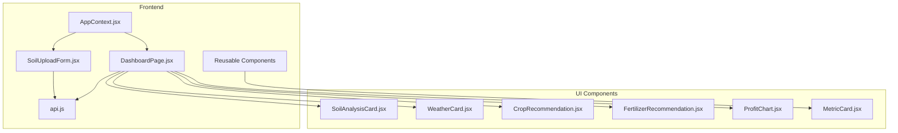
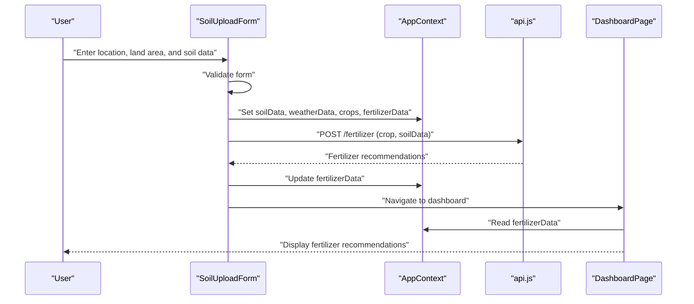
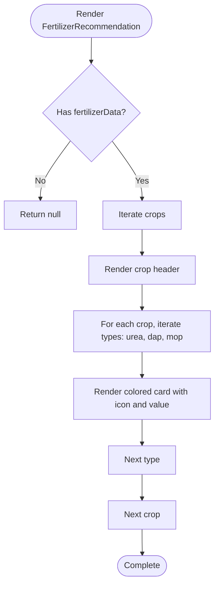
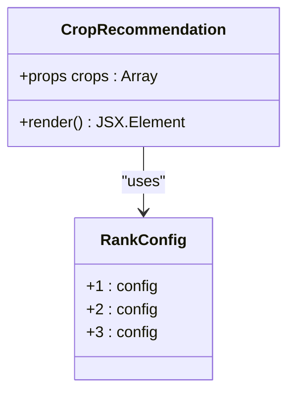
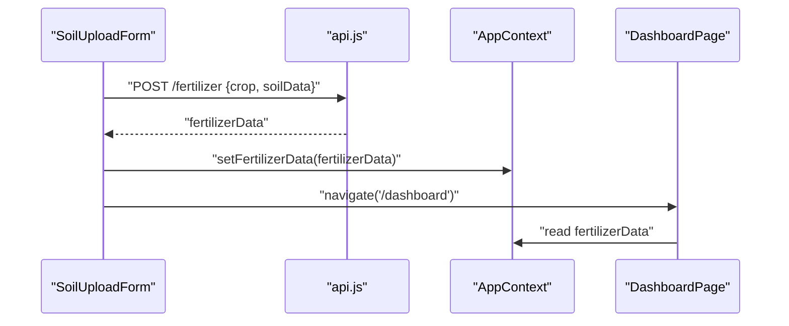
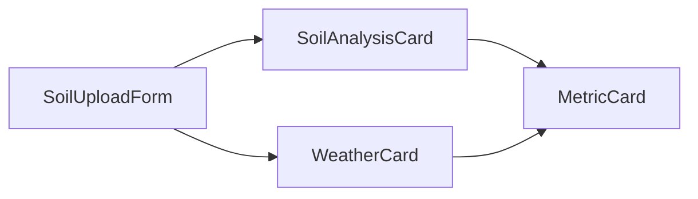
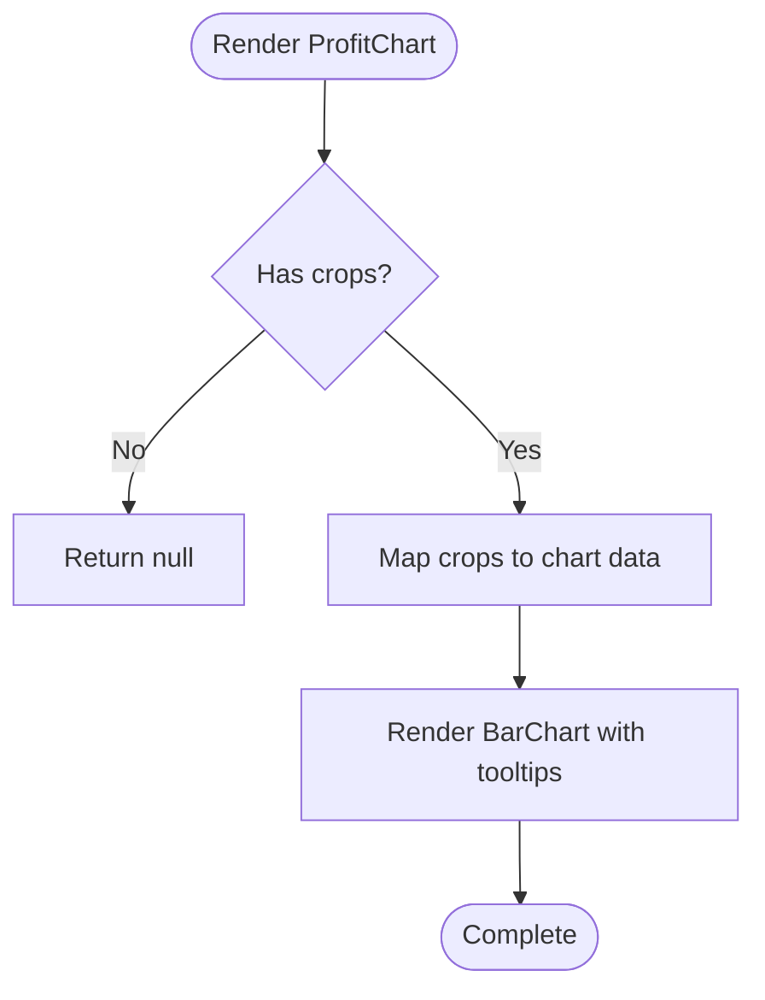
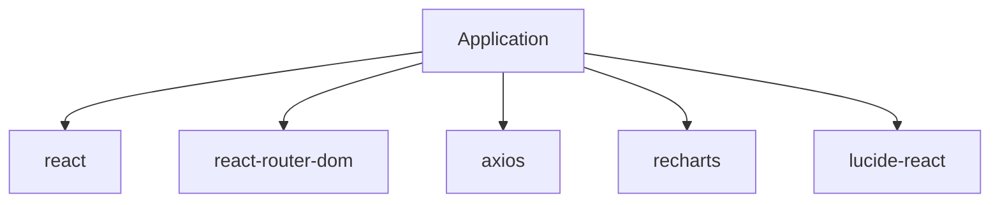

# Fertilizer Recommendation System

<cite>
**Referenced Files in This Document**
- [FertilizerRecommendation.jsx](file://frontend/src/components/Dashboard/FertilizerRecommendation.jsx)
- [CropRecommendation.jsx](file://frontend/src/components/Dashboard/CropRecommendation.jsx)
- [api.js](file://frontend/src/services/api.js)
- [AppContext.jsx](file://frontend/src/context/AppContext.jsx)
- [DashboardPage.jsx](file://frontend/src/pages/DashboardPage.jsx)
- [SoilUploadForm.jsx](file://frontend/src/components/Upload/SoilUploadForm.jsx)
- [SoilAnalysisCard.jsx](file://frontend/src/components/Dashboard/SoilAnalysisCard.jsx)
- [WeatherCard.jsx](file://frontend/src/components/Dashboard/WeatherCard.jsx)
- [ProfitChart.jsx](file://frontend/src/components/Dashboard/ProfitChart.jsx)
- [MetricCard.jsx](file://frontend/src/components/common/MetricCard.jsx)
- [package.json](file://frontend/package.json)
</cite>

## Table of Contents
1. [Introduction](#introduction)
2. [Project Structure](#project-structure)
3. [Core Components](#core-components)
4. [Architecture Overview](#architecture-overview)
5. [Detailed Component Analysis](#detailed-component-analysis)
6. [Dependency Analysis](#dependency-analysis)
7. [Performance Considerations](#performance-considerations)
8. [Troubleshooting Guide](#troubleshooting-guide)
9. [Conclusion](#conclusion)

## Introduction
This document describes the Fertilizer Recommendation System, focusing on the fertilizer calculation engine that determines optimal fertilizer requirements per hectare for major crops. The system integrates crop recommendations, soil analysis, weather data, and fertilizer suggestions into a cohesive dashboard. It supports three primary fertilizers—Urea (N), DAP (P), and MOP (K)—and displays per-hectare requirements alongside visualizations for nutrient balance and profitability.

The current frontend implementation demonstrates the end-to-end flow using mock data and API service calls. Backend endpoints are defined in the frontend API module and would be implemented to compute fertilizer ratios based on crop type and soil parameters.

## Project Structure
The system is organized as a React single-page application with a clear separation of concerns:
- Services: API client abstraction for backend communication
- Context: Global state management for soil, weather, crops, and fertilizer data
- Pages: Route-level components orchestrating data flow
- Components: Reusable UI elements for displaying analysis and recommendations
- Assets: Styling via Tailwind CSS and icons via Lucide React

**Diagram sources**
- [AppContext.jsx:13-52](file://frontend/src/context/AppContext.jsx#L13-L52)
- [api.js:33-83](file://frontend/src/services/api.js#L33-L83)
- [DashboardPage.jsx:11-67](file://frontend/src/pages/DashboardPage.jsx#L11-L67)
- [SoilUploadForm.jsx:9-271](file://frontend/src/components/Upload/SoilUploadForm.jsx#L9-L271)
- [SoilAnalysisCard.jsx:4-73](file://frontend/src/components/Dashboard/SoilAnalysisCard.jsx#L4-L73)
- [WeatherCard.jsx:4-70](file://frontend/src/components/Dashboard/WeatherCard.jsx#L4-L70)
- [CropRecommendation.jsx:27-97](file://frontend/src/components/Dashboard/CropRecommendation.jsx#L27-L97)
- [FertilizerRecommendation.jsx:15-62](file://frontend/src/components/Dashboard/FertilizerRecommendation.jsx#L15-L62)
- [ProfitChart.jsx:4-70](file://frontend/src/components/Dashboard/ProfitChart.jsx#L4-L70)
- [MetricCard.jsx:1-39](file://frontend/src/components/common/MetricCard.jsx#L1-L39)

**Section sources**
- [package.json:1-29](file://frontend/package.json#L1-L29)

## Core Components
This section outlines the key components involved in fertilizer recommendations and their roles in the system.

- FertilizerRecommendation component
  - Purpose: Renders per-hectare fertilizer requirements for Urea, DAP, and MOP for each recommended crop.
  - Data model: Expects an array of objects with crop name and fertilizer quantities.
  - Rendering: Uses icons and color-coded cards for each fertilizer type.

- CropRecommendation component
  - Purpose: Displays top crop recommendations with confidence and expected profit.
  - Data model: Expects an array of crop objects with name, rank, confidence, and expected_profit.
  - Visualization: Includes a ranking system and progress-like confidence bar.

- API service
  - Purpose: Centralized HTTP client for backend endpoints.
  - Endpoints used:
    - POST /predict: Accepts soilData, location, and land_area; returns crop recommendations.
    - POST /fertilizer: Accepts crop and soilData; returns fertilizer recommendations.
    - GET /weather: Accepts location; returns weather data.
    - POST /analyze-soil: Accepts image form data; returns processed soil analysis.

- AppContext
  - Purpose: Global state container for soilData, weatherData, crops, fertilizerData, loading, error, location, and landArea.
  - Responsibilities: Provides shared state across components and a reset function.

- DashboardPage
  - Purpose: Orchestrates the display of analysis results and recommendations.
  - Responsibilities: Validates presence of soilData, renders SoilAnalysisCard, WeatherCard, CropRecommendation, ProfitChart, and FertilizerRecommendation.

- SoilUploadForm
  - Purpose: Collects location, land area, and soil data (via image upload or manual input).
  - Responsibilities: Validates inputs, simulates backend calls with demo data, and navigates to the dashboard.

- Supporting components
  - SoilAnalysisCard: Displays soil nutrient metrics using MetricCard.
  - WeatherCard: Displays current weather metrics using MetricCard.
  - ProfitChart: Visualizes expected profit comparison across crops.
  - MetricCard: Generic reusable card for displaying metrics with icons and colors.

**Section sources**
- [FertilizerRecommendation.jsx:15-62](file://frontend/src/components/Dashboard/FertilizerRecommendation.jsx#L15-L62)
- [CropRecommendation.jsx:27-97](file://frontend/src/components/Dashboard/CropRecommendation.jsx#L27-L97)
- [api.js:33-83](file://frontend/src/services/api.js#L33-L83)
- [AppContext.jsx:13-52](file://frontend/src/context/AppContext.jsx#L13-L52)
- [DashboardPage.jsx:11-67](file://frontend/src/pages/DashboardPage.jsx#L11-L67)
- [SoilUploadForm.jsx:9-271](file://frontend/src/components/Upload/SoilUploadForm.jsx#L9-L271)
- [SoilAnalysisCard.jsx:4-73](file://frontend/src/components/Dashboard/SoilAnalysisCard.jsx#L4-L73)
- [WeatherCard.jsx:4-70](file://frontend/src/components/Dashboard/WeatherCard.jsx#L4-L70)
- [ProfitChart.jsx:4-70](file://frontend/src/components/Dashboard/ProfitChart.jsx#L4-L70)
- [MetricCard.jsx:1-39](file://frontend/src/components/common/MetricCard.jsx#L1-L39)

## Architecture Overview
The system follows a reactive, data-driven architecture:
- Data entry occurs in the upload form, which validates inputs and prepares soil and weather datasets.
- The dashboard consumes global state to render analysis cards, crop recommendations, profit visualization, and fertilizer recommendations.
- API service encapsulates backend communication, enabling easy integration with server-side logic for fertilizer calculations.

**Diagram sources**
- [SoilUploadForm.jsx:53-149](file://frontend/src/components/Upload/SoilUploadForm.jsx#L53-L149)
- [api.js:46-56](file://frontend/src/services/api.js#L46-L56)
- [AppContext.jsx:31-49](file://frontend/src/context/AppContext.jsx#L31-L49)
- [DashboardPage.jsx:13-67](file://frontend/src/pages/DashboardPage.jsx#L13-L67)

## Detailed Component Analysis

### Fertilizer Recommendation Display
The FertilizerRecommendation component presents per-hectare fertilizer needs for Urea, DAP, and MOP aligned with crop recommendations. It uses:
- Icons to visually distinguish fertilizer types
- Color-coded cards for improved readability
- Responsive grid layout for multiple crops

**Diagram sources**
- [FertilizerRecommendation.jsx:15-62](file://frontend/src/components/Dashboard/FertilizerRecommendation.jsx#L15-L62)

**Section sources**
- [FertilizerRecommendation.jsx:15-62](file://frontend/src/components/Dashboard/FertilizerRecommendation.jsx#L15-L62)

### Crop Recommendation Integration
The CropRecommendation component provides context for fertilizer decisions by ranking top crops with confidence and expected profit. This informs which fertilizer recommendations are most relevant.

**Diagram sources**
- [CropRecommendation.jsx:27-97](file://frontend/src/components/Dashboard/CropRecommendation.jsx#L27-L97)

**Section sources**
- [CropRecommendation.jsx:27-97](file://frontend/src/components/Dashboard/CropRecommendation.jsx#L27-L97)

### API Integration and Data Flow
The API service defines the contract for backend endpoints. The frontend currently uses mock data but is structured to integrate with backend implementations.

**Diagram sources**
- [api.js:46-56](file://frontend/src/services/api.js#L46-L56)
- [SoilUploadForm.jsx:116-141](file://frontend/src/components/Upload/SoilUploadForm.jsx#L116-L141)
- [DashboardPage.jsx:13](file://frontend/src/pages/DashboardPage.jsx#L13)

**Section sources**
- [api.js:33-83](file://frontend/src/services/api.js#L33-L83)
- [SoilUploadForm.jsx:53-149](file://frontend/src/components/Upload/SoilUploadForm.jsx#L53-L149)

### Soil and Weather Data Presentation
The SoilAnalysisCard and WeatherCard components present environmental data using MetricCard, ensuring consistent presentation and accessibility.

**Diagram sources**
- [SoilUploadForm.jsx:138-141](file://frontend/src/components/Upload/SoilUploadForm.jsx#L138-L141)
- [SoilAnalysisCard.jsx:4-73](file://frontend/src/components/Dashboard/SoilAnalysisCard.jsx#L4-L73)
- [WeatherCard.jsx:4-70](file://frontend/src/components/Dashboard/WeatherCard.jsx#L4-L70)
- [MetricCard.jsx:1-39](file://frontend/src/components/common/MetricCard.jsx#L1-L39)

**Section sources**
- [SoilAnalysisCard.jsx:4-73](file://frontend/src/components/Dashboard/SoilAnalysisCard.jsx#L4-L73)
- [WeatherCard.jsx:4-70](file://frontend/src/components/Dashboard/WeatherCard.jsx#L4-L70)
- [MetricCard.jsx:1-39](file://frontend/src/components/common/MetricCard.jsx#L1-L39)

### Profit Visualization
The ProfitChart component visualizes expected profits across crops, complementing fertilizer recommendations by highlighting economic viability.

**Diagram sources**
- [ProfitChart.jsx:4-70](file://frontend/src/components/Dashboard/ProfitChart.jsx#L4-L70)

**Section sources**
- [ProfitChart.jsx:4-70](file://frontend/src/components/Dashboard/ProfitChart.jsx#L4-L70)

## Dependency Analysis
The frontend relies on external libraries for routing, HTTP requests, charts, and icons. These dependencies support the system's modular architecture and UI consistency.

**Diagram sources**
- [package.json:11-27](file://frontend/package.json#L11-L27)

**Section sources**
- [package.json:11-27](file://frontend/package.json#L11-L27)

## Performance Considerations
- Minimize re-renders by leveraging the global state pattern in AppContext to avoid prop drilling.
- Defer heavy computations to the backend to keep the UI responsive.
- Use lazy loading for images and charts to improve initial load times.
- Cache API responses where appropriate to reduce network overhead.

## Troubleshooting Guide
Common issues and resolutions:
- Missing soilData on dashboard: The dashboard redirects to the upload page if soilData is unavailable. Ensure the upload form sets soilData before navigation.
- API errors: The API client logs request and response errors. Verify endpoint URLs and network connectivity.
- Empty fertilizer recommendations: Confirm that the backend endpoint for /fertilizer returns data for the selected crop and soil profile.
- Validation failures: The upload form validates location, land area, and soil inputs. Correct invalid entries before resubmission.

**Section sources**
- [DashboardPage.jsx:15-19](file://frontend/src/pages/DashboardPage.jsx#L15-L19)
- [api.js:13-31](file://frontend/src/services/api.js#L13-L31)
- [SoilUploadForm.jsx:41-51](file://frontend/src/components/Upload/SoilUploadForm.jsx#L41-L51)

## Conclusion
The Fertilizer Recommendation System provides a robust foundation for displaying per-hectare fertilizer needs for Urea, DAP, and MOP in alignment with crop recommendations and environmental data. The current implementation focuses on UI and data orchestration, with backend endpoints ready for integration. By extending the backend with fertilizer calculation logic and incorporating real-time pricing, the system can offer actionable, cost-aware recommendations to farmers.