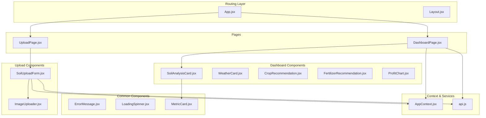
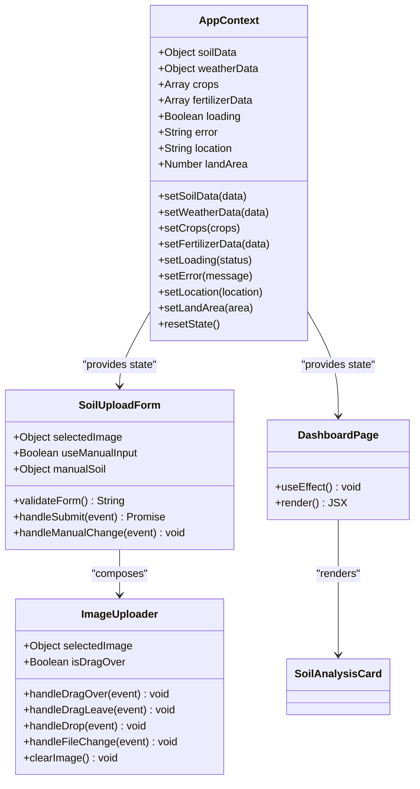
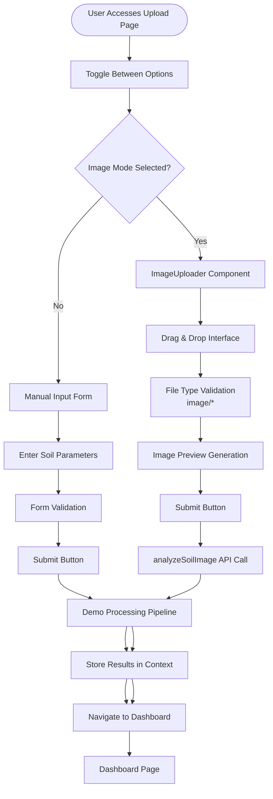
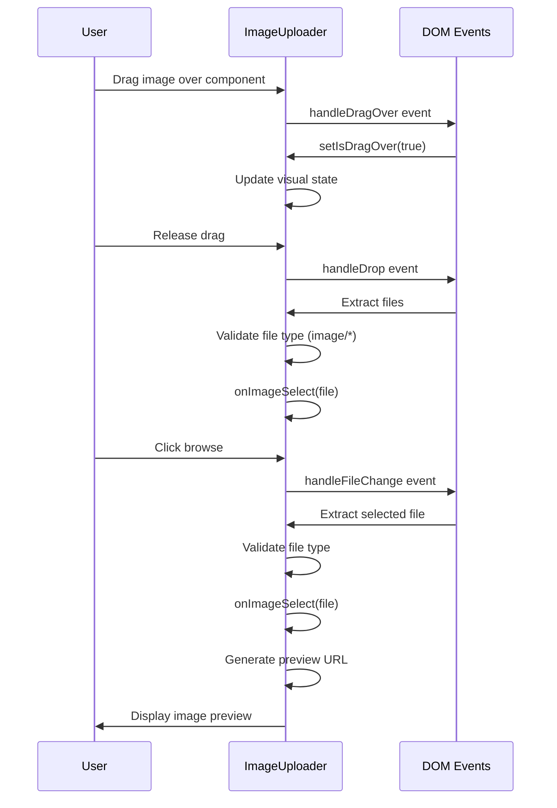
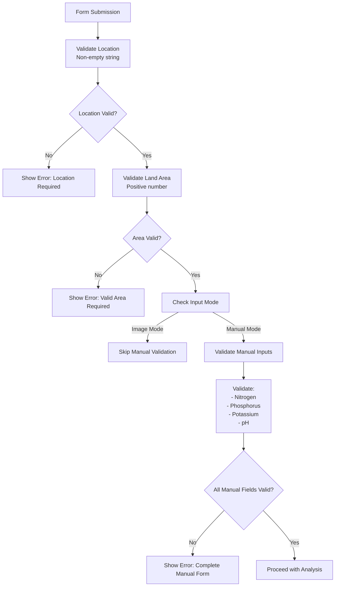
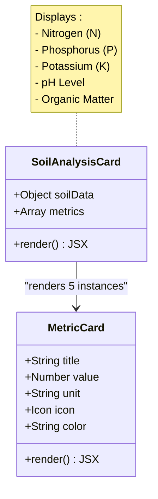
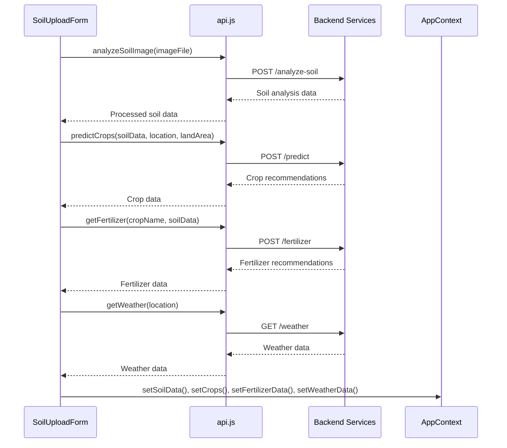

# Soil Analysis System

<cite>
**Referenced Files in This Document**
- [App.jsx](file://frontend/src/App.jsx)
- [index.css](file://frontend/src/index.css)
- [UploadPage.jsx](file://frontend/src/pages/UploadPage.jsx)
- [DashboardPage.jsx](file://frontend/src/pages/DashboardPage.jsx)
- [SoilUploadForm.jsx](file://frontend/src/components/Upload/SoilUploadForm.jsx)
- [ImageUploader.jsx](file://frontend/src/components/Upload/ImageUploader.jsx)
- [SoilAnalysisCard.jsx](file://frontend/src/components/Dashboard/SoilAnalysisCard.jsx)
- [AppContext.jsx](file://frontend/src/context/AppContext.jsx)
- [api.js](file://frontend/src/services/api.js)
- [ErrorMessage.jsx](file://frontend/src/components/common/ErrorMessage.jsx)
- [LoadingSpinner.jsx](file://frontend/src/components/common/LoadingSpinner.jsx)
- [MetricCard.jsx](file://frontend/src/components/common/MetricCard.jsx)
</cite>

## Table of Contents
1. [Introduction](#introduction)
2. [Project Structure](#project-structure)
3. [Core Components](#core-components)
4. [Architecture Overview](#architecture-overview)
5. [Detailed Component Analysis](#detailed-component-analysis)
6. [Dependency Analysis](#dependency-analysis)
7. [Performance Considerations](#performance-considerations)
8. [Troubleshooting Guide](#troubleshooting-guide)
9. [Conclusion](#conclusion)

## Introduction
The Soil Analysis System provides a dual-input approach for agricultural analysis:
- Image-based analysis: Users upload a soil health card image for automated nutrient assessment
- Manual parameter entry: Users input soil parameters (nitrogen, phosphorus, potassium, pH, organic matter) directly

The system integrates with a crop recommendation engine to provide tailored crop suggestions and fertilizer recommendations based on analyzed soil conditions and weather data.

## Project Structure
The frontend follows a component-based architecture with clear separation of concerns:



**Diagram sources**
- [App.jsx:1-20](file://frontend/src/App.jsx#L1-L20)
- [UploadPage.jsx:1-29](file://frontend/src/pages/UploadPage.jsx#L1-L29)
- [DashboardPage.jsx:1-68](file://frontend/src/pages/DashboardPage.jsx#L1-L68)
- [SoilUploadForm.jsx:1-272](file://frontend/src/components/Upload/SoilUploadForm.jsx#L1-L272)
- [ImageUploader.jsx:1-108](file://frontend/src/components/Upload/ImageUploader.jsx#L1-L108)
- [SoilAnalysisCard.jsx:1-74](file://frontend/src/components/Dashboard/SoilAnalysisCard.jsx#L1-L74)
- [AppContext.jsx:1-53](file://frontend/src/context/AppContext.jsx#L1-L53)
- [api.js:1-86](file://frontend/src/services/api.js#L1-L86)

**Section sources**
- [App.jsx:1-20](file://frontend/src/App.jsx#L1-L20)
- [index.css:1-23](file://frontend/src/index.css#L1-L23)

## Core Components
The system consists of several key components working together:

### State Management Architecture
The application uses a centralized context provider to manage global state across components:



**Diagram sources**
- [AppContext.jsx:13-52](file://frontend/src/context/AppContext.jsx#L13-L52)
- [SoilUploadForm.jsx:9-272](file://frontend/src/components/Upload/SoilUploadForm.jsx#L9-L272)
- [ImageUploader.jsx:4-108](file://frontend/src/components/Upload/ImageUploader.jsx#L4-L108)
- [DashboardPage.jsx:11-68](file://frontend/src/pages/DashboardPage.jsx#L11-L68)

### Dual-Input Workflow
The system implements a toggle-based interface allowing users to choose between image upload and manual input:



**Diagram sources**
- [SoilUploadForm.jsx:41-149](file://frontend/src/components/Upload/SoilUploadForm.jsx#L41-L149)
- [ImageUploader.jsx:17-31](file://frontend/src/components/Upload/ImageUploader.jsx#L17-L31)

**Section sources**
- [AppContext.jsx:13-52](file://frontend/src/context/AppContext.jsx#L13-L52)
- [SoilUploadForm.jsx:9-272](file://frontend/src/components/Upload/SoilUploadForm.jsx#L9-L272)
- [ImageUploader.jsx:1-108](file://frontend/src/components/Upload/ImageUploader.jsx#L1-L108)

## Architecture Overview
The system follows a modern React architecture with clear separation between presentation, state management, and data services:

```mermaid
graph TB
subgraph "Presentation Layer"
UploadPage
DashboardPage
SoilUploadForm
ImageUploader
SoilAnalysisCard
end
subgraph "State Management"
AppContext
useAppHook[useApp Hook]
end
subgraph "Data Services"
apiService[api.js]
axiosInstance[Axios Instance]
end
subgraph "UI Components"
ErrorMessage
LoadingSpinner
MetricCard
end
subgraph "External APIs"
PredictAPI[/predict]
FertilizerAPI[/fertilizer]
WeatherAPI[/weather]
AnalyzeSoilAPI[/analyze-soil]
end
UploadPage --> SoilUploadForm
DashboardPage --> SoilAnalysisCard
SoilUploadForm --> AppContext
DashboardPage --> AppContext
SoilUploadForm --> apiService
apiService --> axiosInstance
apiService --> PredictAPI
apiService --> FertilizerAPI
apiService --> WeatherAPI
apiService --> AnalyzeSoilAPI
AppContext --> useAppHook
ErrorMessage --> SoilUploadForm
LoadingSpinner --> SoilUploadForm
MetricCard --> SoilAnalysisCard
```

**Diagram sources**
- [App.jsx:1-20](file://frontend/src/App.jsx#L1-L20)
- [AppContext.jsx:1-53](file://frontend/src/context/AppContext.jsx#L1-L53)
- [api.js:1-86](file://frontend/src/services/api.js#L1-L86)

## Detailed Component Analysis

### Image Upload Component
The ImageUploader component provides a robust drag-and-drop interface for soil health card images:

#### Drag-and-Drop Implementation
The component implements a sophisticated drag-and-drop system with visual feedback:



**Diagram sources**
- [ImageUploader.jsx:7-31](file://frontend/src/components/Upload/ImageUploader.jsx#L7-L31)
- [ImageUploader.jsx:37-62](file://frontend/src/components/Upload/ImageUploader.jsx#L37-L62)

#### File Validation and Preview Generation
The component handles multiple validation scenarios:
- MIME type validation (`image/*`)
- File size considerations
- Preview URL generation using `URL.createObjectURL()`
- Cleanup of object URLs to prevent memory leaks

**Section sources**
- [ImageUploader.jsx:1-108](file://frontend/src/components/Upload/ImageUploader.jsx#L1-L108)

### Manual Input Form Component
The SoilUploadForm implements a comprehensive form for manual soil parameter entry:

#### Form Structure and Validation
The form validates user input through a structured validation process:



**Diagram sources**
- [SoilUploadForm.jsx:41-51](file://frontend/src/components/Upload/SoilUploadForm.jsx#L41-L51)

#### Parameter Input Fields
The manual input form includes five key soil parameters:
- **Nitrogen (N)**: Essential for leaf growth
- **Phosphorus (P)**: Important for root development
- **Potassium (K)**: Critical for disease resistance
- **pH Level**: Measures soil acidity/alkalinity
- **Organic Matter**: Indicates soil fertility

Each field includes:
- Numeric input with decimal support
- Unit specification (kg/ha for nutrients, % for organic matter)
- Real-time validation and error handling

**Section sources**
- [SoilUploadForm.jsx:26-39](file://frontend/src/components/Upload/SoilUploadForm.jsx#L26-L39)
- [SoilUploadForm.jsx:233-257](file://frontend/src/components/Upload/SoilUploadForm.jsx#L233-L257)

### Dashboard Integration
The dashboard displays comprehensive analysis results:

#### Soil Analysis Display
The SoilAnalysisCard presents nutrient data in an organized grid layout:



**Diagram sources**
- [SoilAnalysisCard.jsx:4-43](file://frontend/src/components/Dashboard/SoilAnalysisCard.jsx#L4-L43)
- [MetricCard.jsx:1-39](file://frontend/src/components/common/MetricCard.jsx#L1-L39)

**Section sources**
- [SoilAnalysisCard.jsx:1-74](file://frontend/src/components/Dashboard/SoilAnalysisCard.jsx#L1-L74)
- [MetricCard.jsx:1-39](file://frontend/src/components/common/MetricCard.jsx#L1-L39)

### API Integration
The system integrates with external services through a centralized API service:

#### API Endpoints and Data Flow
The API service handles multiple external integrations:



**Diagram sources**
- [api.js:33-83](file://frontend/src/services/api.js#L33-L83)
- [SoilUploadForm.jsx:138-141](file://frontend/src/components/Upload/SoilUploadForm.jsx#L138-L141)

**Section sources**
- [api.js:1-86](file://frontend/src/services/api.js#L1-L86)

## Dependency Analysis
The system exhibits clean dependency relationships with minimal coupling:

```mermaid
graph TD
subgraph "Internal Dependencies"
AppContext --> SoilUploadForm
AppContext --> DashboardPage
SoilUploadForm --> ImageUploader
DashboardPage --> SoilAnalysisCard
SoilAnalysisCard --> MetricCard
SoilUploadForm --> ErrorMessage
SoilUploadForm --> LoadingSpinner
end
subgraph "External Dependencies"
SoilUploadForm --> api.js
api.js --> axios
AppContext --> React Context API
end
subgraph "UI Dependencies"
ErrorMessage --> Lucide Icons
LoadingSpinner --> Lucide Icons
MetricCard --> Lucide Icons
ImageUploader --> Lucide Icons
SoilUploadForm --> Lucide Icons
end
```

**Diagram sources**
- [AppContext.jsx:1-53](file://frontend/src/context/AppContext.jsx#L1-L53)
- [SoilUploadForm.jsx:1-272](file://frontend/src/components/Upload/SoilUploadForm.jsx#L1-L272)
- [api.js:1-86](file://frontend/src/services/api.js#L1-L86)

### Component Coupling Analysis
- **High Cohesion**: Each component has a single responsibility
- **Low Coupling**: Components communicate primarily through props and context
- **Clear Interfaces**: Props and context provide well-defined contracts
- **Minimal Circular Dependencies**: No circular imports detected

**Section sources**
- [App.jsx:1-20](file://frontend/src/App.jsx#L1-L20)
- [AppContext.jsx:1-53](file://frontend/src/context/AppContext.jsx#L1-L53)

## Performance Considerations
The system implements several performance optimizations:

### Memory Management
- **Image URL Cleanup**: Object URLs are automatically cleaned up when components unmount
- **State Optimization**: Context provider manages state efficiently without unnecessary re-renders
- **Conditional Rendering**: Loading states prevent unnecessary computations

### User Experience Optimizations
- **Visual Feedback**: Drag-and-drop states provide immediate user feedback
- **Progress Indicators**: Loading spinners indicate ongoing processing
- **Graceful Degradation**: Demo mode allows testing without backend connectivity

### Error Handling Strategies
- **Centralized Error State**: Errors are managed through the context provider
- **User-Friendly Messages**: Clear error messages guide users toward resolution
- **Retry Mechanisms**: Error components provide retry functionality

## Troubleshooting Guide

### Common Issues and Solutions

#### Image Upload Problems
**Issue**: Images not uploading despite valid selection
- **Cause**: Incorrect file type or browser compatibility issues
- **Solution**: Verify file is a valid image format (JPG, PNG, WEBP)
- **Debug Steps**: Check browser console for file type validation errors

#### Form Validation Errors
**Issue**: Form submission blocked with validation messages
- **Cause**: Missing or invalid required fields
- **Solution**: Ensure location is entered and land area is a positive number
- **Debug Steps**: Check individual field validation messages

#### API Connectivity Issues
**Issue**: Analysis fails with network errors
- **Cause**: Backend service unavailable or CORS issues
- **Solution**: Verify backend server is running and accessible
- **Debug Steps**: Check browser network tab for failed requests

#### State Management Issues
**Issue**: Dashboard shows empty results
- **Cause**: State not properly set in context
- **Solution**: Ensure form submission completes successfully
- **Debug Steps**: Verify context state values after form submission

**Section sources**
- [ErrorMessage.jsx:1-37](file://frontend/src/components/common/ErrorMessage.jsx#L1-L37)
- [LoadingSpinner.jsx:1-17](file://frontend/src/components/common/LoadingSpinner.jsx#L1-L17)

### Debugging Workflow
1. **Verify Component Mounting**: Check that components render without errors
2. **Inspect Context State**: Monitor state changes in the AppContext
3. **Test API Calls**: Use browser developer tools to inspect network requests
4. **Validate Form Data**: Ensure all required fields are properly populated
5. **Check Error Boundaries**: Verify error handling components display correctly

## Conclusion
The Soil Analysis System provides a robust, user-friendly solution for agricultural analysis through its dual-input approach. The system successfully combines modern React patterns with practical agricultural functionality, offering both automated image analysis and manual parameter entry capabilities.

Key strengths include:
- **Clean Architecture**: Well-separated concerns with clear component boundaries
- **User Experience**: Intuitive interface with comprehensive validation and feedback
- **Extensibility**: Modular design allows easy addition of new features
- **Resilience**: Comprehensive error handling and fallback mechanisms

The system serves as an excellent foundation for agricultural technology applications, with clear pathways for integrating real backend services and expanding functionality.