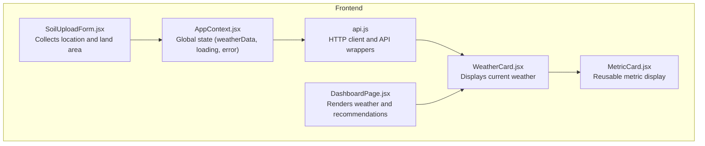
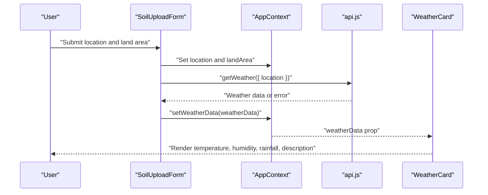
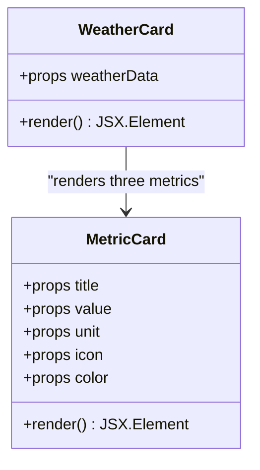
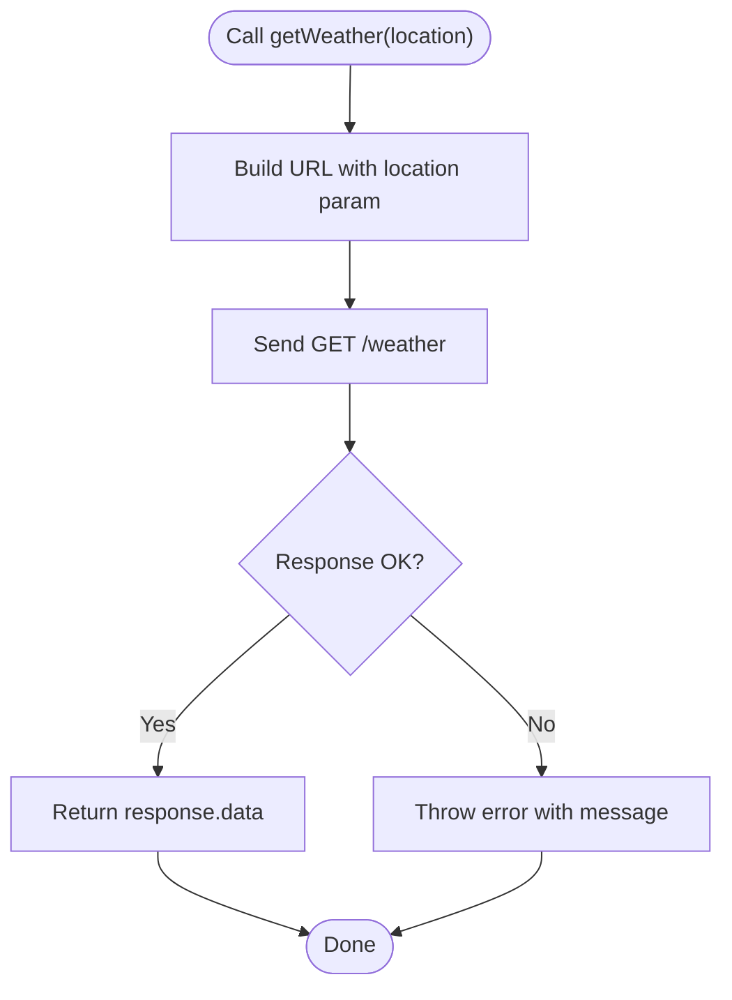
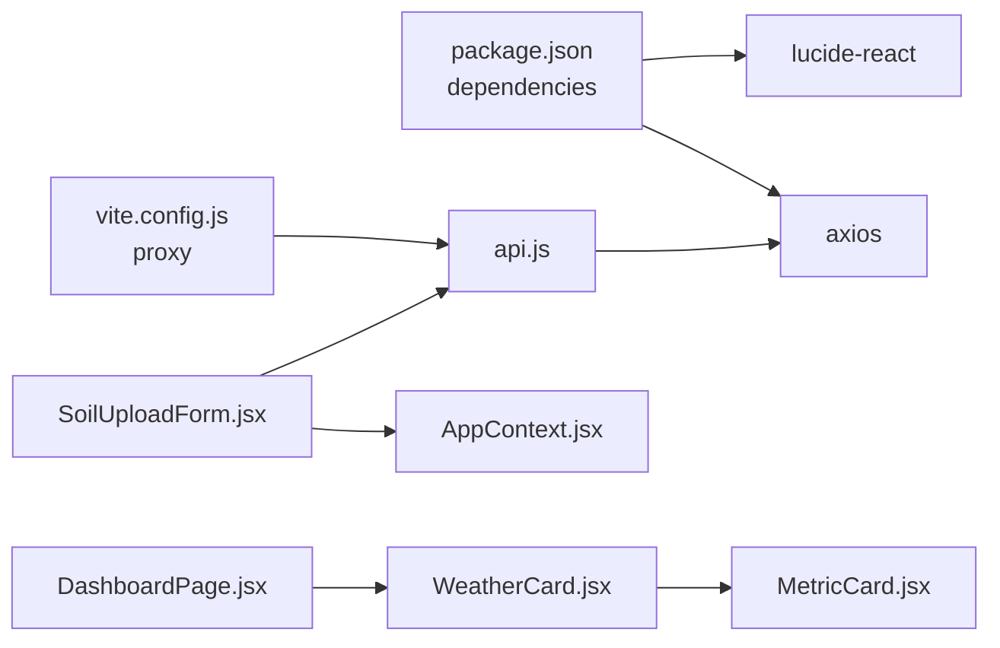

# Weather Integration

<cite>
**Referenced Files in This Document**
- [WeatherCard.jsx](file://frontend/src/components/Dashboard/WeatherCard.jsx)
- [MetricCard.jsx](file://frontend/src/components/common/MetricCard.jsx)
- [api.js](file://frontend/src/services/api.js)
- [AppContext.jsx](file://frontend/src/context/AppContext.jsx)
- [DashboardPage.jsx](file://frontend/src/pages/DashboardPage.jsx)
- [SoilUploadForm.jsx](file://frontend/src/components/Upload/SoilUploadForm.jsx)
- [vite.config.js](file://frontend/vite.config.js)
- [package.json](file://frontend/package.json)
</cite>

## Table of Contents
1. [Introduction](#introduction)
2. [Project Structure](#project-structure)
3. [Core Components](#core-components)
4. [Architecture Overview](#architecture-overview)
5. [Detailed Component Analysis](#detailed-component-analysis)
6. [Dependency Analysis](#dependency-analysis)
7. [Performance Considerations](#performance-considerations)
8. [Troubleshooting Guide](#troubleshooting-guide)
9. [Conclusion](#conclusion)
10. [Appendices](#appendices)

## Introduction
This document explains the Weather Integration feature, focusing on the real-time weather data fetching system, location-based services, and how weather conditions feed into agricultural recommendations. It documents the weather card component implementation, data visualization of temperature, humidity, rainfall, and weather descriptions, and outlines API integration patterns, caching strategies, and error handling. It also describes the relationship between weather conditions and crop/fertilizer recommendations, forecast information processing, and seasonal planning guidance, along with examples of weather data display and troubleshooting common weather API issues.

## Project Structure
The Weather Integration spans the frontend application with the following key areas:
- Services: HTTP client and API wrappers for weather and other features
- Context: Global state for weather data and other analytics
- UI Components: Weather card and metric cards for displaying weather data
- Pages: Dashboard page rendering weather alongside other recommendations
- Forms: Soil upload form capturing location and land area used for weather queries
- Build/Proxy: Vite proxy configuration for backend integration

**Diagram sources**
- [SoilUploadForm.jsx:1-272](file://frontend/src/components/Upload/SoilUploadForm.jsx#L1-L272)
- [AppContext.jsx:1-53](file://frontend/src/context/AppContext.jsx#L1-L53)
- [api.js:1-86](file://frontend/src/services/api.js#L1-L86)
- [WeatherCard.jsx:1-71](file://frontend/src/components/Dashboard/WeatherCard.jsx#L1-L71)
- [MetricCard.jsx:1-39](file://frontend/src/components/common/MetricCard.jsx#L1-L39)
- [DashboardPage.jsx:1-68](file://frontend/src/pages/DashboardPage.jsx#L1-L68)

**Section sources**
- [package.json:1-29](file://frontend/package.json#L1-L29)
- [vite.config.js:1-15](file://frontend/vite.config.js#L1-L15)

## Core Components
- WeatherCard displays current weather metrics and description, using a reusable MetricCard for each metric.
- MetricCard renders a single metric with icon, value, unit, and color theme.
- api.js defines the HTTP client and the getWeather endpoint used to fetch weather by location.
- AppContext manages global state including weatherData, enabling cross-component sharing.
- DashboardPage renders the WeatherCard alongside other recommendations.
- SoilUploadForm captures location and land area; in the current demo mode, it sets mock weather data.

Key responsibilities:
- WeatherCard: Renders temperature, humidity, rainfall, and weather description.
- MetricCard: Provides consistent styling and layout for metrics.
- api.js: Encapsulates HTTP requests and error handling for weather retrieval.
- AppContext: Centralizes state updates for weatherData.
- DashboardPage: Orchestrates the presentation of weather and recommendations.
- SoilUploadForm: Supplies location used for weather queries.

**Section sources**
- [WeatherCard.jsx:1-71](file://frontend/src/components/Dashboard/WeatherCard.jsx#L1-L71)
- [MetricCard.jsx:1-39](file://frontend/src/components/common/MetricCard.jsx#L1-L39)
- [api.js:58-67](file://frontend/src/services/api.js#L58-L67)
- [AppContext.jsx:13-52](file://frontend/src/context/AppContext.jsx#L13-L52)
- [DashboardPage.jsx:11-68](file://frontend/src/pages/DashboardPage.jsx#L11-L68)
- [SoilUploadForm.jsx:53-149](file://frontend/src/components/Upload/SoilUploadForm.jsx#L53-L149)

## Architecture Overview
The weather integration follows a straightforward client-side flow:
- The user enters location and land area in the upload form.
- On submission, the app either simulates backend calls (demo mode) or invokes the getWeather API.
- Weather data is stored in AppContext and passed down to WeatherCard for rendering.
- The DashboardPage composes WeatherCard with other recommendation components.

**Diagram sources**
- [SoilUploadForm.jsx:53-149](file://frontend/src/components/Upload/SoilUploadForm.jsx#L53-L149)
- [AppContext.jsx:13-52](file://frontend/src/context/AppContext.jsx#L13-L52)
- [api.js:58-67](file://frontend/src/services/api.js#L58-L67)
- [WeatherCard.jsx:4-68](file://frontend/src/components/Dashboard/WeatherCard.jsx#L4-L68)

## Detailed Component Analysis

### WeatherCard Component
Purpose:
- Display current weather metrics and description.
- Accept weatherData via props and render three metrics using MetricCard.

Implementation highlights:
- Metrics array defines Temperature, Humidity, and Rainfall with icons and color themes.
- Location is shown using a pin icon and the location field from weatherData.
- Description is rendered in a styled container below the metrics.

**Diagram sources**
- [WeatherCard.jsx:4-68](file://frontend/src/components/Dashboard/WeatherCard.jsx#L4-L68)
- [MetricCard.jsx:1-39](file://frontend/src/components/common/MetricCard.jsx#L1-L39)

**Section sources**
- [WeatherCard.jsx:4-68](file://frontend/src/components/Dashboard/WeatherCard.jsx#L4-L68)
- [MetricCard.jsx:1-39](file://frontend/src/components/common/MetricCard.jsx#L1-L39)

### MetricCard Component
Purpose:
- Provide a reusable card for displaying a single metric with icon, value, unit, and color scheme.

Implementation highlights:
- Color classes for background, text, borders, and icons are mapped by color key.
- Supports optional icon rendering and unit display.

**Section sources**
- [MetricCard.jsx:1-39](file://frontend/src/components/common/MetricCard.jsx#L1-L39)

### API Integration Pattern (api.js)
Purpose:
- Centralized HTTP client and API wrappers for backend communication.
- Defines getWeather endpoint for retrieving weather by location.

Key behaviors:
- Axios client configured with base URL, headers, and timeout.
- Interceptors log requests and surface errors.
- getWeather performs GET /weather with query param location.
- Error handling wraps responses with user-friendly messages.

**Diagram sources**
- [api.js:58-67](file://frontend/src/services/api.js#L58-L67)

**Section sources**
- [api.js:1-86](file://frontend/src/services/api.js#L1-L86)

### State Management (AppContext)
Purpose:
- Provide global state for weatherData and other analytics.
- Enable components like WeatherCard to consume weatherData without prop drilling.

Key behaviors:
- Exposes setWeatherData for updating weather information.
- Holds loading and error states for coordinated UX feedback.

**Section sources**
- [AppContext.jsx:13-52](file://frontend/src/context/AppContext.jsx#L13-L52)

### Dashboard Composition (DashboardPage)
Purpose:
- Render the dashboard layout and compose WeatherCard with other recommendation components.

Key behaviors:
- Uses AppContext to access weatherData and other analytics.
- Displays WeatherCard alongside SoilAnalysisCard, CropRecommendation, ProfitChart, and FertilizerRecommendation.

**Section sources**
- [DashboardPage.jsx:11-68](file://frontend/src/pages/DashboardPage.jsx#L11-L68)

### Location-Based Services and Data Flow (SoilUploadForm)
Purpose:
- Collect user location and land area.
- Demonstrate weather data integration by setting mock weatherData in demo mode.

Key behaviors:
- Validates location and land area.
- Sets weatherData (demo mode) and navigates to the dashboard.

Note: In demo mode, the app sets mock weather data. To integrate a real weather API, replace the demo assignment with a call to getWeather and update AppContext accordingly.

**Section sources**
- [SoilUploadForm.jsx:41-51](file://frontend/src/components/Upload/SoilUploadForm.jsx#L41-L51)
- [SoilUploadForm.jsx:64-149](file://frontend/src/components/Upload/SoilUploadForm.jsx#L64-L149)

## Dependency Analysis
External dependencies relevant to weather integration:
- axios: HTTP client used by api.js for backend communication.
- lucide-react: Icons used in WeatherCard and MetricCard.
- vite: Dev server with proxy configuration to forward /weather to backend.

Internal dependencies:
- WeatherCard depends on MetricCard for metric rendering.
- DashboardPage composes WeatherCard and other recommendation components.
- SoilUploadForm updates AppContext state and triggers navigation to the dashboard.

**Diagram sources**
- [package.json:11-17](file://frontend/package.json#L11-L17)
- [vite.config.js:8-13](file://frontend/vite.config.js#L8-L13)
- [api.js:1-86](file://frontend/src/services/api.js#L1-L86)
- [WeatherCard.jsx:1-71](file://frontend/src/components/Dashboard/WeatherCard.jsx#L1-L71)
- [MetricCard.jsx:1-39](file://frontend/src/components/common/MetricCard.jsx#L1-L39)
- [DashboardPage.jsx:1-68](file://frontend/src/pages/DashboardPage.jsx#L1-L68)
- [AppContext.jsx:1-53](file://frontend/src/context/AppContext.jsx#L1-L53)
- [SoilUploadForm.jsx:1-272](file://frontend/src/components/Upload/SoilUploadForm.jsx#L1-L272)

**Section sources**
- [package.json:11-17](file://frontend/package.json#L11-L17)
- [vite.config.js:8-13](file://frontend/vite.config.js#L8-L13)

## Performance Considerations
- Network timeouts: The HTTP client sets a 30-second timeout for requests. Consider adjusting based on network conditions and backend responsiveness.
- Rendering efficiency: WeatherCard uses a small number of MetricCards; keep the number of metrics constant to avoid unnecessary re-renders.
- Proxy configuration: Vite proxy forwards requests to the backend. Ensure the backend is reachable and responsive to minimize perceived latency.
- Caching: No explicit caching is implemented in the frontend. For production, consider adding cache headers and client-side caching strategies to reduce repeated requests for the same location.

[No sources needed since this section provides general guidance]

## Troubleshooting Guide
Common issues and resolutions:
- Backend connectivity:
  - Verify the backend is running and reachable at the configured base URL.
  - Check the proxy configuration in Vite to ensure /weather requests are forwarded correctly.
- API errors:
  - Inspect the error interceptor logs for detailed error messages returned by the backend.
  - Ensure the location parameter is properly formatted and supported by the weather service.
- Demo vs. real data:
  - In demo mode, mock weather data is set. Replace the demo assignment with a real API call to getWeather.
- Timeout handling:
  - If requests take longer than 30 seconds, adjust the timeout value in the HTTP client configuration.
- UI state:
  - Confirm that AppContext is providing weatherData to WeatherCard and that the component handles missing data gracefully.

**Section sources**
- [api.js:13-31](file://frontend/src/services/api.js#L13-L31)
- [api.js:58-67](file://frontend/src/services/api.js#L58-L67)
- [vite.config.js:8-13](file://frontend/vite.config.js#L8-L13)
- [SoilUploadForm.jsx:64-149](file://frontend/src/components/Upload/SoilUploadForm.jsx#L64-L149)

## Conclusion
The Weather Integration feature provides a clean separation of concerns: a centralized API wrapper, a reusable metric card component, and a dedicated weather card for displaying current conditions. While the current implementation demonstrates the integration with mock data, extending it to a real weather API involves replacing the demo assignment with a call to getWeather and ensuring robust error handling and state management. The architecture supports future enhancements such as caching, improved error handling, and expanded visualization.

[No sources needed since this section summarizes without analyzing specific files]

## Appendices

### API Definitions
- Endpoint: GET /weather
- Query parameters:
  - location (required): City or location identifier
- Success response: Weather object containing temperature, humidity, rainfall, description, and location
- Error response: Error message propagated from the backend

**Section sources**
- [api.js:58-67](file://frontend/src/services/api.js#L58-L67)

### Weather Data Display Examples
- Temperature: Shown with a thermometer icon and °C unit.
- Humidity: Shown with a droplet icon and % unit.
- Rainfall: Shown with a rain cloud icon and mm unit.
- Weather description: Rendered beneath the metrics in a styled container.

**Section sources**
- [WeatherCard.jsx:7-29](file://frontend/src/components/Dashboard/WeatherCard.jsx#L7-L29)
- [WeatherCard.jsx:62-65](file://frontend/src/components/Dashboard/WeatherCard.jsx#L62-L65)

### Seasonal Recommendation Logic
- Current implementation focuses on displaying weather metrics.
- Seasonal recommendations can be derived from:
  - Temperature thresholds for planting windows
  - Humidity and rainfall forecasts for irrigation scheduling
  - Weather descriptions for pest/disease risk assessment
- These recommendations are typically computed in the backend and surfaced via separate endpoints; the frontend can integrate them similarly to weather data.

[No sources needed since this section provides general guidance]