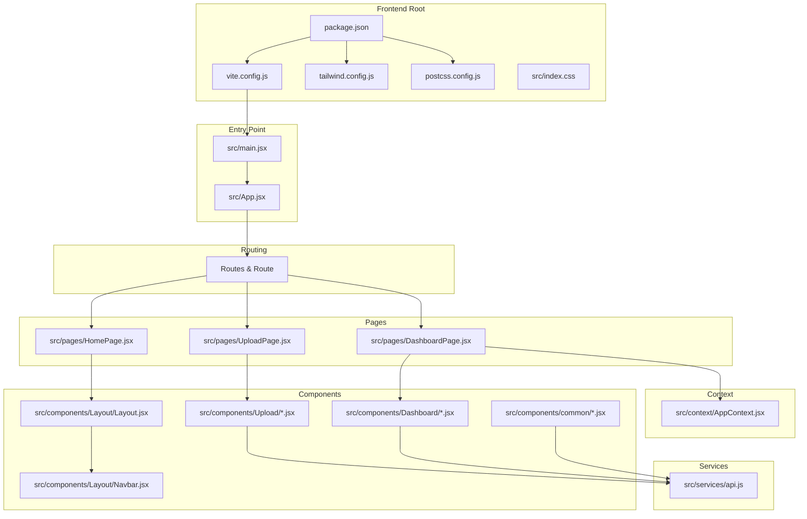
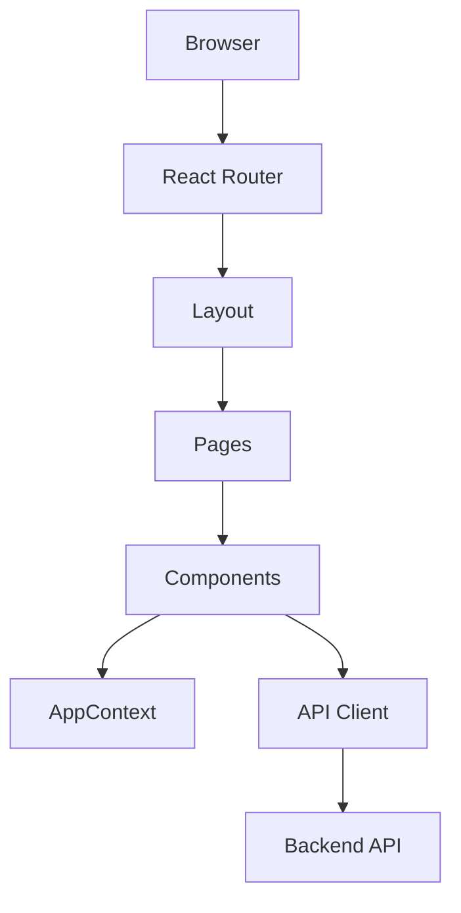
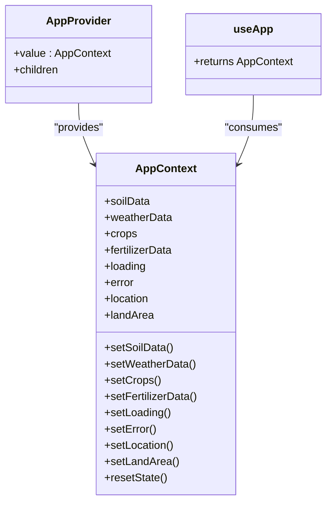
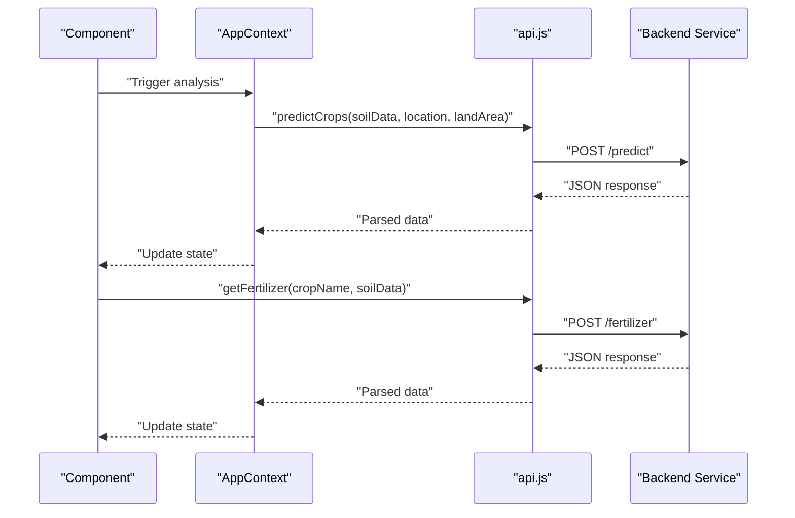
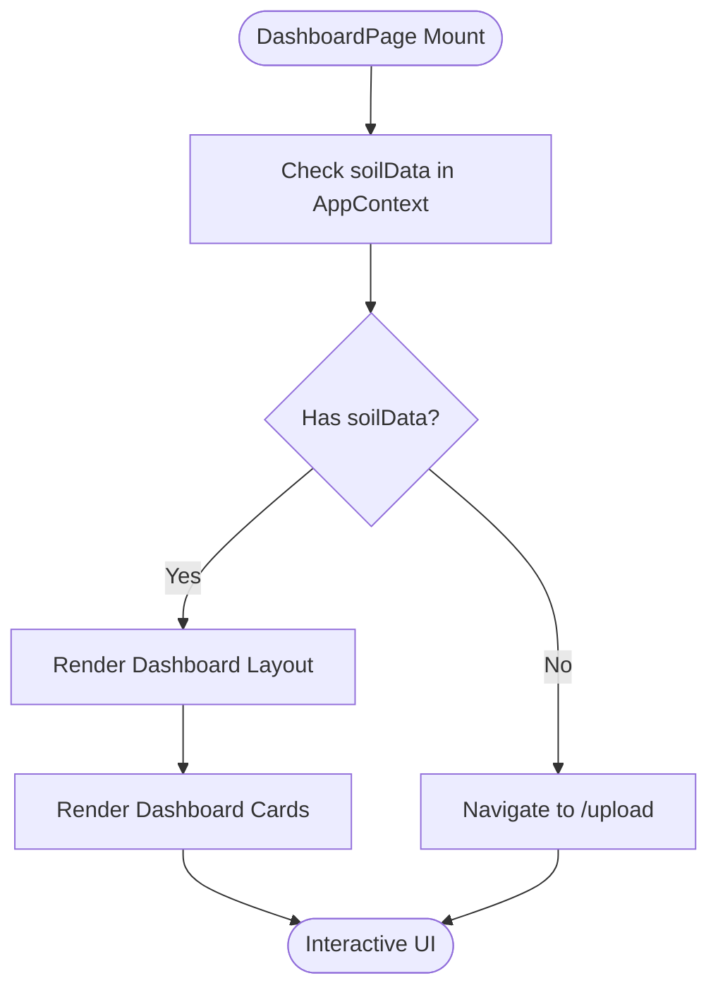
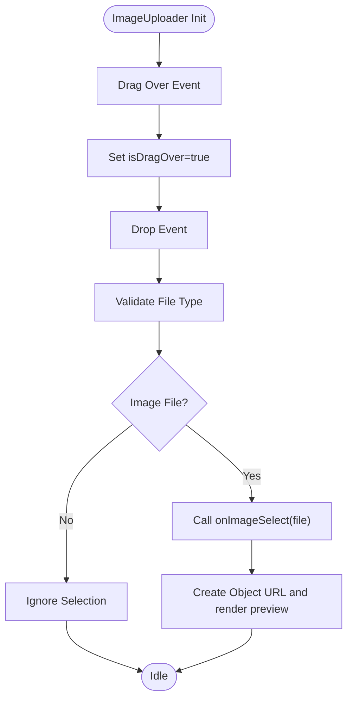
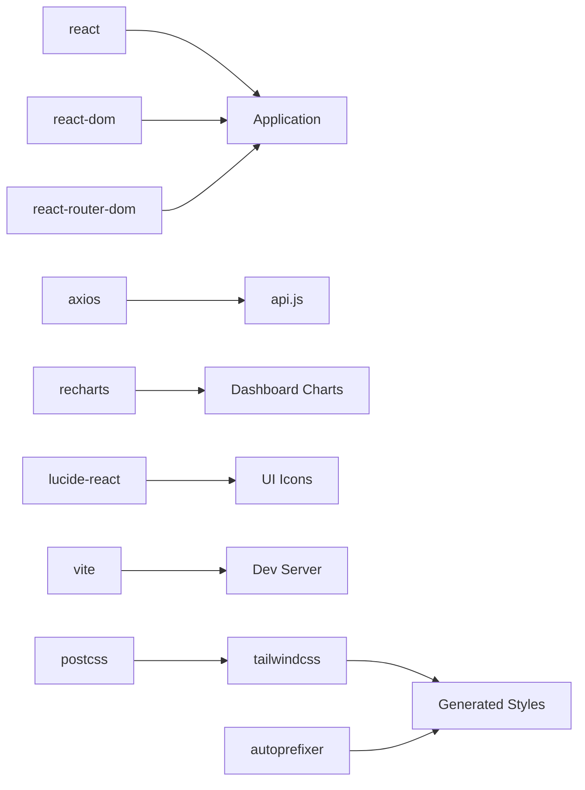

# Development Guidelines

<cite>
**Referenced Files in This Document**
- [package.json](file://frontend/package.json)
- [vite.config.js](file://frontend/vite.config.js)
- [tailwind.config.js](file://frontend/tailwind.config.js)
- [postcss.config.js](file://frontend/postcss.config.js)
- [index.css](file://frontend/src/index.css)
- [main.jsx](file://frontend/src/main.jsx)
- [App.jsx](file://frontend/src/App.jsx)
- [AppContext.jsx](file://frontend/src/context/AppContext.jsx)
- [api.js](file://frontend/src/services/api.js)
- [Layout.jsx](file://frontend/src/components/Layout/Layout.jsx)
- [Navbar.jsx](file://frontend/src/components/Layout/Navbar.jsx)
- [DashboardPage.jsx](file://frontend/src/pages/DashboardPage.jsx)
- [CropRecommendation.jsx](file://frontend/src/components/Dashboard/CropRecommendation.jsx)
- [ImageUploader.jsx](file://frontend/src/components/Upload/ImageUploader.jsx)
- [LoadingSpinner.jsx](file://frontend/src/components/common/LoadingSpinner.jsx)
- [ErrorMessage.jsx](file://frontend/src/components/common/ErrorMessage.jsx)
</cite>

## Table of Contents
1. [Introduction](#introduction)
2. [Project Structure](#project-structure)
3. [Core Components](#core-components)
4. [Architecture Overview](#architecture-overview)
5. [Detailed Component Analysis](#detailed-component-analysis)
6. [Dependency Analysis](#dependency-analysis)
7. [Performance Considerations](#performance-considerations)
8. [Security Considerations](#security-considerations)
9. [Testing Strategies](#testing-strategies)
10. [Build Configuration and Deployment](#build-configuration-and-deployment)
11. [Development Workflow](#development-workflow)
12. [Contribution Guidelines](#contribution-guidelines)
13. [Code Review Process](#code-review-process)
14. [Quality Assurance Standards](#quality-assurance-standards)
15. [Maintenance Practices](#maintenance-practices)
16. [Troubleshooting Guide](#troubleshooting-guide)
17. [Conclusion](#conclusion)

## Introduction
This document provides comprehensive development guidelines for the Smart Farming Advisor project. It establishes code organization principles, component naming conventions, file structure standards, and development best practices tailored for the current React + Vite + Tailwind stack. It also covers TypeScript usage recommendations, styling conventions, testing strategies, build configuration, development workflow, environment setup, deployment processes, performance optimization techniques, security considerations, and maintenance practices.

## Project Structure
The frontend follows a feature-based structure with clear separation of concerns:
- src/components: Reusable UI components organized by feature areas (Dashboard, Home, Layout, Upload, common)
- src/context: Application-wide state management via React Context
- src/pages: Page-level components routed by React Router
- src/services: API client and service abstractions
- Root configuration files for Vite, Tailwind CSS, PostCSS, and package scripts

**Diagram sources**
- [package.json:1-29](file://frontend/package.json#L1-L29)
- [vite.config.js:1-16](file://frontend/vite.config.js#L1-L16)
- [tailwind.config.js:1-57](file://frontend/tailwind.config.js#L1-L57)
- [postcss.config.js:1-7](file://frontend/postcss.config.js#L1-L7)
- [index.css:1-23](file://frontend/src/index.css#L1-L23)
- [main.jsx:1-17](file://frontend/src/main.jsx#L1-L17)
- [App.jsx:1-20](file://frontend/src/App.jsx#L1-L20)
- [AppContext.jsx:1-53](file://frontend/src/context/AppContext.jsx#L1-L53)
- [api.js:1-86](file://frontend/src/services/api.js#L1-L86)
- [Layout.jsx:1-17](file://frontend/src/components/Layout/Layout.jsx#L1-L17)
- [Navbar.jsx:1-80](file://frontend/src/components/Layout/Navbar.jsx#L1-L80)
- [DashboardPage.jsx:1-68](file://frontend/src/pages/DashboardPage.jsx#L1-L68)
- [ImageUploader.jsx:1-108](file://frontend/src/components/Upload/ImageUploader.jsx#L1-L108)
- [LoadingSpinner.jsx:1-17](file://frontend/src/components/common/LoadingSpinner.jsx#L1-L17)
- [ErrorMessage.jsx:1-37](file://frontend/src/components/common/ErrorMessage.jsx#L1-L37)

**Section sources**
- [package.json:1-29](file://frontend/package.json#L1-L29)
- [vite.config.js:1-16](file://frontend/vite.config.js#L1-L16)
- [tailwind.config.js:1-57](file://frontend/tailwind.config.js#L1-L57)
- [postcss.config.js:1-7](file://frontend/postcss.config.js#L1-L7)
- [index.css:1-23](file://frontend/src/index.css#L1-L23)
- [main.jsx:1-17](file://frontend/src/main.jsx#L1-L17)
- [App.jsx:1-20](file://frontend/src/App.jsx#L1-L20)

## Core Components
This section documents the foundational building blocks of the application.

- Application Provider and Context
  - Centralized state management for soil data, weather data, crop recommendations, fertilizer recommendations, loading, error, location, and land area
  - Provides a resetState utility to clear analysis results
  - Exposes a custom hook useApp for consuming context values

- API Client
  - Axios-based client configured with base URL, JSON headers, and timeout
  - Request interceptor logs outgoing requests
  - Response interceptor logs errors and propagates them
  - Exposes typed functions for crop prediction, fertilizer recommendation, weather retrieval, and soil image analysis

- Routing and Layout
  - App wraps routes with Layout, which provides a consistent header, footer, and responsive main content area
  - Navbar handles desktop and mobile navigation with active state highlighting

- Pages
  - DashboardPage orchestrates analysis results display and redirects to upload when no soil data exists
  - UploadPage integrates image upload and form submission flows
  - HomePage showcases hero and features sections

- Components
  - Dashboard cards present structured analysis results with animations and responsive grids
  - Upload components encapsulate drag-and-drop image selection and preview
  - Common components provide reusable feedback elements (loading spinner, error messages)

**Section sources**
- [AppContext.jsx:1-53](file://frontend/src/context/AppContext.jsx#L1-L53)
- [api.js:1-86](file://frontend/src/services/api.js#L1-L86)
- [Layout.jsx:1-17](file://frontend/src/components/Layout/Layout.jsx#L1-L17)
- [Navbar.jsx:1-80](file://frontend/src/components/Layout/Navbar.jsx#L1-L80)
- [DashboardPage.jsx:1-68](file://frontend/src/pages/DashboardPage.jsx#L1-L68)
- [ImageUploader.jsx:1-108](file://frontend/src/components/Upload/ImageUploader.jsx#L1-L108)
- [LoadingSpinner.jsx:1-17](file://frontend/src/components/common/LoadingSpinner.jsx#L1-L17)
- [ErrorMessage.jsx:1-37](file://frontend/src/components/common/ErrorMessage.jsx#L1-L37)

## Architecture Overview
The application follows a layered architecture:
- Presentation Layer: React components and pages
- Services Layer: API client abstraction
- State Management: React Context provider
- Styling: Tailwind CSS with custom theme tokens
- Build Tooling: Vite with React plugin and dev server proxy

**Diagram sources**
- [App.jsx:1-20](file://frontend/src/App.jsx#L1-L20)
- [Layout.jsx:1-17](file://frontend/src/components/Layout/Layout.jsx#L1-L17)
- [DashboardPage.jsx:1-68](file://frontend/src/pages/DashboardPage.jsx#L1-L68)
- [AppContext.jsx:1-53](file://frontend/src/context/AppContext.jsx#L1-L53)
- [api.js:1-86](file://frontend/src/services/api.js#L1-L86)

## Detailed Component Analysis

### State Management with AppContext
The AppContext provides a centralized store for analysis data and shared UI state. It ensures predictable updates and simplifies prop drilling across the component tree.

**Diagram sources**
- [AppContext.jsx:1-53](file://frontend/src/context/AppContext.jsx#L1-L53)

**Section sources**
- [AppContext.jsx:1-53](file://frontend/src/context/AppContext.jsx#L1-L53)

### API Client Interactions
The API client encapsulates backend communication with standardized request/response handling and error propagation.

**Diagram sources**
- [api.js:33-56](file://frontend/src/services/api.js#L33-L56)
- [AppContext.jsx:13-49](file://frontend/src/context/AppContext.jsx#L13-L49)

**Section sources**
- [api.js:1-86](file://frontend/src/services/api.js#L1-L86)
- [AppContext.jsx:1-53](file://frontend/src/context/AppContext.jsx#L1-L53)

### Dashboard Page Flow
The DashboardPage coordinates navigation, data presentation, and user interactions.

**Diagram sources**
- [DashboardPage.jsx:11-30](file://frontend/src/pages/DashboardPage.jsx#L11-L30)

**Section sources**
- [DashboardPage.jsx:1-68](file://frontend/src/pages/DashboardPage.jsx#L1-L68)

### Image Upload Component
The ImageUploader component manages drag-and-drop and file selection with visual feedback and preview rendering.

**Diagram sources**
- [ImageUploader.jsx:17-35](file://frontend/src/components/Upload/ImageUploader.jsx#L17-L35)

**Section sources**
- [ImageUploader.jsx:1-108](file://frontend/src/components/Upload/ImageUploader.jsx#L1-L108)

## Dependency Analysis
External dependencies and their roles:
- React ecosystem: React, React DOM, React Router DOM
- HTTP client: Axios
- Charts: Recharts
- Icons: lucide-react
- Build and styling: Vite, Tailwind CSS, PostCSS, autoprefixer

**Diagram sources**
- [package.json:11-27](file://frontend/package.json#L11-L27)

**Section sources**
- [package.json:1-29](file://frontend/package.json#L1-L29)

## Performance Considerations
- Lazy loading and code splitting: Split large dashboard charts into separate lazy-loaded modules to reduce initial bundle size.
- Image optimization: Compress uploaded images before analysis and avoid rendering oversized previews.
- Virtualization: For long lists of recommendations, consider virtualizing lists to limit DOM nodes.
- Memoization: Use React.memo and useMemo for expensive computations in charts and recommendation lists.
- Network optimization: Implement request deduplication and caching for repeated weather/crop queries.
- Bundle analysis: Regularly audit bundle composition using Vite's built-in analyzer plugin.
- CSS optimization: Purge unused Tailwind classes during production builds and avoid utility bloat.

## Security Considerations
- Environment variables: Store backend URLs and sensitive keys in environment files and never commit secrets to version control.
- Input sanitization: Validate and sanitize all user inputs, especially file uploads and form submissions.
- CORS and proxy: Configure Vite proxy to route API traffic securely and avoid exposing backend endpoints publicly.
- Content Security Policy: Enforce CSP headers to mitigate script injection risks.
- HTTPS enforcement: Serve the application over HTTPS in production environments.

## Testing Strategies
- Unit tests: Test pure functions, hooks, and small components in isolation using a testing framework.
- Component tests: Use React Testing Library to test component rendering, user interactions, and state changes.
- API tests: Mock Axios interceptors and endpoints to validate request/response handling and error scenarios.
- E2E tests: Automate user journeys (upload → analysis → dashboard) to ensure end-to-end functionality.
- Accessibility tests: Verify keyboard navigation, screen reader compatibility, and ARIA attributes.
- Performance tests: Measure bundle sizes, LCP, FID, and CLS metrics across builds.

## Build Configuration and Deployment
- Build commands:
  - Development: Run the Vite dev server with hot module replacement.
  - Production: Build optimized assets for deployment.
  - Preview: Locally preview the production build.
- Environment configuration:
  - Define environment variables for backend URLs and feature flags.
  - Use a dedicated .env file for local development and CI/CD secrets management.
- Deployment:
  - Static hosting: Deploy built assets to platforms supporting static hosting.
  - Reverse proxy: Configure reverse proxy rules for API routing and SSL termination.
  - CDN: Serve assets via CDN for improved global performance.
  - Monitoring: Integrate error tracking and performance monitoring in production.

**Section sources**
- [package.json:6-10](file://frontend/package.json#L6-L10)
- [vite.config.js:4-15](file://frontend/vite.config.js#L4-L15)

## Development Workflow
- Branching strategy: Use feature branches for new features and bug fixes; merge via pull requests.
- Commit hygiene: Write clear, concise commit messages; reference related issues.
- Local setup: Install dependencies, configure environment variables, and start the dev server.
- Code formatting: Enforce consistent formatting with Prettier and linting with ESLint.
- Pre-commit hooks: Run linters and tests automatically before commits.
- Continuous integration: Automate testing and build verification on pull requests.

## Contribution Guidelines
- Code style: Follow established naming conventions and folder structures.
- Component design: Keep components single-responsibility and reusable.
- Documentation: Add inline comments for complex logic and update README for major changes.
- Accessibility: Ensure components are accessible and keyboard-friendly.
- Testing: Include unit and integration tests for new features.
- Review: Request reviews from peers before merging.

## Code Review Process
- Automated checks: Ensure CI passes and no critical issues remain unresolved.
- Peer review: Conduct focused reviews on logic, performance, and maintainability.
- Accessibility and security: Verify compliance with accessibility guidelines and security best practices.
- Approval: Require at least one approving review before merging.

## Quality Assurance Standards
- Coverage targets: Maintain minimum test coverage thresholds for critical modules.
- Performance budgets: Enforce bundle size and runtime performance budgets.
- Error tracking: Monitor and resolve production errors promptly.
- Regression testing: Validate that fixes do not introduce regressions.

## Maintenance Practices
- Dependency updates: Regularly update dependencies and monitor for security advisories.
- Refactoring: Continuously refactor to improve readability and reduce technical debt.
- Documentation: Keep documentation up-to-date with code changes.
- Backward compatibility: Preserve backward compatibility for public APIs and breaking changes.

## Troubleshooting Guide
- API connectivity:
  - Verify backend URL and CORS configuration.
  - Check network tab for failed requests and inspect error payloads.
- Environment variables:
  - Confirm environment files are loaded and values are correct.
- Build issues:
  - Clear node_modules and reinstall dependencies if builds fail.
  - Inspect Vite configuration for misconfigured plugins or proxies.
- Styling problems:
  - Ensure Tailwind content paths match component locations.
  - Verify PostCSS pipeline order and plugin compatibility.

**Section sources**
- [api.js:13-31](file://frontend/src/services/api.js#L13-L31)
- [vite.config.js:8-14](file://frontend/vite.config.js#L8-L14)
- [tailwind.config.js:3-6](file://frontend/tailwind.config.js#L3-L6)

## Conclusion
These guidelines establish a consistent, scalable foundation for developing the Smart Farming Advisor application. By adhering to the outlined conventions, the team can ensure maintainable code, robust functionality, and a smooth developer experience across the frontend stack.