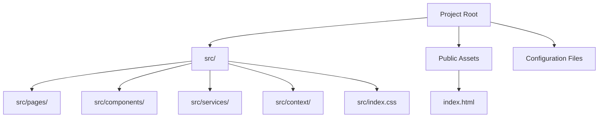
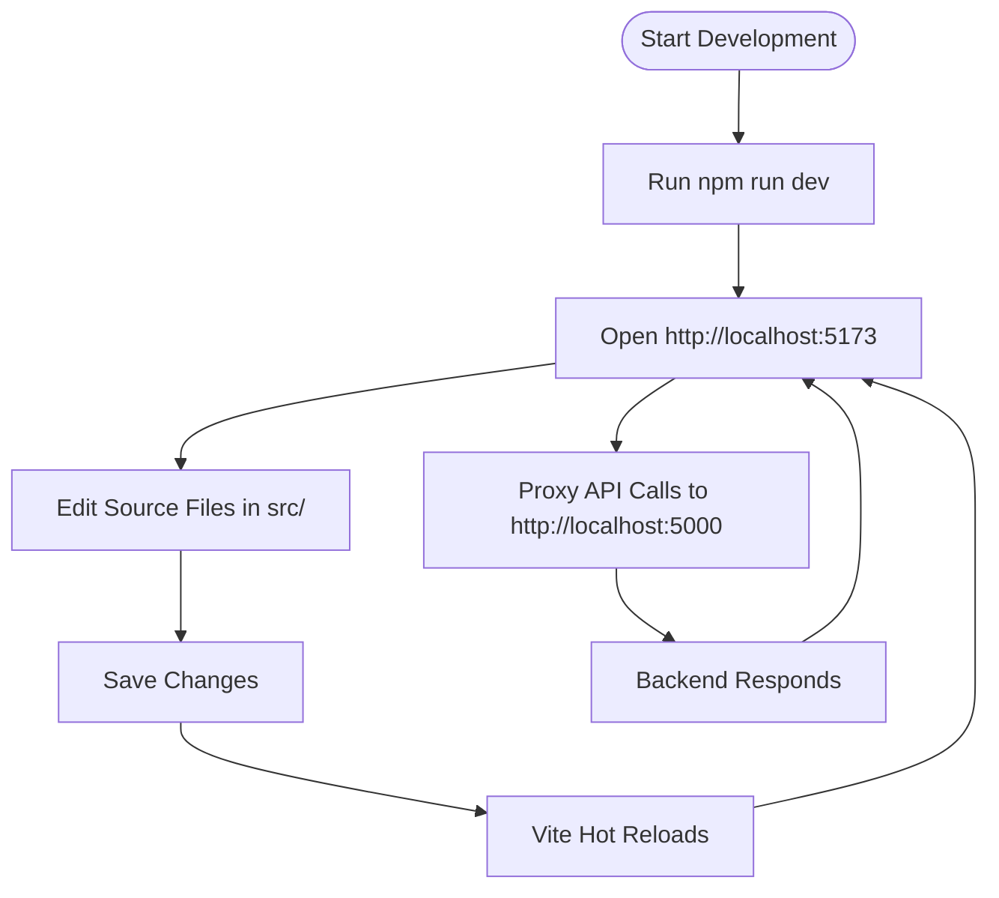

# Getting Started

<cite>
**Referenced Files in This Document**
- [package.json](file://frontend/package.json)
- [vite.config.js](file://frontend/vite.config.js)
- [tailwind.config.js](file://frontend/tailwind.config.js)
- [postcss.config.js](file://frontend/postcss.config.js)
- [index.html](file://frontend/index.html)
- [main.jsx](file://frontend/src/main.jsx)
- [App.jsx](file://frontend/src/App.jsx)
- [index.css](file://frontend/src/index.css)
- [api.js](file://frontend/src/services/api.js)
</cite>

## Table of Contents
1. [Introduction](#introduction)
2. [Prerequisites](#prerequisites)
3. [Installation](#installation)
4. [Environment Setup](#environment-setup)
5. [Local Development Server](#local-development-server)
6. [Project Structure](#project-structure)
7. [Key Configuration Files](#key-configuration-files)
8. [Development Workflow](#development-workflow)
9. [Running the Application](#running-the-application)
10. [Building for Production](#building-for-production)
11. [Understanding the Basic Project Layout](#understanding-the-basic-project-layout)
12. [Troubleshooting Common Setup Issues](#troubleshooting-common-setup-issues)
13. [Verifying Successful Installation](#verifying-successful-installation)
14. [Conclusion](#conclusion)

## Introduction
This guide helps you set up and run the Smart Farming Advisor frontend locally. It covers prerequisites, installation steps, environment configuration, development server startup, and how to build the project for production. You will also learn the project structure, key configuration files, and the development workflow.

## Prerequisites
- Node.js: Ensure you have Node.js installed. The project uses modern JavaScript features and requires a recent LTS version compatible with the specified dependencies.
- npm: npm is included with Node.js. Verify your installation by checking the version in your terminal or command prompt.

[No sources needed since this section provides general guidance]

## Installation
Follow these steps to install the frontend dependencies:

1. Open your terminal or command prompt.
2. Navigate to the frontend directory of the project.
3. Install dependencies using npm.

Example commands:
- cd frontend
- npm install

After installation completes, the project is ready for development.

**Section sources**
- [package.json:11-27](file://frontend/package.json#L11-L27)

## Environment Setup
The frontend uses Vite for development and build tooling, Tailwind CSS for styling, and PostCSS for processing. Configure environment variables as needed.

- API Base URL: The frontend communicates with a backend service. By default, requests are sent to http://localhost:5000. You can override this via an environment variable.
- Proxy: Vite proxies API requests from http://localhost:5173/api to http://localhost:5000 during development.

Steps:
1. Set the API base URL using an environment variable if your backend runs elsewhere.
2. Start the development server so Vite serves the app and handles the proxy.

**Section sources**
- [vite.config.js:6-14](file://frontend/vite.config.js#L6-L14)
- [api.js:3](file://frontend/src/services/api.js#L3)

## Local Development Server
Start the development server to run the application locally.

- Command: npm run dev
- Port: The development server runs on port 5173 by default.
- Proxy: Requests to /api are proxied to http://localhost:5000.

To verify:
- Open http://localhost:5173 in your browser.
- Confirm the app loads without errors.

**Section sources**
- [package.json:6-10](file://frontend/package.json#L6-L10)
- [vite.config.js:6-14](file://frontend/vite.config.js#L6-L14)

## Project Structure
The frontend is organized into logical directories and files. At a high level:
- src: Contains all source code including components, pages, services, context, and styles.
- public assets: The HTML entry point and favicon are served from the project root.
- Configuration: Vite, Tailwind CSS, and PostCSS configurations live at the project root.

[No sources needed since this diagram shows conceptual project layout]

## Key Configuration Files
This section documents the primary configuration files and their roles.

- vite.config.js
  - Purpose: Defines Vite build and dev server settings.
  - Notable settings: Plugin configuration for React, development server port, and API proxy to the backend.
  - Reference: [vite.config.js:1-16](file://frontend/vite.config.js#L1-L16)

- tailwind.config.js
  - Purpose: Tailwind CSS configuration including content paths, custom theme extensions (colors, fonts, animations), and plugins.
  - Reference: [tailwind.config.js:1-57](file://frontend/tailwind.config.js#L1-L57)

- postcss.config.js
  - Purpose: Enables Tailwind CSS and Autoprefixer via PostCSS.
  - Reference: [postcss.config.js:1-7](file://frontend/postcss.config.js#L1-L7)

- index.html
  - Purpose: The single-page HTML entry point that mounts the React application.
  - Reference: [index.html:1-17](file://frontend/index.html#L1-L17)

- package.json
  - Purpose: Declares scripts, dependencies, and devDependencies.
  - Scripts: dev, build, preview.
  - Dependencies: React, React DOM, React Router DOM, Axios, Recharts, Lucide React.
  - DevDependencies: Vite, React plugin, Tailwind CSS, PostCSS, Autoprefixer.
  - Reference: [package.json:1-29](file://frontend/package.json#L1-L29)

**Section sources**
- [vite.config.js:1-16](file://frontend/vite.config.js#L1-L16)
- [tailwind.config.js:1-57](file://frontend/tailwind.config.js#L1-L57)
- [postcss.config.js:1-7](file://frontend/postcss.config.js#L1-L7)
- [index.html:1-17](file://frontend/index.html#L1-L17)
- [package.json:1-29](file://frontend/package.json#L1-L29)

## Development Workflow
The typical development workflow involves:
- Starting the development server with npm run dev.
- Making changes to components, pages, or services under src/.
- Using the proxy to communicate with the backend API at http://localhost:5000.
- Leveraging Tailwind CSS utilities and custom theme tokens defined in the Tailwind configuration.

[No sources needed since this diagram shows conceptual workflow]

## Running the Application
- Development mode: npm run dev starts the Vite dev server on port 5173.
- Preview production build: npm run preview after building to serve the production bundle locally.

References:
- [package.json:6-10](file://frontend/package.json#L6-L10)

**Section sources**
- [package.json:6-10](file://frontend/package.json#L6-L10)

## Building for Production
- Build command: npm run build generates optimized static assets for production.
- Output: The build artifacts are placed in the default dist directory as configured by Vite.

References:
- [package.json:8](file://frontend/package.json#L8)

**Section sources**
- [package.json:8](file://frontend/package.json#L8)

## Understanding the Basic Project Layout
The application entry point and routing are defined as follows:
- Entry point: main.jsx initializes React, wraps the app with routing and context providers, and mounts the root element.
- Routing: App.jsx defines routes for home, upload, and dashboard pages.
- Styling: index.css imports Tailwind directives and custom base/utilities.
- API client: api.js encapsulates HTTP requests to the backend with interceptors and convenience functions.

References:
- [main.jsx:1-17](file://frontend/src/main.jsx#L1-L17)
- [App.jsx:1-20](file://frontend/src/App.jsx#L1-L20)
- [index.css:1-23](file://frontend/src/index.css#L1-L23)
- [api.js:1-86](file://frontend/src/services/api.js#L1-L86)

**Section sources**
- [main.jsx:1-17](file://frontend/src/main.jsx#L1-L17)
- [App.jsx:1-20](file://frontend/src/App.jsx#L1-L20)
- [index.css:1-23](file://frontend/src/index.css#L1-L23)
- [api.js:1-86](file://frontend/src/services/api.js#L1-L86)

## Troubleshooting Common Setup Issues
- Port conflicts:
  - Symptom: Port 5173 already in use.
  - Resolution: Change the dev server port in the Vite configuration or stop the conflicting process.
  - Reference: [vite.config.js:7](file://frontend/vite.config.js#L7)

- Proxy not working:
  - Symptom: API calls fail or CORS errors occur.
  - Resolution: Ensure the backend is running on http://localhost:5000. Confirm the proxy configuration targets the correct origin.
  - References:
    - [vite.config.js:8-13](file://frontend/vite.config.js#L8-L13)
    - [api.js:3](file://frontend/src/services/api.js#L3)

- Missing environment variable:
  - Symptom: Unexpected API base URL or runtime errors.
  - Resolution: Set the VITE_API_URL environment variable to match your backend endpoint.
  - Reference: [api.js:3](file://frontend/src/services/api.js#L3)

- Tailwind classes not applied:
  - Symptom: Custom colors or utilities do not render.
  - Resolution: Ensure Tailwind’s content globs include your source files and rebuild the project.
  - Reference: [tailwind.config.js:3-6](file://frontend/tailwind.config.js#L3-L6)

- Fonts not loading:
  - Symptom: Inter font not applied.
  - Resolution: Confirm the font link is present in the HTML head.
  - Reference: [index.html:8-10](file://frontend/index.html#L8-L10)

**Section sources**
- [vite.config.js:7](file://frontend/vite.config.js#L7)
- [vite.config.js:8-13](file://frontend/vite.config.js#L8-L13)
- [api.js:3](file://frontend/src/services/api.js#L3)
- [tailwind.config.js:3-6](file://frontend/tailwind.config.js#L3-L6)
- [index.html:8-10](file://frontend/index.html#L8-L10)

## Verifying Successful Installation
After completing installation and starting the development server:
- Open http://localhost:5173 in your browser.
- Confirm the homepage renders without errors.
- Test API connectivity by triggering a page that makes an API call (e.g., visiting a route that fetches data).
- Check the browser console for any warnings or errors related to missing environment variables or network requests.

References:
- [package.json:6](file://frontend/package.json#L6)
- [vite.config.js:6-14](file://frontend/vite.config.js#L6-L14)
- [api.js:3](file://frontend/src/services/api.js#L3)

**Section sources**
- [package.json:6](file://frontend/package.json#L6)
- [vite.config.js:6-14](file://frontend/vite.config.js#L6-L14)
- [api.js:3](file://frontend/src/services/api.js#L3)

## Conclusion
You now have the prerequisites, installation steps, environment setup, and development workflow to run the Smart Farming Advisor frontend locally. Use the provided references to adjust ports, configure the backend proxy, and troubleshoot common issues. When ready, build the project for production using the provided script and deploy the generated assets according to your hosting environment.

[No sources needed since this section summarizes without analyzing specific files]