# Project Overview

<cite>
**Referenced Files in This Document**
- [package.json](file://frontend/package.json)
- [vite.config.js](file://frontend/vite.config.js)
- [tailwind.config.js](file://frontend/tailwind.config.js)
- [App.jsx](file://frontend/src/App.jsx)
- [main.jsx](file://frontend/src/main.jsx)
- [AppContext.jsx](file://frontend/src/context/AppContext.jsx)
- [api.js](file://frontend/src/services/api.js)
- [DashboardPage.jsx](file://frontend/src/pages/DashboardPage.jsx)
- [HomePage.jsx](file://frontend/src/pages/HomePage.jsx)
- [UploadPage.jsx](file://frontend/src/pages/UploadPage.jsx)
- [CropRecommendation.jsx](file://frontend/src/components/Dashboard/CropRecommendation.jsx)
- [FertilizerRecommendation.jsx](file://frontend/src/components/Dashboard/FertilizerRecommendation.jsx)
- [WeatherCard.jsx](file://frontend/src/components/Dashboard/WeatherCard.jsx)
- [SoilAnalysisCard.jsx](file://frontend/src/components/Dashboard/SoilAnalysisCard.jsx)
- [ProfitChart.jsx](file://frontend/src/components/Dashboard/ProfitChart.jsx)
</cite>

## Table of Contents
1. [Introduction](#introduction)
2. [Project Structure](#project-structure)
3. [Core Components](#core-components)
4. [Architecture Overview](#architecture-overview)
5. [Detailed Component Analysis](#detailed-component-analysis)
6. [Dependency Analysis](#dependency-analysis)
7. [Performance Considerations](#performance-considerations)
8. [Troubleshooting Guide](#troubleshooting-guide)
9. [Conclusion](#conclusion)

## Introduction
Smart Farming Advisor is an intelligent agricultural decision-support system designed to help farmers, agricultural consultants, and researchers make data-driven decisions. By combining soil analysis, weather insights, and predictive modeling, the platform recommends optimal crops and fertilizers tailored to specific field conditions. Its core value proposition lies in simplifying complex agricultural decisions through a clean, responsive interface and robust backend integrations.

The system’s vision is to accelerate digital transformation in agriculture by bridging the gap between scientific insights and practical farming operations. It aims to improve farming efficiency, reduce resource waste, and support sustainable practices through evidence-based recommendations.

## Project Structure
The frontend is built with React 18 and Vite, styled with Tailwind CSS. Routing is handled via React Router DOM. The app is organized into pages, components, services, and a shared context provider. A dedicated API service encapsulates backend communication, while reusable UI components power the dashboard and upload flows.

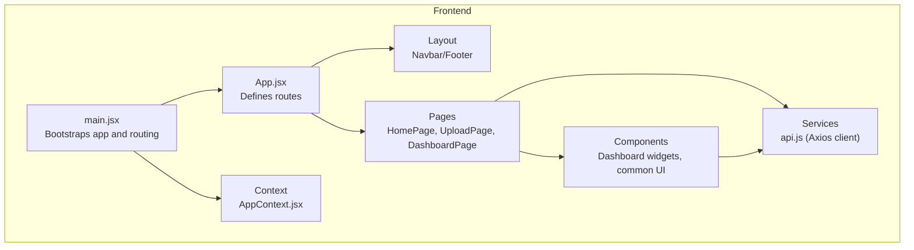

**Diagram sources**
- [main.jsx:1-17](file://frontend/src/main.jsx#L1-L17)
- [App.jsx:1-20](file://frontend/src/App.jsx#L1-L20)
- [DashboardPage.jsx:1-68](file://frontend/src/pages/DashboardPage.jsx#L1-L68)
- [UploadPage.jsx:1-29](file://frontend/src/pages/UploadPage.jsx#L1-L29)
- [HomePage.jsx:1-14](file://frontend/src/pages/HomePage.jsx#L1-L14)
- [api.js:1-86](file://frontend/src/services/api.js#L1-L86)
- [AppContext.jsx:1-53](file://frontend/src/context/AppContext.jsx#L1-L53)

**Section sources**
- [package.json:1-29](file://frontend/package.json#L1-L29)
- [vite.config.js:1-16](file://frontend/vite.config.js#L1-L16)
- [tailwind.config.js:1-57](file://frontend/tailwind.config.js#L1-L57)
- [main.jsx:1-17](file://frontend/src/main.jsx#L1-L17)
- [App.jsx:1-20](file://frontend/src/App.jsx#L1-L20)

## Core Components
- Application shell and routing: [App.jsx:1-20](file://frontend/src/App.jsx#L1-L20), [main.jsx:1-17](file://frontend/src/main.jsx#L1-L17)
- Global state management: [AppContext.jsx:1-53](file://frontend/src/context/AppContext.jsx#L1-L53)
- Backend integration: [api.js:1-86](file://frontend/src/services/api.js#L1-L86)
- Pages: [HomePage.jsx:1-14](file://frontend/src/pages/HomePage.jsx#L1-L14), [UploadPage.jsx:1-29](file://frontend/src/pages/UploadPage.jsx#L1-L29), [DashboardPage.jsx:1-68](file://frontend/src/pages/DashboardPage.jsx#L1-L68)
- Dashboard widgets: [SoilAnalysisCard.jsx:1-74](file://frontend/src/components/Dashboard/SoilAnalysisCard.jsx#L1-L74), [WeatherCard.jsx:1-71](file://frontend/src/components/Dashboard/WeatherCard.jsx#L1-L71), [CropRecommendation.jsx:1-98](file://frontend/src/components/Dashboard/CropRecommendation.jsx#L1-L98), [FertilizerRecommendation.jsx:1-63](file://frontend/src/components/Dashboard/FertilizerRecommendation.jsx#L1-L63), [ProfitChart.jsx:1-71](file://frontend/src/components/Dashboard/ProfitChart.jsx#L1-L71)

**Section sources**
- [App.jsx:1-20](file://frontend/src/App.jsx#L1-L20)
- [main.jsx:1-17](file://frontend/src/main.jsx#L1-L17)
- [AppContext.jsx:1-53](file://frontend/src/context/AppContext.jsx#L1-L53)
- [api.js:1-86](file://frontend/src/services/api.js#L1-L86)
- [DashboardPage.jsx:1-68](file://frontend/src/pages/DashboardPage.jsx#L1-L68)

## Architecture Overview
The frontend uses a layered architecture:
- Presentation layer: React components and pages
- State management: Centralized context for soil, weather, crop, and fertilizer data
- Services: Axios-based API client with interceptors for logging and error handling
- Routing: React Router DOM for navigation

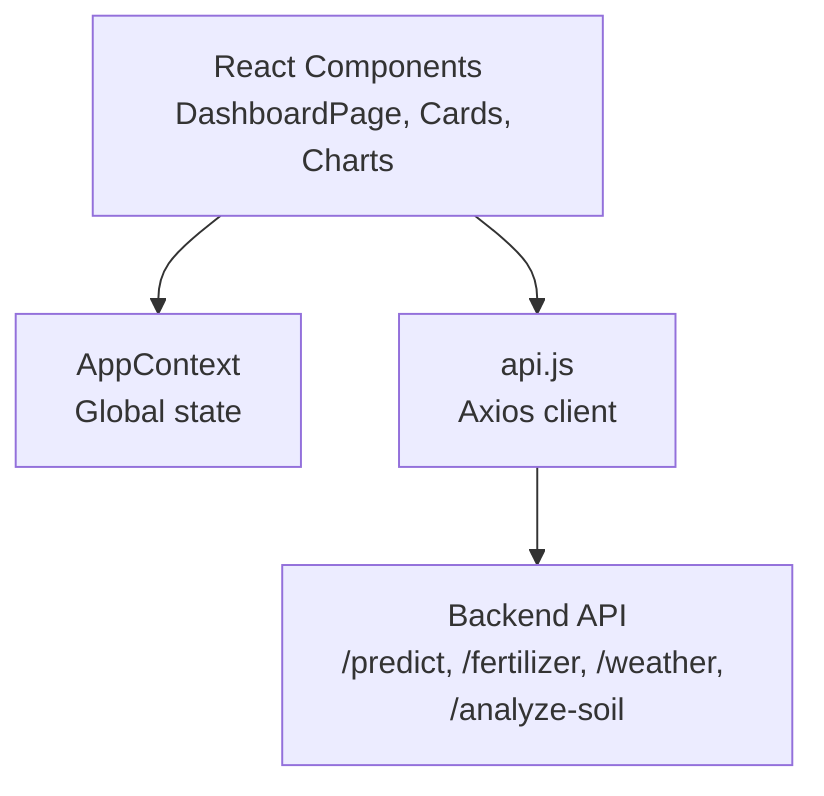

**Diagram sources**
- [DashboardPage.jsx:1-68](file://frontend/src/pages/DashboardPage.jsx#L1-L68)
- [AppContext.jsx:1-53](file://frontend/src/context/AppContext.jsx#L1-L53)
- [api.js:1-86](file://frontend/src/services/api.js#L1-L86)

## Detailed Component Analysis

### Technology Stack
- Frontend framework: React 18 with React Router DOM
- Build tool: Vite
- Styling: Tailwind CSS with custom color palette and animations
- HTTP client: Axios
- Charts: Recharts
- Icons: lucide-react

**Section sources**
- [package.json:11-18](file://frontend/package.json#L11-L18)
- [package.json:19-27](file://frontend/package.json#L19-L27)
- [vite.config.js:1-16](file://frontend/vite.config.js#L1-L16)
- [tailwind.config.js:1-57](file://frontend/tailwind.config.js#L1-L57)

### Application Shell and Routing
- Bootstrapping: [main.jsx:1-17](file://frontend/src/main.jsx#L1-L17) initializes React, routing, and the global context provider
- Routing: [App.jsx:1-20](file://frontend/src/App.jsx#L1-L20) defines routes for home, upload, and dashboard pages

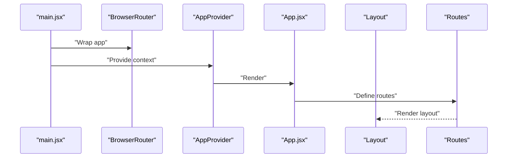

**Diagram sources**
- [main.jsx:1-17](file://frontend/src/main.jsx#L1-L17)
- [App.jsx:1-20](file://frontend/src/App.jsx#L1-L20)

**Section sources**
- [main.jsx:1-17](file://frontend/src/main.jsx#L1-L17)
- [App.jsx:1-20](file://frontend/src/App.jsx#L1-L20)

### Global State Management (AppContext)
- Purpose: Centralizes soilData, weatherData, crops, fertilizerData, loading, error, location, and landArea
- Provides a resetState utility and exposes setters/getters for downstream components

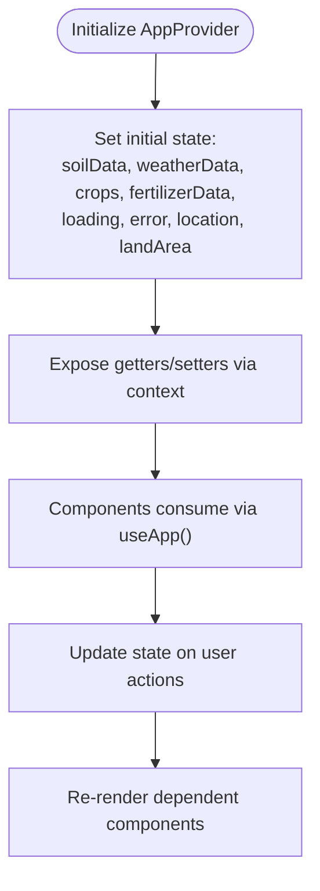

**Diagram sources**
- [AppContext.jsx:13-52](file://frontend/src/context/AppContext.jsx#L13-L52)

**Section sources**
- [AppContext.jsx:1-53](file://frontend/src/context/AppContext.jsx#L1-L53)

### API Layer (api.js)
- Base URL resolution via environment variable
- Interceptors for request logging and error propagation
- Methods:
  - predictCrops(soilData, location, landArea)
  - getFertilizer(cropName, soilData)
  - getWeather(location)
  - analyzeSoilImage(imageFile)

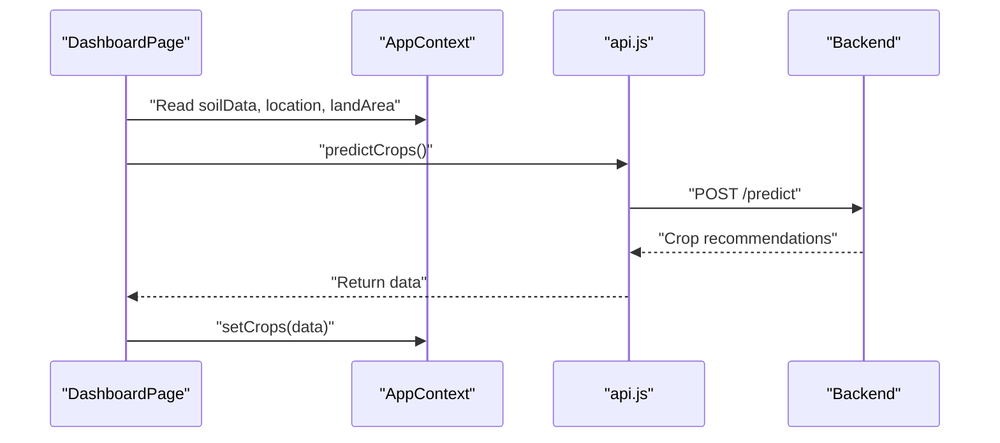

**Diagram sources**
- [DashboardPage.jsx:13-19](file://frontend/src/pages/DashboardPage.jsx#L13-L19)
- [api.js:33-44](file://frontend/src/services/api.js#L33-L44)
- [AppContext.jsx:36-38](file://frontend/src/context/AppContext.jsx#L36-L38)

**Section sources**
- [api.js:1-86](file://frontend/src/services/api.js#L1-L86)

### Dashboard Page
- Redirects to upload page if soilData is missing
- Renders:
  - SoilAnalysisCard
  - WeatherCard
  - CropRecommendation
  - ProfitChart
  - FertilizerRecommendation

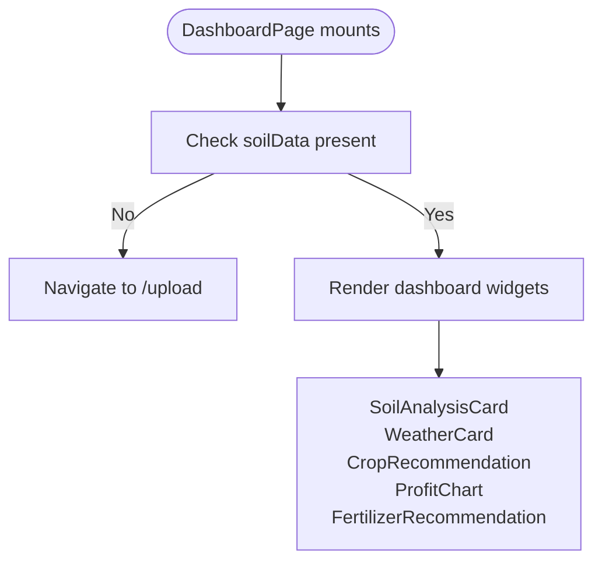

**Diagram sources**
- [DashboardPage.jsx:11-67](file://frontend/src/pages/DashboardPage.jsx#L11-L67)

**Section sources**
- [DashboardPage.jsx:1-68](file://frontend/src/pages/DashboardPage.jsx#L1-L68)

### Dashboard Widgets

#### Crop Recommendation Engine
- Displays ranked crop suggestions with confidence and expected profit
- Uses icons and badges to visually encode rank and quality

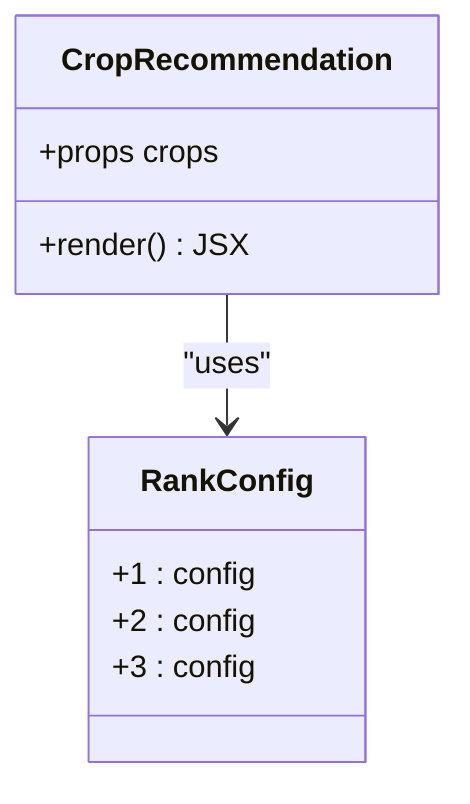

**Diagram sources**
- [CropRecommendation.jsx:1-98](file://frontend/src/components/Dashboard/CropRecommendation.jsx#L1-L98)

**Section sources**
- [CropRecommendation.jsx:1-98](file://frontend/src/components/Dashboard/CropRecommendation.jsx#L1-L98)

#### Fertilizer Recommendation System
- Shows per-hectare fertilizer needs for recommended crops
- Maps fertilizer types to icons and color schemes

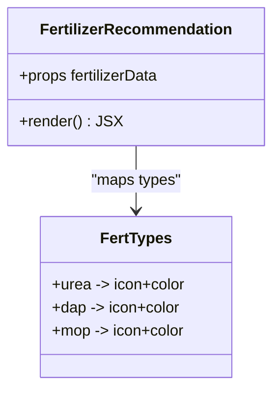

**Diagram sources**
- [FertilizerRecommendation.jsx:1-63](file://frontend/src/components/Dashboard/FertilizerRecommendation.jsx#L1-L63)

**Section sources**
- [FertilizerRecommendation.jsx:1-63](file://frontend/src/components/Dashboard/FertilizerRecommendation.jsx#L1-L63)

#### Weather Integration
- Displays temperature, humidity, rainfall, and current description
- Shows location pin and uses metric cards for consistent presentation

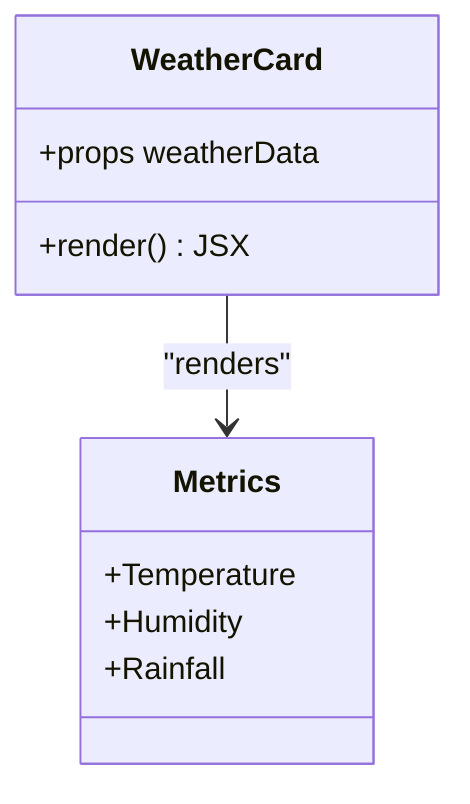

**Diagram sources**
- [WeatherCard.jsx:1-71](file://frontend/src/components/Dashboard/WeatherCard.jsx#L1-L71)

**Section sources**
- [WeatherCard.jsx:1-71](file://frontend/src/components/Dashboard/WeatherCard.jsx#L1-L71)

#### Analytics Dashboard
- SoilAnalysisCard: Presents NPK, pH, and organic matter metrics
- ProfitChart: Bar chart comparing expected profits across crops

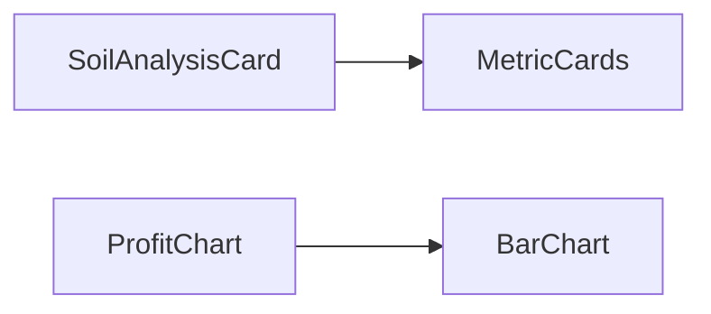

**Diagram sources**
- [SoilAnalysisCard.jsx:1-74](file://frontend/src/components/Dashboard/SoilAnalysisCard.jsx#L1-L74)
- [ProfitChart.jsx:1-71](file://frontend/src/components/Dashboard/ProfitChart.jsx#L1-L71)

**Section sources**
- [SoilAnalysisCard.jsx:1-74](file://frontend/src/components/Dashboard/SoilAnalysisCard.jsx#L1-L74)
- [ProfitChart.jsx:1-71](file://frontend/src/components/Dashboard/ProfitChart.jsx#L1-L71)

### Upload and Home Pages
- UploadPage: Prompts for farm details and soil image upload or manual input
- HomePage: Hero and features sections introducing the platform

**Section sources**
- [UploadPage.jsx:1-29](file://frontend/src/pages/UploadPage.jsx#L1-L29)
- [HomePage.jsx:1-14](file://frontend/src/pages/HomePage.jsx#L1-L14)

## Dependency Analysis
- Runtime dependencies: React, React DOM, React Router DOM, Axios, Recharts, lucide-react
- Dev dependencies: Vite, Tailwind CSS, PostCSS, React plugin
- Build and dev server: Vite with local proxy to backend on port 5000

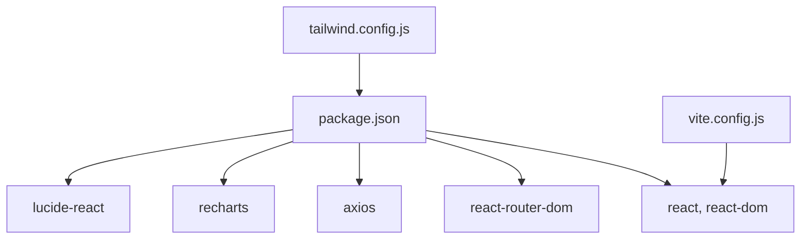

**Diagram sources**
- [package.json:6-27](file://frontend/package.json#L6-L27)
- [vite.config.js:4-14](file://frontend/vite.config.js#L4-L14)
- [tailwind.config.js:1-57](file://frontend/tailwind.config.js#L1-L57)

**Section sources**
- [package.json:1-29](file://frontend/package.json#L1-L29)
- [vite.config.js:1-16](file://frontend/vite.config.js#L1-L16)
- [tailwind.config.js:1-57](file://frontend/tailwind.config.js#L1-L57)

## Performance Considerations
- Lazy loading: Consider lazy-loading heavy charts and images to reduce initial bundle size.
- Memoization: Wrap expensive renders (e.g., charts) with memoization to avoid unnecessary re-renders.
- Network timeouts: Axios timeout is configured; ensure UI surfaces meaningful feedback during long requests.
- Animations: Tailwind animations are lightweight but disable where not needed on low-power devices.
- Chart rendering: Use responsive containers and limit data points to improve responsiveness on mobile.

## Troubleshooting Guide
- API connectivity:
  - Verify backend base URL and proxy configuration in Vite.
  - Confirm environment variable for API URL is set appropriately.
- Error handling:
  - API interceptor logs errors; check browser console for detailed messages.
  - Surface user-friendly error messages via the global context error state.
- Routing:
  - Dashboard redirects to upload if soilData is missing; ensure upload completes successfully before navigating to dashboard.

**Section sources**
- [vite.config.js:8-13](file://frontend/vite.config.js#L8-L13)
- [api.js:13-31](file://frontend/src/services/api.js#L13-L31)
- [DashboardPage.jsx:15-19](file://frontend/src/pages/DashboardPage.jsx#L15-L19)

## Conclusion
Smart Farming Advisor delivers a cohesive, scalable frontend for an intelligent agricultural decision-support system. Its modular component architecture, centralized state management, and clear separation of concerns enable rapid iteration and maintainability. Combined with a modern tech stack and thoughtful UI/UX, the platform is well-positioned to drive digital transformation in agriculture, supporting smarter, more efficient, and sustainable farming practices.