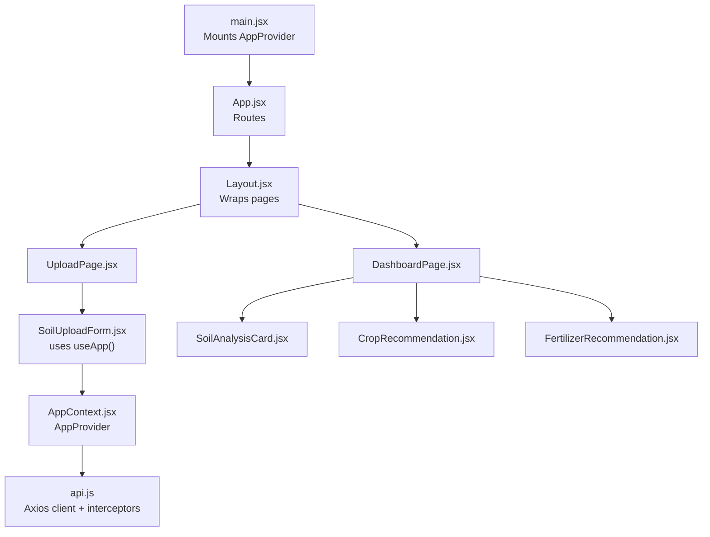
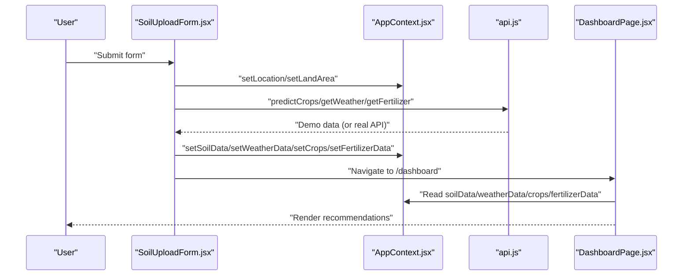
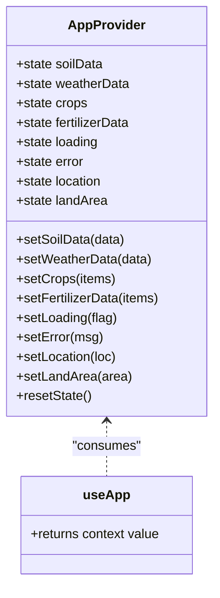
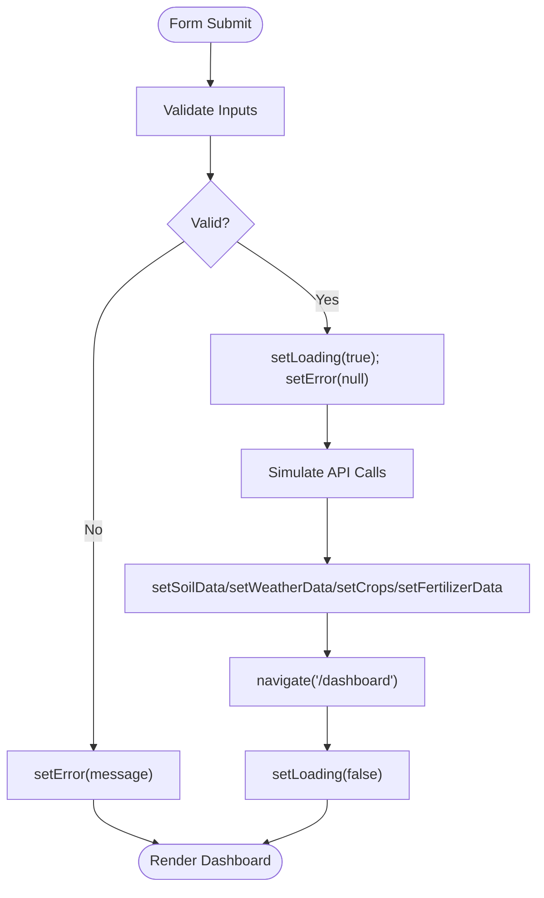
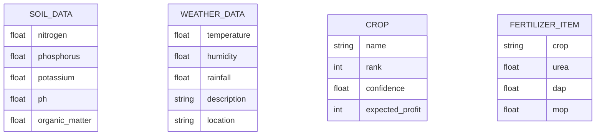
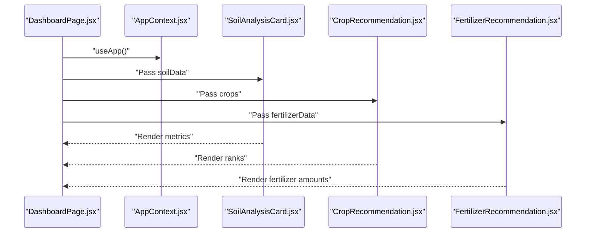
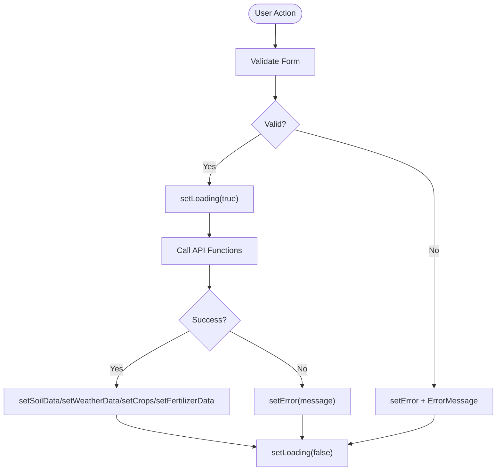
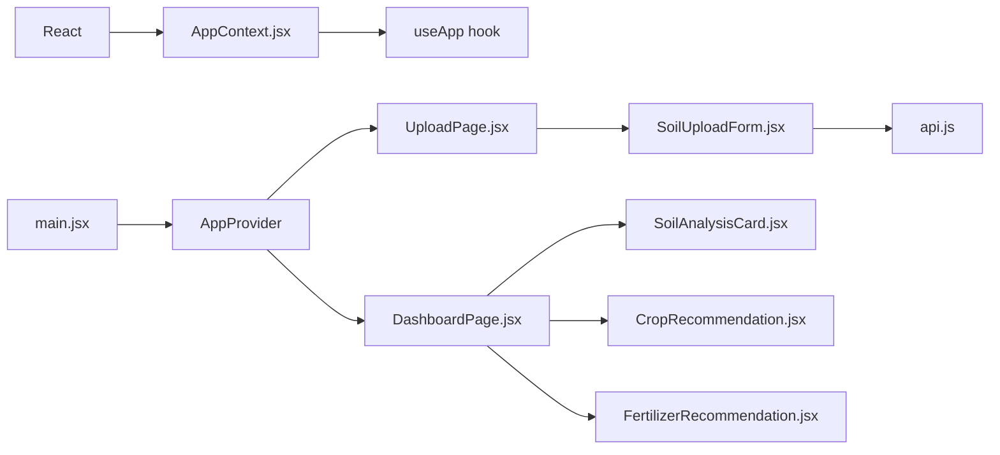

# State Management

<cite>
**Referenced Files in This Document**
- [AppContext.jsx](file://frontend/src/context/AppContext.jsx)
- [App.jsx](file://frontend/src/App.jsx)
- [main.jsx](file://frontend/src/main.jsx)
- [api.js](file://frontend/src/services/api.js)
- [DashboardPage.jsx](file://frontend/src/pages/DashboardPage.jsx)
- [UploadPage.jsx](file://frontend/src/pages/UploadPage.jsx)
- [SoilUploadForm.jsx](file://frontend/src/components/Upload/SoilUploadForm.jsx)
- [ImageUploader.jsx](file://frontend/src/components/Upload/ImageUploader.jsx)
- [SoilAnalysisCard.jsx](file://frontend/src/components/Dashboard/SoilAnalysisCard.jsx)
- [CropRecommendation.jsx](file://frontend/src/components/Dashboard/CropRecommendation.jsx)
- [FertilizerRecommendation.jsx](file://frontend/src/components/Dashboard/FertilizerRecommendation.jsx)
- [Layout.jsx](file://frontend/src/components/Layout/Layout.jsx)
- [ErrorMessage.jsx](file://frontend/src/components/common/ErrorMessage.jsx)
- [LoadingSpinner.jsx](file://frontend/src/components/common/LoadingSpinner.jsx)
</cite>

## Table of Contents
1. [Introduction](#introduction)
2. [Project Structure](#project-structure)
3. [Core Components](#core-components)
4. [Architecture Overview](#architecture-overview)
5. [Detailed Component Analysis](#detailed-component-analysis)
6. [Dependency Analysis](#dependency-analysis)
7. [Performance Considerations](#performance-considerations)
8. [Troubleshooting Guide](#troubleshooting-guide)
9. [Conclusion](#conclusion)

## Introduction
This document explains the Smart Farming Advisor’s state management system built with React’s Context API. It covers the centralized state structure, provider setup, component subscriptions, data flow patterns, and practical examples for initialization, updates, and cleanup. It also documents state shapes for soil data, weather data, and recommendations, error handling strategies, and performance considerations. Finally, it outlines best practices for state management in React and how the Context API can replace external state management libraries.

## Project Structure
The state management is encapsulated in a single provider that exposes a unified context to the app. The provider is mounted at the root of the application and consumed by pages and components across the app.

**Diagram sources**
- [main.jsx:8-16](file://frontend/src/main.jsx#L8-L16)
- [App.jsx:7-17](file://frontend/src/App.jsx#L7-L17)
- [Layout.jsx:4-14](file://frontend/src/components/Layout/Layout.jsx#L4-L14)
- [UploadPage.jsx:4-26](file://frontend/src/pages/UploadPage.jsx#L4-L26)
- [DashboardPage.jsx:11-64](file://frontend/src/pages/DashboardPage.jsx#L11-L64)
- [SoilUploadForm.jsx:9-24](file://frontend/src/components/Upload/SoilUploadForm.jsx#L9-L24)
- [SoilAnalysisCard.jsx:4-71](file://frontend/src/components/Dashboard/SoilAnalysisCard.jsx#L4-L71)
- [CropRecommendation.jsx:27-95](file://frontend/src/components/Dashboard/CropRecommendation.jsx#L27-L95)
- [FertilizerRecommendation.jsx:15-60](file://frontend/src/components/Dashboard/FertilizerRecommendation.jsx#L15-L60)
- [AppContext.jsx:13-52](file://frontend/src/context/AppContext.jsx#L13-L52)
- [api.js:1-86](file://frontend/src/services/api.js#L1-L86)

**Section sources**
- [main.jsx:8-16](file://frontend/src/main.jsx#L8-L16)
- [App.jsx:7-17](file://frontend/src/App.jsx#L7-L17)
- [Layout.jsx:4-14](file://frontend/src/components/Layout/Layout.jsx#L4-L14)

## Core Components
- AppProvider: Centralized state container exposing soilData, weatherData, crops, fertilizerData, loading, error, location, landArea, plus setters and a resetState function.
- useApp: Hook that enforces consumption within AppProvider and returns the shared state and actions.
- API module: Axios client with base URL, request/response interceptors, and typed functions for crop prediction, fertilizer recommendation, weather retrieval, and soil image analysis.

Key state fields and their roles:
- soilData: Object containing nutrient levels and pH; used by SoilAnalysisCard and downstream recommendations.
- weatherData: Object containing temperature, humidity, rainfall, and location; used by WeatherCard and recommendations.
- crops: Array of crop recommendation records with name, confidence, expected_profit, and rank.
- fertilizerData: Array of fertilizer recommendations per crop with urea, dap, and mop quantities.
- loading: Boolean flag controlling loading UI.
- error: String message for user-visible errors.
- location: String city name entered by the user.
- landArea: Numeric hectare value entered by the user.

**Section sources**
- [AppContext.jsx:13-52](file://frontend/src/context/AppContext.jsx#L13-L52)
- [api.js:33-83](file://frontend/src/services/api.js#L33-L83)

## Architecture Overview
The Context API provides a unidirectional data flow:
- Consumers (pages and components) read state via useApp().
- Actions (setters and resetState) mutate state.
- Side effects (API calls) are initiated in components and update state upon completion.
- UI components render based on the latest state.

**Diagram sources**
- [SoilUploadForm.jsx:53-149](file://frontend/src/components/Upload/SoilUploadForm.jsx#L53-L149)
- [AppContext.jsx:31-49](file://frontend/src/context/AppContext.jsx#L31-L49)
- [api.js:33-83](file://frontend/src/services/api.js#L33-L83)
- [DashboardPage.jsx:13-64](file://frontend/src/pages/DashboardPage.jsx#L13-L64)

## Detailed Component Analysis

### Context Provider and Hook
- AppProvider initializes state fields and exposes setters and a resetState function.
- useApp validates provider presence and returns the context value.
- The provider wraps the entire app in main.jsx.

**Diagram sources**
- [AppContext.jsx:13-52](file://frontend/src/context/AppContext.jsx#L13-L52)

**Section sources**
- [AppContext.jsx:5-11](file://frontend/src/context/AppContext.jsx#L5-L11)
- [AppContext.jsx:13-52](file://frontend/src/context/AppContext.jsx#L13-L52)
- [main.jsx:8-16](file://frontend/src/main.jsx#L8-L16)

### State Initialization and Updates
- Initialization occurs in the provider defaults (null/empty arrays/strings).
- Updates occur in the upload form:
  - Validates inputs and sets error if invalid.
  - Sets loading true and clears previous error.
  - Demonstrates API-like behavior with timeouts and demo data.
  - Writes to soilData, weatherData, crops, fertilizerData, and navigates to the dashboard.
  - On completion, loading is set to false.

**Diagram sources**
- [SoilUploadForm.jsx:41-149](file://frontend/src/components/Upload/SoilUploadForm.jsx#L41-L149)

**Section sources**
- [SoilUploadForm.jsx:41-149](file://frontend/src/components/Upload/SoilUploadForm.jsx#L41-L149)

### State Shape Definitions
- soilData: Object with numeric fields for nutrients and pH; used by SoilAnalysisCard.
- weatherData: Object with temperature, humidity, rainfall, description, and location; used by WeatherCard.
- crops: Array of recommendation objects with name, confidence, expected_profit, and rank.
- fertilizerData: Array of recommendation objects per crop with urea, dap, and mop values.

**Diagram sources**
- [SoilAnalysisCard.jsx:7-43](file://frontend/src/components/Dashboard/SoilAnalysisCard.jsx#L7-L43)
- [SoilUploadForm.jsx:85-136](file://frontend/src/components/Upload/SoilUploadForm.jsx#L85-L136)
- [FertilizerRecommendation.jsx:31-56](file://frontend/src/components/Dashboard/FertilizerRecommendation.jsx#L31-L56)

**Section sources**
- [SoilAnalysisCard.jsx:7-43](file://frontend/src/components/Dashboard/SoilAnalysisCard.jsx#L7-L43)
- [SoilUploadForm.jsx:85-136](file://frontend/src/components/Upload/SoilUploadForm.jsx#L85-L136)
- [FertilizerRecommendation.jsx:31-56](file://frontend/src/components/Dashboard/FertilizerRecommendation.jsx#L31-L56)

### Component Subscription Patterns
- DashboardPage reads soilData, weatherData, crops, fertilizerData, and landArea from useApp and redirects if soilData is missing.
- SoilAnalysisCard renders metrics derived from soilData.
- CropRecommendation renders ranked crop recommendations.
- FertilizerRecommendation renders per-crop fertilizer quantities.

**Diagram sources**
- [DashboardPage.jsx:13-64](file://frontend/src/pages/DashboardPage.jsx#L13-L64)
- [SoilAnalysisCard.jsx:4-71](file://frontend/src/components/Dashboard/SoilAnalysisCard.jsx#L4-L71)
- [CropRecommendation.jsx:27-95](file://frontend/src/components/Dashboard/CropRecommendation.jsx#L27-L95)
- [FertilizerRecommendation.jsx:15-60](file://frontend/src/components/Dashboard/FertilizerRecommendation.jsx#L15-L60)

**Section sources**
- [DashboardPage.jsx:13-64](file://frontend/src/pages/DashboardPage.jsx#L13-L64)
- [SoilAnalysisCard.jsx:4-71](file://frontend/src/components/Dashboard/SoilAnalysisCard.jsx#L4-L71)
- [CropRecommendation.jsx:27-95](file://frontend/src/components/Dashboard/CropRecommendation.jsx#L27-L95)
- [FertilizerRecommendation.jsx:15-60](file://frontend/src/components/Dashboard/FertilizerRecommendation.jsx#L15-L60)

### Cleanup Procedures
- resetState clears soilData, weatherData, crops, fertilizerData, and error while preserving location and landArea.
- Components can rely on the provider to reset state when needed (e.g., returning to the upload page).

**Section sources**
- [AppContext.jsx:23-29](file://frontend/src/context/AppContext.jsx#L23-L29)

### Error Handling in State Updates
- Validation errors are surfaced via setError and displayed with ErrorMessage.
- API functions wrap requests and surface user-friendly messages.
- LoadingSpinner is shown during asynchronous operations.

**Diagram sources**
- [SoilUploadForm.jsx:41-149](file://frontend/src/components/Upload/SoilUploadForm.jsx#L41-L149)
- [ErrorMessage.jsx:4-34](file://frontend/src/components/common/ErrorMessage.jsx#L4-L34)
- [LoadingSpinner.jsx:3-14](file://frontend/src/components/common/LoadingSpinner.jsx#L3-L14)
- [api.js:33-83](file://frontend/src/services/api.js#L33-L83)

**Section sources**
- [SoilUploadForm.jsx:41-149](file://frontend/src/components/Upload/SoilUploadForm.jsx#L41-L149)
- [ErrorMessage.jsx:4-34](file://frontend/src/components/common/ErrorMessage.jsx#L4-L34)
- [LoadingSpinner.jsx:3-14](file://frontend/src/components/common/LoadingSpinner.jsx#L3-L14)
- [api.js:33-83](file://frontend/src/services/api.js#L33-L83)

### Best Practices Demonstrated
- Centralized provider with granular setters for predictable updates.
- Strict consumer enforcement via useApp hook.
- UI-driven loading and error states.
- Minimal side effects inside components; state mutations remain local to handlers.
- Separation of concerns: provider manages state, components render and trigger updates.

[No sources needed since this section provides general guidance]

## Dependency Analysis
- AppProvider depends on React’s useState and createContext.
- useApp depends on useContext and throws if used outside provider.
- main.jsx mounts AppProvider at the root.
- UploadPage and DashboardPage consume useApp.
- SoilUploadForm orchestrates state updates and navigation.
- api.js encapsulates network logic and error messaging.

**Diagram sources**
- [AppContext.jsx:1-11](file://frontend/src/context/AppContext.jsx#L1-L11)
- [main.jsx:8-16](file://frontend/src/main.jsx#L8-L16)
- [UploadPage.jsx:4-26](file://frontend/src/pages/UploadPage.jsx#L4-L26)
- [DashboardPage.jsx:11-64](file://frontend/src/pages/DashboardPage.jsx#L11-L64)
- [SoilUploadForm.jsx:9-24](file://frontend/src/components/Upload/SoilUploadForm.jsx#L9-L24)
- [api.js:1-86](file://frontend/src/services/api.js#L1-L86)
- [SoilAnalysisCard.jsx:4-71](file://frontend/src/components/Dashboard/SoilAnalysisCard.jsx#L4-L71)
- [CropRecommendation.jsx:27-95](file://frontend/src/components/Dashboard/CropRecommendation.jsx#L27-L95)
- [FertilizerRecommendation.jsx:15-60](file://frontend/src/components/Dashboard/FertilizerRecommendation.jsx#L15-L60)

**Section sources**
- [AppContext.jsx:1-11](file://frontend/src/context/AppContext.jsx#L1-L11)
- [main.jsx:8-16](file://frontend/src/main.jsx#L8-L16)
- [UploadPage.jsx:4-26](file://frontend/src/pages/UploadPage.jsx#L4-L26)
- [DashboardPage.jsx:11-64](file://frontend/src/pages/DashboardPage.jsx#L11-L64)
- [SoilUploadForm.jsx:9-24](file://frontend/src/components/Upload/SoilUploadForm.jsx#L9-L24)
- [api.js:1-86](file://frontend/src/services/api.js#L1-L86)

## Performance Considerations
- Prefer granular setters to minimize re-renders; update only affected slices (e.g., setCrops vs. resetting entire state).
- Avoid unnecessary deep copies; pass primitives and small objects directly.
- Debounce or throttle frequent updates (e.g., live input) to reduce churn.
- Use memoization for expensive computations in components rendering large lists (e.g., crop recommendations).
- Keep the provider near the root to avoid prop drilling and excessive re-renders in nested components.

[No sources needed since this section provides general guidance]

## Troubleshooting Guide
Common issues and resolutions:
- useApp used outside provider: The hook throws an error; ensure AppProvider wraps the app root.
- Missing soilData on dashboard: Dashboard redirects to upload; ensure upload form writes soilData.
- Validation errors: Check setError propagation and ErrorMessage visibility.
- Long-running operations: Confirm loading state toggles and UI remains responsive.

**Section sources**
- [AppContext.jsx:5-11](file://frontend/src/context/AppContext.jsx#L5-L11)
- [DashboardPage.jsx:15-19](file://frontend/src/pages/DashboardPage.jsx#L15-L19)
- [SoilUploadForm.jsx:56-59](file://frontend/src/components/Upload/SoilUploadForm.jsx#L56-L59)
- [ErrorMessage.jsx:4-34](file://frontend/src/components/common/ErrorMessage.jsx#L4-L34)

## Conclusion
The Smart Farming Advisor employs a clean, centralized state management approach using React’s Context API. The provider exposes a cohesive set of state fields and setters, enabling predictable updates and easy component subscriptions. The system demonstrates robust error handling, loading states, and a clear data flow from upload to dashboard. By following the outlined patterns and best practices, teams can scale state management without external libraries, keeping the codebase maintainable and performant.