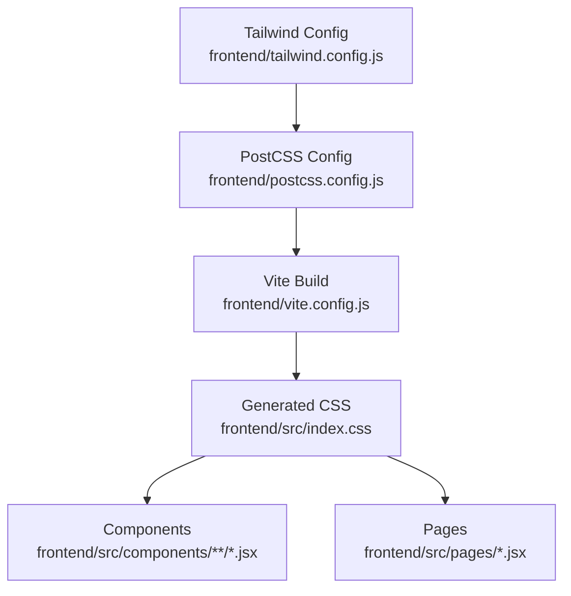
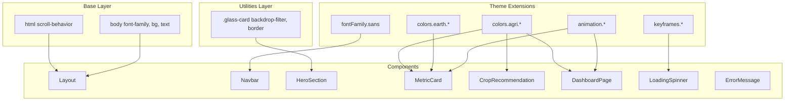
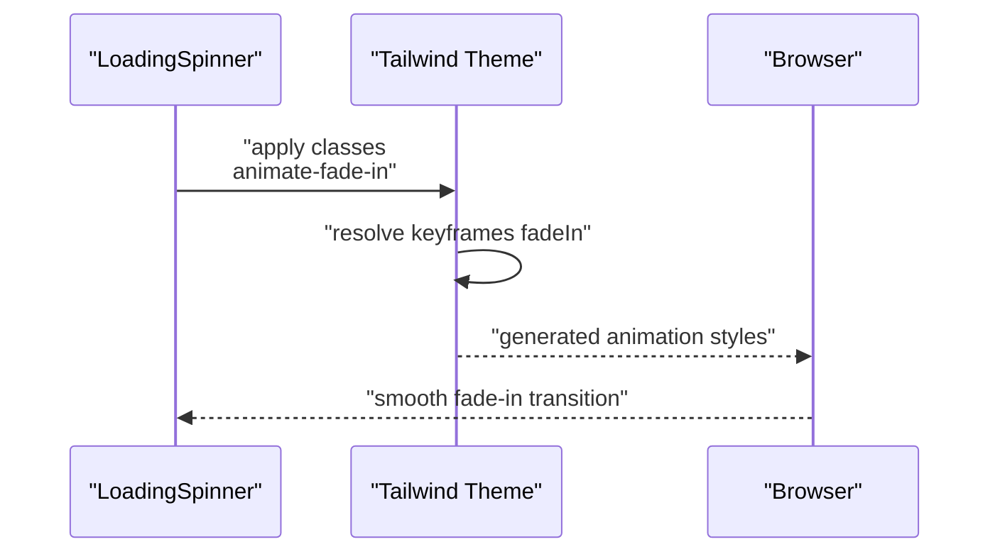
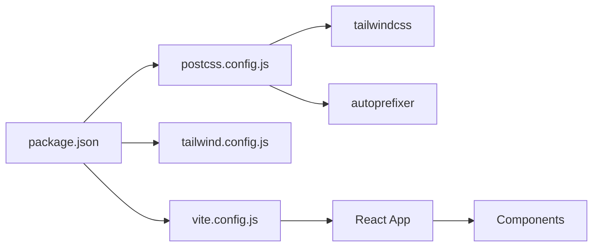

# Styling and Design System

<cite>
**Referenced Files in This Document**
- [tailwind.config.js](file://frontend/tailwind.config.js)
- [postcss.config.js](file://frontend/postcss.config.js)
- [index.css](file://frontend/src/index.css)
- [vite.config.js](file://frontend/vite.config.js)
- [package.json](file://frontend/package.json)
- [Layout.jsx](file://frontend/src/components/Layout/Layout.jsx)
- [Navbar.jsx](file://frontend/src/components/Layout/Navbar.jsx)
- [HeroSection.jsx](file://frontend/src/components/Home/HeroSection.jsx)
- [MetricCard.jsx](file://frontend/src/components/common/MetricCard.jsx)
- [CropRecommendation.jsx](file://frontend/src/components/Dashboard/CropRecommendation.jsx)
- [DashboardPage.jsx](file://frontend/src/pages/DashboardPage.jsx)
- [LoadingSpinner.jsx](file://frontend/src/components/common/LoadingSpinner.jsx)
- [ErrorMessage.jsx](file://frontend/src/components/common/ErrorMessage.jsx)
</cite>

## Table of Contents
1. [Introduction](#introduction)
2. [Project Structure](#project-structure)
3. [Core Components](#core-components)
4. [Architecture Overview](#architecture-overview)
5. [Detailed Component Analysis](#detailed-component-analysis)
6. [Dependency Analysis](#dependency-analysis)
7. [Performance Considerations](#performance-considerations)
8. [Troubleshooting Guide](#troubleshooting-guide)
9. [Conclusion](#conclusion)
10. [Appendices](#appendices)

## Introduction
This document describes the Smart Farming Advisor styling and design system. It covers Tailwind CSS configuration, the custom color palette, typography, spacing and responsive conventions, component styling patterns, animations and transitions, dark/light theme considerations, accessibility, and the PostCSS build pipeline. It also provides guidelines for extending the design system while maintaining consistency across components.

## Project Structure
The styling system is organized around Tailwind CSS with PostCSS processing and Vite for development and build. The configuration files define the design tokens and build pipeline, while individual components apply utility classes consistently.

**Diagram sources**
- [tailwind.config.js:1-57](file://frontend/tailwind.config.js#L1-L57)
- [postcss.config.js:1-7](file://frontend/postcss.config.js#L1-L7)
- [vite.config.js:1-16](file://frontend/vite.config.js#L1-L16)
- [index.css:1-23](file://frontend/src/index.css#L1-L23)

**Section sources**
- [tailwind.config.js:1-57](file://frontend/tailwind.config.js#L1-L57)
- [postcss.config.js:1-7](file://frontend/postcss.config.js#L1-L7)
- [index.css:1-23](file://frontend/src/index.css#L1-L23)
- [vite.config.js:1-16](file://frontend/vite.config.js#L1-L16)
- [package.json:1-29](file://frontend/package.json#L1-L29)

## Core Components
- Tailwind CSS configuration defines:
  - Content paths scanned for class usage
  - Extended color palette with custom keys
  - Typography family
  - Animation and keyframe definitions
- Base layer sets global styles (scroll behavior, font family, body colors)
- Utilities layer adds reusable utility classes (e.g., glass card effect)
- PostCSS pipeline enables Tailwind and Autoprefixer
- Vite manages dev server and build process

Key design system elements:
- Color system: agri (green tones) and earth (earthy/brown tones) palettes
- Typography: Inter as primary font
- Animations: fade-in, slide-up, bounce-slow
- Responsive breakpoints: sm, md, lg usage across components

**Section sources**
- [tailwind.config.js:3-6](file://frontend/tailwind.config.js#L3-L6)
- [tailwind.config.js:7-53](file://frontend/tailwind.config.js#L7-L53)
- [index.css:5-22](file://frontend/src/index.css#L5-L22)
- [postcss.config.js:1-7](file://frontend/postcss.config.js#L1-L7)
- [vite.config.js:1-16](file://frontend/vite.config.js#L1-L16)

## Architecture Overview
The styling architecture follows a layered approach:
- Tailwind base layer for resets and globals
- Component classes for layout, colors, typography, spacing, and interactions
- Utility classes for advanced effects (glass card)
- Animations and transitions coordinated via Tailwind utilities

**Diagram sources**
- [index.css:5-22](file://frontend/src/index.css#L5-L22)
- [tailwind.config.js:7-53](file://frontend/tailwind.config.js#L7-L53)
- [Layout.jsx](file://frontend/src/components/Layout/Layout.jsx#L6)
- [Navbar.jsx](file://frontend/src/components/Layout/Navbar.jsx#L18)
- [HeroSection.jsx:7-8](file://frontend/src/components/Home/HeroSection.jsx#L7-L8)
- [MetricCard.jsx](file://frontend/src/components/common/MetricCard.jsx#L19)
- [CropRecommendation.jsx](file://frontend/src/components/Dashboard/CropRecommendation.jsx#L31)
- [DashboardPage.jsx](file://frontend/src/pages/DashboardPage.jsx#L33)
- [LoadingSpinner.jsx](file://frontend/src/components/common/LoadingSpinner.jsx#L5)

## Detailed Component Analysis

### Color System and Palette
- Custom palette keys:
  - agri: 50–900 scale for green-themed UI
  - earth: 50–900 scale for earth-toned UI
- Usage patterns:
  - Backgrounds: e.g., bg-agri-50, bg-earth-50
  - Borders: e.g., border-agri-200, border-earth-200
  - Text: e.g., text-agri-700, text-earth-700
  - Gradients and accents: e.g., gradient backgrounds in recommendations

Guidelines:
- Prefer agri palette for primary/agricultural contexts
- Use earth palette for neutral/organic elements
- Keep contrast ratios sufficient for readability

**Section sources**
- [tailwind.config.js:9-34](file://frontend/tailwind.config.js#L9-L34)
- [MetricCard.jsx:2-8](file://frontend/src/components/common/MetricCard.jsx#L2-L8)
- [CropRecommendation.jsx:4-25](file://frontend/src/components/Dashboard/CropRecommendation.jsx#L4-L25)

### Typography System
- Font family: Inter for clean, modern readability
- Headings and body weights: extrabold, font-bold, font-semibold applied across components
- Line heights and letter spacing tuned for content density

Usage examples:
- Hero headings use extra-large sizes with tight tracking
- Cards and navigation use medium/large sizes with appropriate weights

**Section sources**
- [tailwind.config.js:35-37](file://frontend/tailwind.config.js#L35-L37)
- [HeroSection.jsx:17-20](file://frontend/src/components/Home/HeroSection.jsx#L17-L20)
- [Navbar.jsx](file://frontend/src/components/Layout/Navbar.jsx#L25)

### Spacing and Responsive Conventions
- Consistent padding/margin scales using Tailwind spacing utilities
- Grid layouts with responsive column counts:
  - 1 column on small screens
  - 2–3 columns on medium/large screens for cards and feature grids
- Max widths and horizontal gutters using max-w-*, px-4/sm:px-6/lg:px-8

Responsive patterns:
- sm, md, lg breakpoint classes drive layout shifts
- Flex utilities center content and align items across breakpoints

**Section sources**
- [HeroSection.jsx:9-10](file://frontend/src/components/Home/HeroSection.jsx#L9-L10)
- [CropRecommendation.jsx:42-43](file://frontend/src/components/Dashboard/CropRecommendation.jsx#L42-L43)
- [DashboardPage.jsx:54-55](file://frontend/src/pages/DashboardPage.jsx#L54-L55)

### Component Styling Patterns
- Layout container: min-h-screen, flex-col, bg-agri-50
- Navigation: backdrop blur, border, active state highlighting
- Cards: rounded-xl, border, subtle shadows, hover transitions
- Metrics: color mapping via props to maintain consistent variants
- Recommendations: gradient backgrounds per rank, badges, progress bars

Consistency enforcements:
- Centralized colorClasses/iconClasses mapping in metric cards
- Shared animation utilities (fade-in, slide-up)
- Standardized hover/shadow transitions

**Section sources**
- [Layout.jsx](file://frontend/src/components/Layout/Layout.jsx#L6)
- [Navbar.jsx:18-39](file://frontend/src/components/Layout/Navbar.jsx#L18-L39)
- [MetricCard.jsx:1-39](file://frontend/src/components/common/MetricCard.jsx#L1-L39)
- [CropRecommendation.jsx:31-94](file://frontend/src/components/Dashboard/CropRecommendation.jsx#L31-L94)

### Animation and Transition System
- Built-in animations:
  - fade-in: base utility for appearing elements
  - slide-up: entrance with vertical translation
  - bounce-slow: slow bounce for decorative emphasis
- Keyframes:
  - fadeIn: opacity 0 → 1
  - slideUp: translateY(20px) → 0 with opacity 0 → 1
- Usage:
  - animate-fade-in on loaders and alerts
  - animate-slide-up on cards and recommendation blocks
  - animate-bounce for redirect messaging

**Diagram sources**
- [LoadingSpinner.jsx](file://frontend/src/components/common/LoadingSpinner.jsx#L5)
- [tailwind.config.js:38-52](file://frontend/tailwind.config.js#L38-L52)

**Section sources**
- [tailwind.config.js:38-52](file://frontend/tailwind.config.js#L38-L52)
- [LoadingSpinner.jsx](file://frontend/src/components/common/LoadingSpinner.jsx#L5)
- [ErrorMessage.jsx](file://frontend/src/components/common/ErrorMessage.jsx#L10)
- [MetricCard.jsx](file://frontend/src/components/common/MetricCard.jsx#L19)
- [DashboardPage.jsx](file://frontend/src/pages/DashboardPage.jsx#L33)

### Dark/Light Theme Support
- Current theme: light mode with agri/earth palette
- No explicit dark mode classes or toggles are present in the current configuration
- Suggestion for future extension:
  - Add dark mode variant classes (e.g., dark:bg-* and dark:text-*)
  - Introduce a theme toggle in the app context and propagate via a root attribute
  - Extend color palette entries for dark variants

[No sources needed since this section provides general guidance]

### Accessibility Considerations
- Contrast:
  - Ensure sufficient contrast between text and backgrounds (e.g., text-agri-900 on agri-50)
- Focus and motion:
  - Respect reduced motion preferences by avoiding excessive animations
- Semantic structure:
  - Combine utility classes with semantic HTML and proper heading hierarchy
- Interactive states:
  - Hover/focus states clearly indicated via transitions and color changes

[No sources needed since this section provides general guidance]

## Dependency Analysis
The styling pipeline depends on Tailwind CSS, PostCSS, and Vite. Dependencies are declared in package.json and configured in postcss.config.js and tailwind.config.js.

**Diagram sources**
- [package.json:11-27](file://frontend/package.json#L11-L27)
- [postcss.config.js:1-7](file://frontend/postcss.config.js#L1-L7)
- [tailwind.config.js:1-57](file://frontend/tailwind.config.js#L1-L57)
- [vite.config.js:1-16](file://frontend/vite.config.js#L1-L16)

**Section sources**
- [package.json:11-27](file://frontend/package.json#L11-L27)
- [postcss.config.js:1-7](file://frontend/postcss.config.js#L1-L7)
- [tailwind.config.js:1-57](file://frontend/tailwind.config.js#L1-L57)
- [vite.config.js:1-16](file://frontend/vite.config.js#L1-L16)

## Performance Considerations
- Purge unused CSS:
  - Tailwind’s content scanning targets HTML and JSX files to remove unused styles
- Minification and autoprefixing:
  - PostCSS pipeline includes Tailwind and Autoprefixer for optimized CSS
- Build optimization:
  - Vite provides fast dev server and efficient production builds
- Animation performance:
  - Prefer transform/opacity for smooth animations
  - Limit heavy backdrop-filter usage on low-end devices

[No sources needed since this section provides general guidance]

## Troubleshooting Guide
- Styles not applying:
  - Verify Tailwind directives are present in index.css
  - Confirm content paths in tailwind.config.js include component directories
- Animation not working:
  - Ensure animation utilities are applied and keyframes are defined
- Build errors:
  - Check PostCSS plugin configuration and versions in package.json
- Responsive layout issues:
  - Validate breakpoint classes and grid configurations

**Section sources**
- [index.css:1-3](file://frontend/src/index.css#L1-L3)
- [tailwind.config.js:3-6](file://frontend/tailwind.config.js#L3-L6)
- [postcss.config.js:1-7](file://frontend/postcss.config.js#L1-L7)
- [package.json:19-27](file://frontend/package.json#L19-L27)

## Conclusion
The Smart Farming Advisor employs a consistent, utility-first design system built on Tailwind CSS. The custom agri and earth color palettes, Inter typography, and animation/keyframe system create a cohesive visual language. Components leverage responsive grids and standardized spacing to ensure scalability across devices. The PostCSS and Vite pipeline delivers a robust build process. Extending the system should focus on preserving color semantics, typography consistency, and animation performance.

## Appendices

### Guidelines for Extending the Design System
- Colors
  - Add new palette entries under theme.extend.colors
  - Define semantic aliases (e.g., brand-primary) for reuse
- Typography
  - Extend fontFamily with system-friendly fallbacks
  - Define font-size scale and line-height tokens
- Spacing
  - Use Tailwind’s default spacing scale; avoid ad hoc values
  - Establish container and gutter tokens for consistent layouts
- Components
  - Encapsulate shared variants in centralized mapping objects
  - Prefer composition over duplication
- Animations
  - Define keyframes centrally and expose via animation utilities
  - Keep durations and easing consistent across similar interactions
- Dark Mode
  - Introduce dark variants for colors and backgrounds
  - Provide a theme toggle and propagate via a root attribute

[No sources needed since this section provides general guidance]